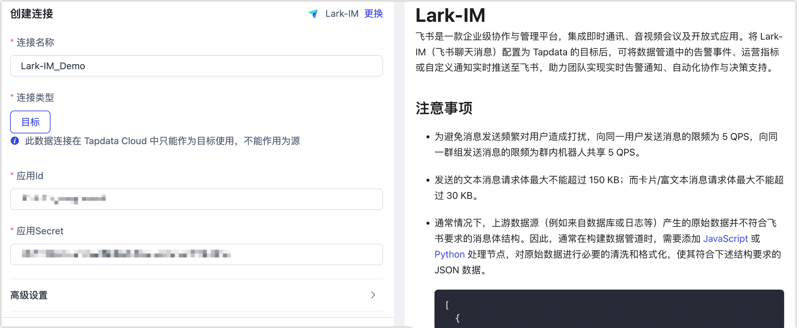

# Lark-IM
import Content from '../../reuse-content/_enterprise-and-cloud-features.md';

<Content />

飞书是一款企业级协作与管理平台，集成即时通讯、音视频会议及开放式应用。将 Lark-IM（飞书聊天消息）配置为 Tapdata 的目标后，可将数据管道中的告警事件、运营指标或自定义通知实时推送至飞书，助力团队实现实时告警通知、自动化协作与决策支持。

## 注意事项

- 为避免消息发送频繁对用户造成打扰，向同一用户发送消息的限频为 5 QPS，向同一群组发送消息的限频为群内机器人共享 5 QPS。

- 发送的文本消息请求体最大不能超过 150 KB；而卡片/富文本消息请求体最大不能超过 30 KB。

- 通常情况下，上游数据源（例如来自数据库或日志等）产生的原始数据并不符合飞书要求的消息体结构。因此，通常在构建数据管道时，需要添加  [JavaScript](../../user-guide/data-development/process-node.md#js-process) 或 [Python](../../user-guide/data-development/process-node.md#python) 处理节点，对原始数据进行必要的清洗和格式化，使其符合下述结构要求的 JSON 数据。 

  ```json
  [
    {
      "receiveType": "{{user | email | phone | chat}}",
      "receiveId": "{{user_open_id | user_email | user_phone | chat_id}}",
      "contentType": "text",
      "content": "{\"text\":\"Hello! This is lark message! \"}"
    }
  ]
  ```

<details>

<summary>字段说明</summary>


  | 字段名          | 含义                                                         |
  | --------------- | ------------------------------------------------------------ |
  | **receiveType** | 接收者类型，取值范围为： `user`（默认）、`chat`、`email`、`phone` |
  | **receiveId**   | 对应的接收人标识，需在应用的可见范围内，否则消息将发送失败   |
  | **contentType** | 消息类型，如 `text`、`interactive`（卡片）等                 |
  | **content**     | 消息体内容，需为字符串化后的 JSON 格式                       |

  更多字段介绍，见[官方文档](https://open.feishu.cn/document/uAjLw4CM/ukTMukTMukTM/im-v1/message/create_json)。

</details>


## <span id="prerequisite">准备工作</span>

1. 以管理员的身份登录[飞书开放平台](https://open.feishu.cn/app)。

2. 在开发平台首页，进入企业自建的应用。

   :::tip

   关于企业自建应用的创建方法，见[开发流程](https://open.feishu.cn/document/home/introduction-to-custom-app-development/self-built-application-development-process)。

   :::

3. 在左侧导航栏，单击**凭证与基础信息**，获取 App ID 和 App Secret 信息，后续将在连接数据源时使用。

   
   
4. [设置应用可用范围](https://open.feishu.cn/document/develop-process/test-and-release-app/availability)，确保飞书消息的目标用户或群组已纳入飞书自建应用的可见范围，避免消息接受失败。

5. 为应用开启[机器人能力](https://open.feishu.cn/document/uAjLw4CM/ugTN1YjL4UTN24CO1UjN/trouble-shooting/how-to-enable-bot-ability)，注意需要应用发布后才能生效。


## 添加数据源

1. [登录 Tapdata 平台](../../user-guide/log-in.md)。

2. 在左侧导航栏，单击**连接管理**。

3. 在页面右侧，单击**创建连接**。

4. 在弹出的对话框中，搜索并选择 **Lark-IM**。

5. 根据下述说明完成数据源配置。

   

   * **连接名称**：填写具有业务意义的独有名称。
   * **连接类型**：仅支持作为**目标**。
   * **应用 ID**、**应用 Secret**：可通过飞书开放平台获取，具体操作，见[准备工作](#prerequisite)。
   * **agent 设置**：默认为**平台自动分配**，您也可以手动指定。
   * **模型加载频率**：数据源中模型数量大于 1 万时，Tapdata 将按照本参数的设定定期刷新模型。

6. 单击**连接测试**，测试通过后单击**保存**。

   :::tip

   如提示连接测试失败，请根据页面提示进行修复。

   :::