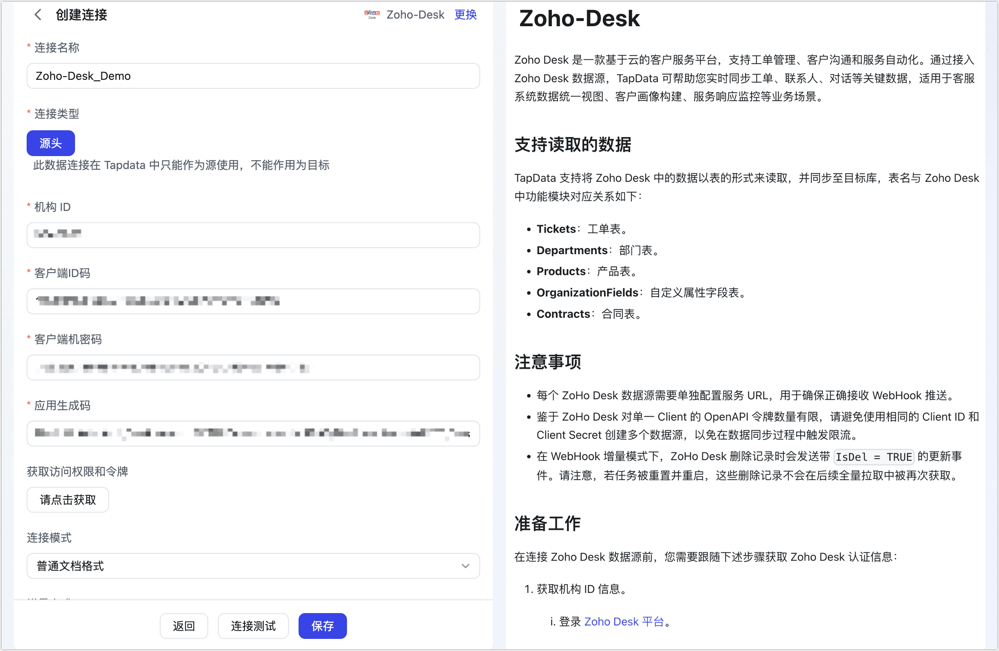

# Zoho-Desk
import Content from '../../reuse-content/_all-features.md';

<Content />

Zoho Desk 是一款基于云的客户服务平台，支持工单管理、客户沟通和服务自动化。通过接入 Zoho Desk 数据源，TapData 可帮助您实时同步工单、联系人、对话等关键数据，适用于客服系统数据统一视图、客户画像构建、服务响应监控等业务场景。

## 支持读取的数据

TapData 支持将 Zoho Desk 中的数据以表的形式来读取，并同步至目标库，表名与 Zoho Desk 中功能模块对应关系如下：

- **Tickets**：工单表。
- **Departments**：部门表。
- **Products**：产品表。
- **OrganizationFields**：自定义属性字段表。
- **Contracts**：合同表。

## 注意事项

- 每个 ZoHo Desk 数据源需要单独配置服务 URL，用于确保正确接收 WebHook 推送。
- 鉴于 ZoHo Desk 对单一 Client 的 OpenAPI 令牌数量有限，请避免使用相同的 Client ID 和 Client Secret 创建多个数据源，以免在数据同步过程中触发限流。
- 在 WebHook 增量模式下，ZoHo Desk 删除记录时会发送带 `IsDel = TRUE` 的更新事件。请注意，若任务被重置并重启，这些删除记录不会在后续全量拉取中被再次获取。

## <span id="prerequisites">准备工作</span>

在连接 Zoho Desk 数据源前，您需要跟随下述步骤获取 Zoho Desk 认证信息：

1. 获取机构 ID 信息。

   1. 登录 [Zoho Desk 平台](https://www.zoho.com/)。

   2. 单击页面右上角的图标，搜索 **APIs** 并进入 API 认证页面，即可获取机构 ID 信息。

      

2. 获取客户端 ID 码和客户端机密码。

   1. 登录 [Zoho API 控制台](https://api-console.zoho.com/)，然后单击 **GET STARTED**。

   2. 单击 **Self Client** 卡片对应的 **CREATE NOW**。

   3. 单击 **CREATE**，然后在弹出的对话框中单击 **OK**。

   4. 创建完成后，您将获取 **Client ID** 和 **Client Secret** 信息，后续将在连接数据源时使用。

      

3. 获取令牌信息。

   1. 单击 **Generate Code** 页签，填写下述授权的 **Scope**、授权有效期和描述信息，然后单击 **CREATE**。

      

      ```bash
      Desk.tickets.ALL,Desk.search.READ,Desk.contacts.READ,Desk.contacts.WRITE,Desk.contacts.UPDATE,Desk.contacts.CREATE,Desk.tasks.ALL,Desk.basic.READ,Desk.basic.CREATE,Desk.settings.ALL,Desk.events.ALL,Desk.articles.READ,Desk.articles.CREATE,Desk.articles.UPDATE,Desk.articles.DELETE
      ```

      :::tip

      关于 Scope 的设置参考资料，见 [OAuth 认证](https://www.zoho.com.cn/crm/help/developer/api/oauth-overview.html)。

      :::

   2. 在 **Select Portal** 区域框，选择目标 Portal 和 Production，单击 **CREATE**。

   3. 在弹出的对话框中，复制或下载应用生成码，妥善保存该信息，后续将在连接数据源时使用。

      

      :::tip

      默认有效期为三分钟，请尽快完成数据源的添加，如过期请重复执行上述操作，重新获取令牌信息。
   
      :::

## 连接 Zoho Desk

1. [登录 TapData 平台](../../user-guide/log-in.md)。

2. 在左侧导航栏，单击**连接管理**。

3. 单击页面右侧的**创建**。

4. 在弹出的对话框中，搜索并选择 **Zoho-Desk**。

5. 根据下述说明完成数据源配置。
   
   
   
   - **基础设置**
     
     - **连接名称**：填写具有业务意义的独有名称。
     
     - **连接类型**：仅作为源库。
     
     - **机构 ID**：您的数据来源机构，需要您手动进入ZoHo Desk获取并配置到此处；
     
     - **客户端 ID 码**、**客户端机密码**、**应用生成码**：分别填写所需的认证信息，获取方式，见[准备工作](#prerequisites)。
     
       填写完成后，单击下方按钮获取访问权限和令牌，认证信息无误后提示 **OK**，如提示 “**invalid_client**” 可能是令牌过期，请参考准备工作重新生成令牌。
     
     - **连接模式**：固定为普通文档模式。
     
     - **增量方式**：由于 Zoho Desk 显示，目前增量方式进支持 WebHook 方式。
     
       如需获取 Zoho Desk 的实时数据，请单击**生成要通知的 URL**，然后跟随下述说明完成 Zoho Desk 平台的 Webhook 配置。
       
       :::tip
       
       如 TapData 部署部署在本地，请确保刚刚生成的 URL 可通过防火墙，以确保可正常接收来自 Zoho Desk 推送的增量数据。
       
       :::
       
       <details>
       <summary><b>创建 Webhook</b></summary>
       
       1. 在 [Zoho Desk](https://www.zoho.com/) 平台，单击页面右上角的图标。
       
       2. 搜索 **Webhooks** 并进入其配置页面，然后单击 **New Webhook**。
       
       3. 跟随下述说明完成 Webhook 设置，完成设置后单击 **Test Run**，提示通过后单击 **Save**。
       
          
       
          - **Name**：填写具有业务意义的名称，方便后续识别。
          - **URL to notify**：填写从 TapData 的 Zoho Desk 数据源配置页面，获取到的要通知的 URL。
          - **Choose Event**：选择要通知的事件信息，支持的事件及其数据样例，见 [Events Supported](https://desk.zoho.com/support/WebhookDocument.do#EventsSupported)。
          
          :::tip
          
          - 为确保
          - 除此方式外，您也可以通过工作流[配置 Webhook](https://help.zoho.com.cn/portal/zh/kb/crm/crmhelp/automate-business-processes/actions/articles/webhooks-workflow)。
          
          :::
       
       </details>
     
   - **高级设置**
     
     - **Agent 设置**：默认为**平台自动分配**，您也可以手动指定。
     - **模型加载时间**：当数据源中模型数量小于 10,000 时，每小时刷新一次模型信息；如果模型数据超过 10,000，则每天按照您指定的时间刷新模型信息。
   
5. 单击页面下方的**连接测试**，提示通过后单击**保存**。
   
   :::tip
   
   如提示连接测试失败，请根据页面提示进行修复。
   
   :::

## 扩展阅读

- [Zoho Desk OpenAPI 介绍](https://desk.zoho.com.cn/support/APIDocument.do#Introduction)
- [Zoho Desk WebHook 介绍](https://desk.zoho.com.cn/support/WebhookDocument.do#Introduction)
- [工作流配置介绍文档](https://www.zoho.com.cn/developer/help/extensions/automation/workflow-rules.html)
