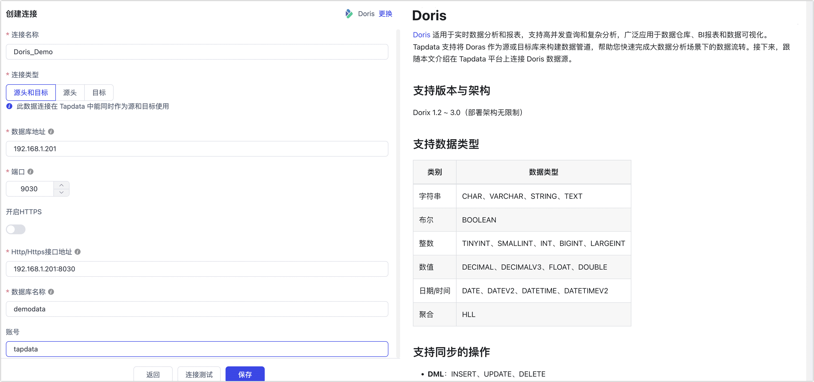

# Doris
import Content1 from '../../reuse-content/_all-features.md';

<Content1 />

[Doris](https://doris.apache.org/) 适用于实时数据分析和报表，支持高并发查询和复杂分析，广泛应用于数据仓库、BI报表和数据可视化。Tapdata 支持将 Doras 作为源或目标库来构建数据管道，帮助您快速完成大数据分析场景下的数据流转。接下来，跟随本文介绍在 Tapdata 平台上连接 Doris 数据源。

```mdx-code-block
import Tabs from '@theme/Tabs';
import TabItem from '@theme/TabItem';
```

## 支持版本与架构

Dorix 1.2 ~ 3.0（部署架构无限制）

## 支持数据类型

| 类别      | 数据类型                                 |
| --------- | ---------------------------------------- |
| 字符串    | CHAR、VARCHAR、STRING、TEXT              |
| 布尔      | BOOLEAN                                  |
| 整数      | TINYINT、SMALLINT、INT、BIGINT、LARGEINT |
| 数值      | DECIMAL、DECIMALV3、FLOAT、DOUBLE        |
| 日期/时间 | DATE、DATEV2、DATETIME、DATETIMEV2       |
| 聚合      | HLL                                      |

## 支持同步的操作

* **DML**：INSERT、UPDATE、DELETE
* **DDL**（仅在作为目标时支持）：ADD COLUMN、CHANGE COLUMN、DROP COLUMN、RENAME COLUMN

:::tip

- 作为源库时，增量数据同步需通过字段轮询的方式实现，且不支持采集 DDL 操作，详见[变更数据捕获（CDC）](../../introduction/change-data-capture-mechanism.md)。
- 作为目标库时，您还可以通过任务节点的高级配置，选择 DML 写入策略：插入冲突场景下是否转为更新。

:::

## 注意事项

* 受限于 Doris 特性，作为同步目标库时应尽量避免频繁的事务性操作（如频繁更新和删除），以免影响写入性能。
* 当前 TapData 仅支持通过 Stream Load 方式写入数据，因此，对于使用**明细模型**或**聚合模型**创建的表，更新和删除操作的支持尚不完整。
* 作为同步目标库时，为提升大批量数据插入的性能，建议根据单条记录的大小，将批次大小配置为 1 万 ~ 10 万条记录，注意避免设置过大以免引发 OOM 问题。
* Doris 作为目标库进行大规模数据入仓时，建议在业务低峰期执行，以避免占用数据库 I/O 资源，影响查询性能。

## 准备工作

1. 登录 Doris 数据库，执行下述格式的命令，创建用于数据同步/开发任务的账号。

   ```sql
   CREATE USER 'username'@'host' IDENTIFIED BY 'password';
   ```

   - **username**：用户名。
   - **password**：密码。
   - **host**：允许该账号登录的主机，百分号（%）表示允许任意主机。

   示例：创建一个名为 tapdata 的账号。

   ```sql
   CREATE USER 'tapdata'@'%' IDENTIFIED BY 'Tap@123456';
   ```

2. 为刚创建的账号授予权限，您也可以基于业务需求设置更精细化的权限控制。

```mdx-code-block
<Tabs className="unique-tabs">
<TabItem value="作为源库">
```
```sql
-- 请根据下述提示更换 catalog_name、database_name 和 username
GRANT SELECT_PRIV ON catalog_name.database_name.* TO 'username'@'%';
```
</TabItem>

<TabItem value="作为目标库">

```sql
-- 请根据下述提示更换 catalog_name、database_name 和 username
GRANT SELECT_PRIV, ALTER_PRIV, CREATE_PRIV, DROP_PRIV, LOAD_PRIV ON catalog_name.database_name.* TO 'username'@'%';
```
</TabItem>
</Tabs>

 

:::tip

请更换上述命令中的信息：
* **catalog_name**：数据目录名称，默认名称为 **internal**，可以通过 [SHOW CATALOGS](https://doris.apache.org/zh-CN/docs/1.2/sql-manual/sql-reference/Show-Statements/SHOW-CATALOGS) 命令查看已创建的数据目录。更多介绍，见[多源数据目录](https://doris.apache.org/zh-CN/docs/1.2/lakehouse/multi-catalog/)。
* **database_name**：要授予权限的数据库名称。
* **username**：用户名。

:::


## 连接 Doris

1. [登录 Tapdata 平台](../../user-guide/log-in.md)。

2. 在左侧导航栏，单击**连接管理**。

3. 单击页面右侧的**创建**。

4. 在弹出的对话框中，搜索并选择 **Doris**。

5. 在跳转到的页面，根据下述说明填写 Doris 的连接信息。

   

    - 基本设置
      - **连接名称**：填写具有业务意义的独有名称。
      - **连接类型**：支持将 Doris 作为源或目标库。
      - **数据库地址**：Doris 的连接地址。
      - **端口**：Doris 的查询服务端口，默认端口为 **9030**。
      - **开启 HTTPS**：选择是否启用无证书的 HTTPS 连接功能。
      - **HTTP/HTTPS 接口地址**：FE 服务的 HTTP/HTTPS 协议访问地址，包含地址和端口信息，默认端口为 **8030**。
      - **数据库名称**：一个连接对应一个数据库，如有多个数据库则需创建多个数据连接。
       - **账号**、**密码**：分别填写数据库的账号和密码。
    - 高级设置
      - **Doris 目录**：Doris 的目录，其层级在数据库之上，如使用默认目录可置空，更多介绍，见[多源数据目录](https://doris.apache.org/zh-CN/docs/1.2/lakehouse/multi-catalog/)。
      - **其他连接参数**：额外的连接参数，默认为空。
      - **时区**：默认为 0 时区，如果更改为其他时区，不带时区的字段（如 DATETIME、DATETIMEV2）会受到影响，而 DATE、DATE2 类型则不会受到影响。
      - **Agent 设置**：默认为**平台自动分配**，您也可以手动指定 Agent。
      - **模型加载时间**：如果数据源中的模型数量少于10,000个，则每小时更新一次模型信息。但如果模型数量超过10,000个，则刷新将在您指定的时间每天进行。
      - **开启心跳表**：当连接类型为源头或目标时，可启用该开关。TapData 会在源库创建 `_tapdata_heartbeat_table` 心跳表，并每 10 秒更新一次（需具备相应权限），用于监测数据源连接与任务的健康状况。心跳任务在数据复制/开发任务启动后自动启动，您可在数据源编辑页面[查看心跳任务](../../case-practices/best-practice/heart-beat-task.md)。

6. 单击页面下方的**连接测试**，提示通过后单击**保存**。

   :::tip

   如提示连接测试失败，请根据页面提示进行修复。

   :::

## 节点高级特性

在配置数据同步/转换任务时，将 Doris 作为目标节点时，为更好满足业务复杂需求，最大化发挥性能，TapData 为其内置更多高级特性能力，您可以基于业务需求配置：


| 配置               | 说明                                                         |
| ------------------ | ------------------------------------------------------------ |
| **键类型**         | 选择建表类型，支持 Unique（默认，主键模型） 、Aggregate（聚合模型）、Duplicate（明细模型），更多介绍，见[数据模型](https://doris.apache.org/zh-CN/docs/table-design/data-model/overview)。<br />当键类型选择为 **Duplicate**，且使用追加模式写入时，由于无更新条件，还需要指定排序字段。 |
| **分区字段**       | 非传统意义上的分区，而是指建表时的 `DISTRIBUTED BY HASH` 分桶键。若手动设置分桶键，将优先使用；未设置则默认选主键或更新条件字段，若都未指定则使用全字段（不推荐）。 |
| **分桶数**         | 创建表时选择分桶数，需基于实际业务情况设置，更多介绍，见[分桶数设计建议](https://doris.apache.org/zh-CN/docs/table-design/data-partition#bucket-%E7%9A%84%E6%95%B0%E9%87%8F%E5%92%8C%E6%95%B0%E6%8D%AE%E9%87%8F%E7%9A%84%E5%BB%BA%E8%AE%AE)。 |
| **表属性**         | 支持基于业务需求，自行指定建表时的[表属性](https://doris.apache.org/zh-CN/docs/sql-manual/sql-statements/Data-Definition-Statements/Create/CREATE-TABLE#properties)。 |
| **写入缓冲区容量** | 默认为 10240 KB，适当调大可提升大批量插入数据的性能，也可以调低以限制内存的占用避免发生 OOM。 |
| **写入格式**       | 支持 JSON（默认）和 CSV 两种格式，JSON 格式相较于 CSV 更安全，适合处理复杂数据类型，但性能略低，可基于数据安全性和性能需求选择。 |

