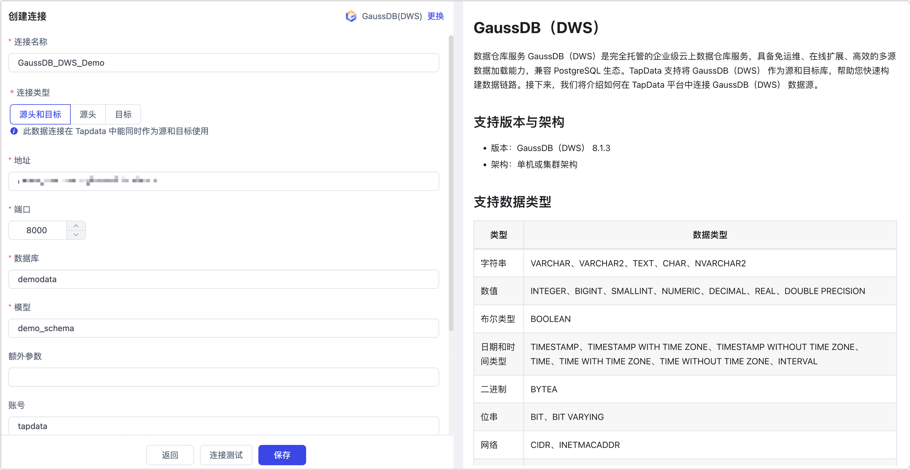

# GaussDB（DWS）

数据仓库服务 GaussDB（DWS）是完全托管的企业级云上数据仓库服务，具备免运维、在线扩展、高效的多源数据加载能力，兼容 PostgreSQL 生态。完成 Agent 部署后，您可以跟随本文教程在 Tapdata 中添加 GaussDB 数据源，后续可将其作为目标库来构建数据管道。

## 支持版本

GaussDB（DWS） 8.1.3

## 注意事项

* 在 GaussDB 中，分布列不允许被修改，如必须要更新，可跳过报错或将其修改为不会更新的列，更多介绍，见[分布键更新解决方案](https://support.huaweicloud.com/trouble-dws/dws_09_0048.html)。
* 如果建表时没有指定分布列，数据会基于不同的情况来存储：
  * 若建表时包含主键/唯一约束，则选取HASH分布，分布列为主键/唯一约束对应的列。
  * 若建表时不包含主键/唯一约束，但存在数据类型支持作分布列的列，则选取 HASH 分布，分布列为第一个数据类型支持作分布列的列。
  * 若建表时不包含主键/唯一约束，也不存在数据类型支持作分布列的列，选取 ROUNDROBIN 分布。
* 如果需要使用分区表，在选择目标表存在处理策略时，推荐保留表结构，否则会由 Tapdata 自动创建普通表。
* 当分区表没有主键或唯一索引时，Tapdata 不支持冲突更新操作。

<b>了解更多分布列和分区表的介绍</b>

* 在 GaussDB 中，分布列是指分布表中用于数据分布的列，它决定了数据在分布式存储中的分布方式并影响查询性能。更多介绍，见[分布列选择最佳实践](https://support.huaweicloud.com/performance-dws/dws_10_0042.html)。
* 分区表就是把逻辑上的一张表根据分区策略分成几张物理块库进行存储，这张逻辑上的表称之为分区表，物理块称之为分区。分区表是一张逻辑表，不存储数据，数据实际是存储在分区上的。当进行条件查询时，系统只会扫描满足条件的分区，避免全表扫描，从而提升查询性能。

## 连接 GaussDB

1. 登录 Tapdata 平台。

2. 在左侧导航栏，单击**连接管理**。

3. 单击页面右侧的**创建**。

4. 在弹出的对话框中，搜索并选择 **GaussDB（DWS）**。

5. 在跳转到的页面，根据下述说明填写 GaussDB（DWS） 的连接信息。

   

    - **连接名称**：填写具有业务意义的独有名称。
    - **连接类型**：仅支持**目标**。
    - **地址**：数据库服务的连接地址，更多介绍，见[获取集群连接地址](https://support.huaweicloud.com/mgtg-dws/dws_01_0033.html)。
    - **端口**：数据库的服务端口。
    - **数据库**：数据库名称，即一个连接对应一个数据库，如有多个数据库则需创建多个数据连接。
    - **模型**：模型名称。
    - **额外参数**：额外的连接参数，默认为空。
    - **账号**、**密码**：分别填写数据库的账号和密码。
    - **时区**：默认为数据库所用的时区，您也可以根据业务需求手动指定。
    - **包含表**：默认为**全部**，您也可以选择自定义并填写包含的表，多个表之间用英文逗号（,）分隔。
    - **排除表**：打开该开关后，可以设定要排除的表，多个表之间用英文逗号（,）分隔。
    - **agent 设置**：默认为**平台自动分配**，您也可以手动指定 Agent。

6. 单击页面下方的**连接测试**，提示通过后单击**保存**。

   :::tip

   如提示连接测试失败，请根据页面提示进行修复。

   :::
