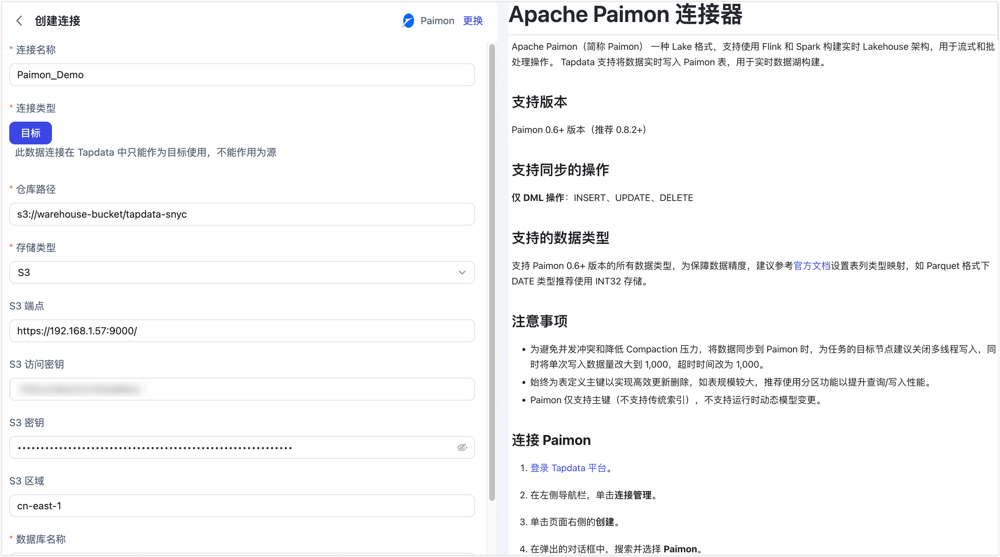

# Paimon

Apache Paimon（简称 Paimon） 一种 Lake 格式，支持使用 Flink 和 Spark 构建实时 Lakehouse 架构，用于流式和批处理操作。 Tapdata 支持将数据实时写入 Paimon 表，用于实时数据湖构建。


```mdx-code-block
import Tabs from '@theme/Tabs';
import TabItem from '@theme/TabItem';
```

## 支持版本

Paimon 0.6+ 版本（推荐 0.8.2+）

## 支持同步的操作

**仅 DML 操作**：INSERT、UPDATE、DELETE

## 支持的数据类型

支持 Paimon 0.6+ 版本的所有数据类型，为保障数据精度，建议参考[官方文档](https://paimon.apache.org/docs/master/concepts/spec/fileformat/)设置表列类型映射，如 Parquet 格式下 DATE 类型推荐使用 INT32 存储。

:::tip

您可以通过增加类型修改的处理节点，来修改目标 Paimon 表的类型，从而实现数据类型的转换。

:::

## 注意事项

- 为避免并发冲突和降低 Compaction 压力，将数据同步到 Paimon 时，为任务的目标节点建议关闭多线程写入，同时将单次写入数据量改大到 1,000，超时时间改为 1,000。
- 始终为表定义主键以实现高效更新删除，如表规模较大，推荐使用分区功能以提升查询/写入性能。
- Paimon 仅支持主键（不支持传统索引），不支持运行时动态模型变更。

## 连接 Paimon

1. 登录 Tapdata 平台。

2. 在左侧导航栏，单击**连接管理**。

3. 单击页面右侧的**创建**。

4. 在弹出的对话框中，搜索并选择 **Paimon**。

5. 在跳转到的页面，根据下述说明填写 Paimon 的连接信息。

   

    - **基本设置**
      - **连接名称**：填写具有业务意义的独有名称。
      - **连接类型**：仅支持将 Paimon 作为目标库。
      - **仓库路径**：Paimon 存储数据的根路径，存储类型为 S3 时，填写示例为 `s3://bucket/path`；存储类型为 HDFS 时，填写示例为 `hdfs://namenode:port/path`；存储类型为 OSS 时，填写示例为 `oss://bucket/path`；存储类型为本地文件系统时，填写示例为 `/local/path/to/warehouse`。
      - **存储类型**：Paimon 支持多种存储类型，包括 S3、HDFS、OSS 和本地文件系统，根据实际场景选择合适的存储类型。
        ```mdx-code-block
        <Tabs className="unique-tabs">
        <TabItem value="S3" default>
        ```
        支持标准 S3 协议的对象存储服务，如 AWS S3、MinIO 等，需要填写下述配置：

        * **S3 端点**：填写 S3 服务端点，包含端口号，例如：`http://192.168.1.57:9000/`
        * **S3 访问密钥**：填写 S3 服务的访问密钥 ID
        * **S3 密钥**：填写 S3 服务的密钥
        * **S3 区域**：填写 S3 服务的区域，例如：`us-east-1`

        </TabItem>
        <TabItem value="HDFS">

        支持 HDFS 协议的文件系统，如 Apache Hadoop HDFS 等，需要填写下述配置：

        * **HDFS 主机**：填写 HDFS 服务的主机名，例如：`192.168.1.57`
        * **HDFS 端口**：填写 HDFS 服务的端口号，例如：`9000`
        * **HDFS 用户**：填写 HDFS 服务的操作用户，例如：`hadoop`

        </TabItem>
        <TabItem value="OSS">

        支持 OSS 协议的对象存储服务，如阿里云 OSS 等，需要填写下述配置：

        * **OSS 端点**：填写 OSS 服务端点，包含端口号，例如：`https://oss-cn-hangzhou.aliyuncs.com`
        * **OSS 访问密钥**：填写 OSS 服务的访问密钥 ID
        * **OSS 密钥**：填写 OSS 服务的密钥

        </TabItem>
        <TabItem value="Local">

        支持本地文件系统，该路径需要在 TapData 服务所在节点可访问。

        </TabItem>
        </Tabs>
      - **数据库名称**：一个连接对应一个数据库，默认为 default，如有多个数据库则需创建多个数据连接。
    - **高级设置**
      - **Agent 设置**：默认为**平台自动分配**，您也可以手动指定 Agent。
      - **模型加载时间**：如果数据源中的模型数量少于10,000个，则每小时更新一次模型信息。但如果模型数量超过10,000个，则刷新将在您指定的时间每天进行。

6. 单击页面下方的**连接测试**，提示通过后单击**保存**。

   :::tip

   如提示连接测试失败，请根据页面提示进行修复。

   :::
