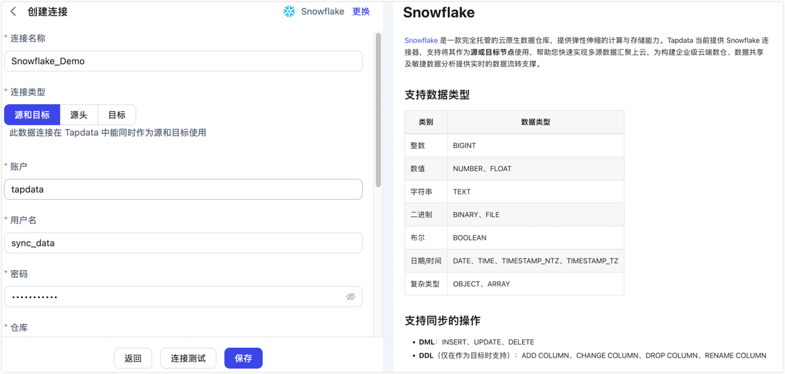

# Snowflake

import Content1 from '../../reuse-content/_all-features.md';

<Content1 />

[Snowflake](https://www.snowflake.com/) 是一款完全托管的云原生数据仓库，提供弹性伸缩的计算与存储能力。Tapdata 当前提供 Snowflake 连接器，支持将其作为**源或目标节点**使用，帮助您快速实现多源数据汇聚上云，为构建企业级云端数仓、数据共享及敏捷数据分析提供实时的数据流转支撑。


```mdx-code-block
import Tabs from '@theme/Tabs';
import TabItem from '@theme/TabItem';
```

## 支持数据类型

| 类别    | 数据类型                         |
| ----- | ---------------------------- |
| 数值    | NUMBER、FLOAT                 |
| 字符串   | TEXT                         |
| 二进制   | BINARY、FILE                  |
| 布尔    | BOOLEAN                      |
| 日期/时间 | DATE、TIME、TIMESTAMP_NTZ、TIMESTAMP_TZ |
| 复杂类型  | OBJECT、ARRAY                 |

## 支持同步的操作

INSERT、UPDATE、DELETE

:::tip

- 作为源库时，增量数据同步需通过字段轮询的方式实现，且不支持采集 DDL 操作，详见[变更数据捕获（CDC）](../../introduction/change-data-capture-mechanism.md)。
- 作为目标库时，您还可以通过任务节点的高级配置，选择 DML 写入策略：插入冲突场景下是否转为更新。

:::

## 准备工作

1. 确保 TapData 所属服务端可访问 Snowflake 服务，即可访问域名：`snowflakecomputing.com`。

2. 登录 Snowflake 数据库，执行下述格式的命令，创建用于数据同步的账号与角色。

   ```sql
   -- 请将 role_name、username、password、warehouse_name、database_name、schema_name 替换为实际值
   CREATE ROLE IF NOT EXISTS <role_name>;

   CREATE USER <username>
      PASSWORD = '<password>'
      DEFAULT_ROLE = <role_name>
      DEFAULT_WAREHOUSE = <warehouse_name>
      DEFAULT_NAMESPACE = <database_name>.<schema_name>
      MUST_CHANGE_PASSWORD = FALSE;

   GRANT ROLE <role_name> TO USER <username>;
   ```

3. 为刚创建的账号授予权限，您也可以基于业务需求设置更精细化的权限控制。

   ```mdx-code-block
   <Tabs className="unique-tabs">
   <TabItem value="作为源库">
   ```

   ```sql
   -- 请根据下述提示替换 warehouse_name、database_name、schema_name、role_name

   -- 授予计算资源、数据库及 Schema 的访问权限
   GRANT USAGE ON WAREHOUSE <warehouse_name> TO ROLE <role_name>;
   GRANT USAGE ON DATABASE <database_name> TO ROLE <role_name>;
   GRANT USAGE ON SCHEMA <database_name>.<schema_name> TO ROLE <role_name>;

   -- 授予对 Schema 下现有表及未来新增表的查询权限
   GRANT SELECT ON ALL TABLES IN SCHEMA <database_name>.<schema_name> TO ROLE <role_name>;
   GRANT SELECT ON FUTURE TABLES IN SCHEMA <database_name>.<schema_name> TO ROLE <role_name>;
   ```
   </TabItem>

   <TabItem value="作为目标库">

   ```sql
   -- 请根据下述提示替换 warehouse_name、database_name、schema_name、role_name
   -- 授予计算资源、数据库及 Schema 的访问权限
   GRANT USAGE ON WAREHOUSE <warehouse_name> TO ROLE <role_name>;
   GRANT USAGE ON DATABASE <database_name> TO ROLE <role_name>;
   GRANT USAGE ON SCHEMA <database_name>.<schema_name> TO ROLE <role_name>;

   -- 授予在 Schema 下创建表的权限（用于同步时自动建表）
   GRANT CREATE TABLE ON SCHEMA <database_name>.<schema_name> TO ROLE <role_name>;

   -- 授予对 Schema 下现有表的 DML 权限（TRUNCATE 用于全量刷新场景）
   GRANT SELECT, INSERT, UPDATE, DELETE, TRUNCATE
      ON ALL TABLES IN SCHEMA <database_name>.<schema_name>
      TO ROLE <role_name>;

   -- 授予对未来新增表的 DML 权限，确保新表无需重新授权即可写入
   GRANT SELECT, INSERT, UPDATE, DELETE, TRUNCATE
      ON FUTURE TABLES IN SCHEMA <database_name>.<schema_name>
      TO ROLE <role_name>;
   ```
   </TabItem>
   </Tabs>

## 连接 Snowflake

1. [登录 TapData 平台](../../user-guide/log-in.md)。

2. 在左侧导航栏，单击**连接管理**。

3. 单击页面右侧的**创建**。

4. 在弹出的对话框中，搜索并选择 **Snowflake**。

5. 在跳转到的页面，根据下述说明填写 Snowflake 的连接信息。

   
   
   - 基本设置
     - **连接名称**：填写具有业务意义的独有名称。
     - **连接类型**：支持将 Snowflake 作为源或目标节点。
     - **账户**：Snowflake 账户标识，获取方式，请参考[Snowflake 官网文档](https://docs.snowflake.com/en/user-guide/admin-account-identifier)。
     - **用户名**：拥有连接权限的 Snowflake 用户名。
     - **密码**：用户名对应的密码。
     - **仓库**：指定连接使用的计算仓库名称。
     - **数据库**：要连接的数据库（Database）名称。
     - **模式**：数据库中的模式（Schema）名称，默认为 **PUBLIC**，如需使用其他模式请手动修改。
     - **角色**：可选项，未填写时默认使用用户在 Snowflake 中配置的默认角色。
     - **时区**：默认为 0 时区，如果更改为其他时区，不带时区的字段会受到影响。
   
   - 高级设置
      - **包含表**：默认为**全部**，您也可以选择自定义并填写包含的表，多个表之间用英文逗号（,）分隔。
      - **排除表**：打开该开关后，可以设定要排除的表，多个表之间用英文逗号（,）分隔。
      - **Agent 设置**：默认为**平台自动分配**，您也可以手动指定 Agent。
      - **模型加载时间**：如果数据源中的模型数量少于10000个，则每小时更新一次模型信息。但如果模型数量超过10,000个，则刷新将在您指定的时间每天进行。 

6. 单击页面下方的**连接测试**，提示通过后单击**保存**。
   
   :::tip
   
   如提示连接测试失败，请根据页面提示进行修复。
   
   :::