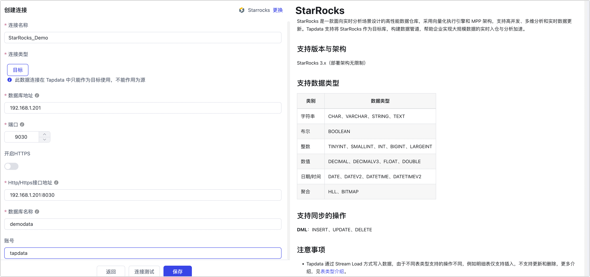

# StarRocks

StarRocks 是一款面向实时分析场景设计的高性能数据仓库，采用向量化执行引擎和 MPP 架构，支持高并发、多维分析和实时数据更新。Tapdata 支持将 StarRocks 作为目标库，构建数据管道，帮助企业实现大规模数据的实时入仓与分析加速。

```mdx-code-block
import Tabs from '@theme/Tabs';
import TabItem from '@theme/TabItem';
```

## 支持版本与架构

StarRocks 3.x（部署架构无限制）

## 支持数据类型

| 类别      | 数据类型                                 |
| --------- | ---------------------------------------- |
| 字符串    | CHAR、VARCHAR、STRING、TEXT              |
| 布尔      | BOOLEAN                                  |
| 整数      | TINYINT、SMALLINT、INT、BIGINT、LARGEINT |
| 数值      | DECIMAL、DECIMALV3、FLOAT、DOUBLE        |
| 日期/时间 | DATE、DATEV2、DATETIME、DATETIMEV2       |
| 聚合      | HLL、BITMAP                              |

## 支持同步的操作

**DML**：INSERT、UPDATE、DELETE

## 注意事项

* Tapdata 通过 Stream Load 方式写入数据，由于不同表类型支持的操作不同，例如明细表仅支持插入，不支持更新和删除，更多介绍，见[表类型介绍](https://docs.mirrorship.cn/zh/docs/table_design/table_types/)。

  :::tip

  不支持自动创建分区表，为表设置分区键、分桶、排序键设置，如有特殊需求，请在同步前手动创建表。

  :::

* 作为同步目标库时应尽量避免频繁的事务性操作（如频繁更新和删除），以免影响写入性能。

* 为提升大批量数据插入的性能，建议在配置数据同步时，根据单条记录的大小，将写入的批次大小配置为 1 万 ~ 10 万条记录，注意避免设置过大以免引发 OOM 问题。

* 进行大规模数据入仓时，建议在业务低峰期执行，以避免占用数据库 I/O 资源，影响查询性能。

  
## 准备工作

1. 登录 StarRocks 数据库，执行下述格式的命令，创建用于数据同步/开发任务的账号。

   ```sql
   CREATE USER 'username'@'host' IDENTIFIED BY 'password';
   ```

   - **username**：用户名。
   - **password**：密码，更多认证方式（如 LDAP），见 [CREATE USER](https://docs.mirrorship.cn/zh/docs/sql-reference/sql-statements/account-management/CREATE_USER)。
   - **host**：允许该账号登录的主机，百分号（%）表示允许任意主机。

   示例：创建一个名为 tapdata 的账号。

   ```sql
   CREATE USER 'tapdata'@'%' IDENTIFIED BY 'Tap@123456';
   ```

2. 为刚创建的账号授予权限，您也可以基于业务需求设置更精细化的权限控制。

```mdx-code-block
<Tabs className="unique-tabs">
<TabItem value="授予指定库权限">
```

```sql
-- 请替换真实的数据库名和用户名
GRANT ALL ON DATABASE your_db_name TO USER your_username;
GRANT ALL ON ALL TABLES IN DATABASE database_name TO USER your_username;
```

</TabItem>

<TabItem value="授予所有库权限">

```sql
-- 请替换真实的用户名
GRANT ALL ON ALL DATABASES TO USER your_username;
GRANT ALL ON ALL TABLES IN ALL DATABASES TO USER your_username;
```

</TabItem>
</Tabs>

:::tip

如果数据库位于非默认的数据目录，您需要执行 `SET CATALOG <catelog_name>;` 之后再执行授权命令，您可以通过 [SHOW CATALOGS](https://docs.starrocks.io/zh/docs/sql-reference/sql-statements/Catalog/SHOW_CATALOGS/) 命令查看已创建的数据目录。更多介绍，见[数据目录](https://docs.mirrorship.cn/zh/docs/data_source/catalog/catalog_overview/)。

:::


## 连接 StarRocks

1. 登录 Tapdata 平台。

2. 在左侧导航栏，单击**连接管理**。

3. 单击页面右侧的**创建**。

4. 在弹出的对话框中，搜索并选择 **StarRocks**。

5. 在跳转到的页面，根据下述说明填写 StarRocks 的连接信息。

   

    - **基本设置**
      - **连接名称**：填写具有业务意义的独有名称。
      - **连接类型**：仅支持将 StarRocks 作为目标库。
      - **数据库地址**：StarRocks 的连接地址。
      - **端口**：StarRocks 的查询服务端口，默认端口为 **9030**。
      - **开启 HTTPS**：选择是否启用无证书的 HTTPS 连接功能。
      - **HTTP/HTTPS 接口地址**：FE 服务的 HTTP/HTTPS 协议访问地址，包含地址和端口，例如 `http://192.168.1.18:8030`。
      - **数据库名称**：一个连接对应一个数据库，如有多个数据库则需创建多个数据连接。
       - **账号**、**密码**：分别填写数据库的账号和密码。
       - **BE 节点数量**：为保障自动建表时设置正确的副本数，TapData 会尝试自动探测（需 StarRocks 数据库管理员权限），如不具备相关权限，则需要手动填写 BE 节点数量。
       - **BE 节点的数量**：为确保建表时副本数设置正确，Tapdata 会尝试自动获取 BE 数量（需管理员权限），如您提供的账号的权限不足，请手动填写节点数。
    - **高级设置**
      - **StarRocks 目录**：StarRocks 的数据目录，其层级在数据库之上，如使用默认目录可置空，更多介绍，见[数据目录](https://docs.mirrorship.cn/zh/docs/data_source/catalog/catalog_overview/)。
      - **其他连接串参数**：额外的连接参数，默认为空。
      - **时间类型的时区**：默认为 0 时区，如果更改为其他时区，不带时区的字段（如 DATETIME、DATETIMEV2）会受到影响，而 DATE、DATE2 类型则不会受到影响。
      - **Agent 设置**：默认为**平台自动分配**，您也可以手动指定 Agent。
      - **模型加载时间**：如果数据源中的模型数量少于10,000个，则每小时更新一次模型信息。但如果模型数量超过10,000个，则刷新将在您指定的时间每天进行。
      - **开启心跳表**：当连接类型为源头或目标时，可启用该开关。TapData 会在源库创建 `_tapdata_heartbeat_table` 心跳表，并每 10 秒更新一次（需具备相应权限），用于监测数据源连接与任务的健康状况。心跳任务在数据复制/开发任务启动后自动启动，您可在数据源编辑页面查看心跳任务。

6. 单击页面下方的**连接测试**，提示通过后单击**保存**。

   :::tip

   如提示连接测试失败，请根据页面提示进行修复。

   :::