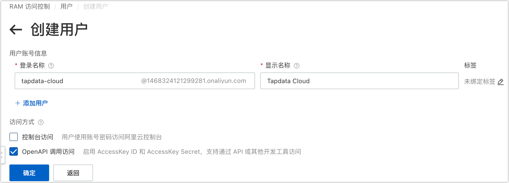

阿里云对象存储 OSS 是一款海量、安全、低成本、高可靠的云存储服务，可提供 99.9999999999%（12个9）的数据持久性，99.995%的数据可用性。当您的文件存放在阿里云 OSS 上时，您需要获取用户的访问密钥、Bucket 名称、文件路径等信息。

1. 登录[阿里云 RAM 访问控制台](https://ram.console.aliyun.com/overview)。

2. 创建用户并获取访问密钥（AccessKey）。

   1. 在左侧导航栏，选择**身份管理** > **用户**。

   2. 单击**创建用户**。

   3. 在跳转到的页面填写登录名称、显示名称，选择 OpenAPI 调用方式并单击**确定**。

      

   4. 用户创建完成后，单击下载 CSV 文件，该文件包含访问密钥（AccessKey）信息。

      :::tip

      为保障信息安全，请妥善保存访问密钥。

      :::

3. 为用户授予权限。

   1. 在跳转到的用户列表页，找到并单击刚刚创建的用户。

   2. 单击权限管理页签，然后单击**新增授权**。

   3. 在右侧弹出的面板中，选择授权范围，然后搜索并选中 **AliyunOSSReadOnlyAccess** 策略。

      

   4. 单击**确定**，然后单击**完成**。

4. 获取 OSS 的访问域名（Endpoint）。

   1. 登录[阿里云 OSS 控制台](https://oss.console.aliyun.com/bucket/)。

   2. 找到并单击目标 Bucket（存储桶）。

   3. 单击左侧的概览标签页，下翻至访问端口即可获取外网访问地址对应的 Endpoint。
   
      
