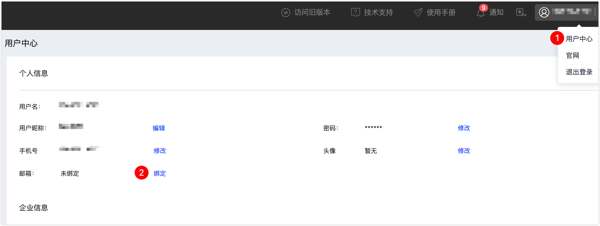

# 获取支持

除查阅 Tapdata 文档外，您还可以通过用户社区和工单系统来获取 Tapdata 产品的原厂技术支持。

## 账号说明

在获取支持前，您需要[注册 Tapdata Cloud](https://auth.tapdata.net/)并前往用户中心绑定邮箱，使用该邮箱来登录用户社区和工单系统。

## 用户社区

您可以访问 Tapdata [用户社区](https://tapdata.zohodesk.com.cn/portal/zh/community/tapdata-support)来获取支持，讨论使用中遇到的问题，提出您宝贵的意见和反馈，Tapdata 技术工程师或社区用户会进行回复。

:::tip

在新开话题讨论前，您也可以搜索是否有类似问题和解决方案，如果您的问题涉及到一些不宜公开的信息，请使用工单系统获取支持。

:::

## 工单系统

如果用户社区中没有找到相似问题及解决方案，您也可以通过[创建工单](https://tapdata.zohodesk.com.cn/portal/zh/newticket)的方式来获取技术支持。

为帮助我们更快识别和响应问题，请参考下述说明填写工单信息。

* **部门**：选择 **Tapdata 技术支持**。
* **产品名称**：选择 **Tapdata 企业版**。
* **版本号**：可在 Tapdata 平台右上角查看，具体操作，见[查看系统版本](user-guide/other-settings/check-version.md)。
* **支持分类**：根据您的问题类型选择，如选择**用户使用问题**。
* **主题**：一句话描述您所遇到的问题，便于识别定位。
* **描述**：填写您遇到的问题，推荐包含下述信息：
  * 任务名称，或链接。
  * 问题现象描述。
  * 相关报错日志信息或截图。
  * 源/目标端数据库的类型和版本。
