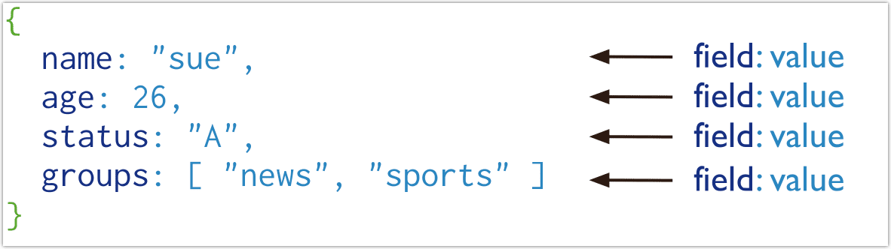

# 文档 (Document）

TapDB 将数据记录存储为 BSON 文档。 BSON 是 JSON 文档的二进制表示形式，但它包含的数据类型比 JSON 更多。有关 BSON 规范，请参阅 bsonspec.org 。另请参阅 BSON 类型。



## 文档结构

TapDB 文档由成对的字段和字段值组成，并具有以下结构：

```sql
{
field1: value1,
field2: value2,
field3: value3,
...
fieldN: valueN
}
```

字段的值可以是任何 BSON 数据类型，包括其他文档、数组和文档数组。例如，以下文档包含不同类型的值：

```sql
var mydoc = {
                _id: ObjectId("5099803df3f4948bd2f98391"),
                name: { first: "Alan", last: "Turing" },
                birth: new Date('Jun 23, 1912'),
                death: new Date('Jun 07, 1954'),
                contribs: [ "Turing machine", "Turing test", "Turingery" ],
                views : NumberLong(1250000)
            }
```

上述字段具有以下数据类型：

- _id包含一个ObjectId。

- name 包含一个嵌入式文档，其中包含字段 first 和 last。

- birth 和 death保存日期类型的值。

- contribs 保存着一个字符串数组。

- views 保存 NumberLong 类型的值。


### 字段名称

字段名称为字符串，文档对字段名称有以下限制：

- 字段名称 _id 保留用作主键；它的值在集合中必须是唯一的、不可变的，并且可以是除数组之外的任何类型。如果 _id 包含子字段，则子字段名称不能以 ($) 符号开头。

- 字段名称不能包含 null 字符。

- 服务器允许存储包含点 (.) 和美元符号 ($) 的字段名称。

- TapDB 5.0改进了对在字段名称中使用 ( $ ) 和 ( . ) 的支持。有一些限制。有关详细信息，请参阅字段名称注意事项。

TapDB 查询语言不支持具有重复字段名称的文档。虽然某些 BSON 构建器可能支持创建具有重复字段名称的 BSON 文档，但即使插入成功或看似成功，也不支持将这些文档插入 TapDB。例如，通过 TapDB 驱动程序插入具有重复字段名称的 BSON 文档可能会导致驱动程序在插入之前静默删除重复值，或者导致插入包含重复字段的无效文档。对任何此类文档的查询都会导致任意且不一致的结果。

## 点符号

TapDB 使用点符号来访问数组的元素和访问嵌入式文档的字段。

### 数组

要通过从零开始的索引位置指定或访问数组的元素，请用点号 (.) 将数组名称和从零开始的索引位置连接，并用引号引起来：

```sql
"<array>.<index>"
```

例如，假设文档中包含以下给定字段：

```sql
{
    ...
    contribs: [ "Turing machine", "Turing test", "Turingery" ],
    ...
}
```

要指定 contribs 数组中的第三个元素，使用点符号 "contribs.2"。

有关查询数组的示例，请参阅：

- 查询数组

- 查询嵌入式文档数组


### 嵌入式文档

要使用点符号指定或访问嵌入式文档的字段，请将嵌入式文档名称与点 ( .) 和字段名称连接起来，并用引号引起来：


```sql
<embedded document>.<field>
```

例如，假设文档中包含以下给定字段：

```sql
{
    ...
    name: { first: "Alan", last: "Turing" },
    contact: { phone: { type: "cell", number: "111-222-3333" } },
    ...
}
```

- 要在 name 字段中指定名为 last 的字段，请使用点符号 "name.last"。

- 要在 contact 字段中指定 phone 文档中的 number，请使用点符号 "contact.phone.number"。

:::tip

分区字段不能使用包含点 (.) 的字段名称。

:::

## 文档限制

文档具有以下属性：

### 文档大小限制

BSON 文档的大小限制为 16 MB。

最大文档大小有助于确保单个文档不会使用过多的 RAM，或者在传输过程中不会使用过多的带宽。要存储大于最大大小的文档，TapDB 提供了 GridFS API。

### 文档字段顺序

与 JavaScript 对象不同，BSON 文档中的字段为有序字段。

#### 查询中的字段顺序

对于查询，字段顺序行为如下：

- 比较文档时，字段排序很重要。例如，在查询中将文档与字段 a 和 b 进行比较时：

  - `{a: 1, b: 1}` 等于 `{a: 1, b: 1}`

  - `{a: 1, b: 1}` 不等于 `{b: 1, a: 1}`

- 为了高效执行查询，查询引擎可能会在查询处理期间对字段重新排序。在其他情况下，处理这些投影操作符时可能会发生字段重新排序： $project 、 $addFields 、 $set和$unset 。

  - 字段重新排序可能发生在中间结果以及通过查询返回的最终结果中。

  - 由于某些操作可能会对字段重新排序，因此对于使用前面列出的投影操作符的查询，您不应依赖于这些查询结果中返回的特定字段排序。

#### 写入操作中的字段顺序

对于写入操作，TapDB 会保留文档字段的顺序，但以下情况除外：

- _id 字段始终是文档中的第一个字段。

- 包含字段名称renaming的更新可能会导致文档中的字段重新排序。

### _id 字段

在 TapDB 中，存储在集合中的每个文档都需要一个唯一的_id字段作为主键。如果插入的文档省略了_id字段，则 TapDB 驱动程序会自动为ObjectId字段生成_id 。

这也适用于通过带有upsert: true 的更新操作插入的文档。

_id 字段具有以下行为和约束：

- 默认情况下，TapDB 在创建集合期间会在 _id 字段上创建唯一索引。

- `_id` 字段始终是文档中的第一个字段。如果在服务器收到的文档中，`_id` 不是第一个字段，则服务器会将该字段移动到开头。

- 如果 _id 包含子字段，则子字段名称不能以 ($) 符号开头。

- _id字段可以包含任何BSON 数据类型的值，数组、正则表达式或未定义除外。

  :::tip
  
  为了确保复制功能正常，请勿在 _id 字段中存储 BSON 正则表达式类型的值。
  
  :::

以下是存储 _id 值的常见选项：

- 使用ObjectId。

- 使用自然唯一标识符（如果可用）。这样可以节省空间并避免附加索引。

- 生成一个自动递增的数字。

- 在应用程序代码中生成 UUID。为了更有效率地将 UUID 值存储在该集合和 _id 索引中，请将 UUID 存储为 BSON BinData 类型的值。

  如果满足以下条件，则 BinData 类型的索引键可以更有效地存储在索引中：

  - 二进制子类型值的范围是 0-7 或 128-135，并且

  - 字节数组的长度为：0, 1, 2, 3, 4, 5, 6, 7, 8, 10, 12, 14, 16, 20, 24 或 32。

- 使用驱动程序的 BSON UUID 工具生成 UUID。请注意，驱动程序实现可能会以不同的方式实现 UUID 序列化和反序列化逻辑，这可能与其他驱动程序不完全兼容。有关 UUID 互操作性的信息，请参阅驱动程序文档。

:::tip

大多数 TapDB 驱动程序客户端将包含 `_id` 字段并生成 ObjectId ，然后再将插入操作发送到 TapDB；但是，如果客户端发送的文档没有 `_id` 字段，则 TapDB 将自动添加 `_id` 字段并生成 ObjectId 。

:::

## 文档结构的其他用途

除定义数据记录外，TapDB 还始终使用这种文档结构，包括但不限于：查询过滤器、更新规范文档和索引规范文档

### 查询筛选器文档

查询筛选器文档指定条件，确定选择哪些记录进行读取、更新和删除操作。

您可以使用 `<field>:<value>` 表达式指定相等条件和查询运算符表达式。

```sql
{
<field1>: <value1>,
<field2>: { <operator>: <value> },
...
}
```

示例请参见：

- 查询文档

- 对嵌入/嵌套文档的查询

- 查询数组

- 查询嵌入式文档数组

### 更新规范文档

更新规范文档使用更新操作符来指定在更新操作期间要对特定字段执行的数据修改。

```sql
{
<operator1>: { <field1>: <value1>, ... },
<operator2>: { <field2>: <value2>, ... },
...
}
```

有关示例，请参阅更新规范。

### 索引规范文档

索引规范文档定义待索引的字段和索引类型：

```sql
{ <field1>: <type1>, <field2>: <type2>, ...  }
```