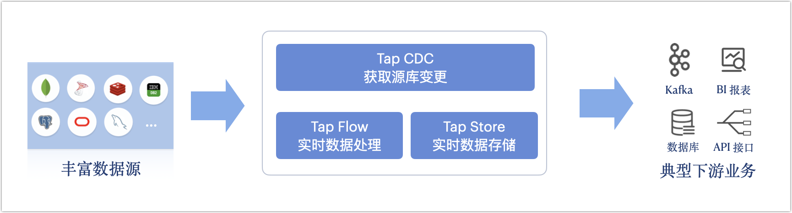

# TapFlow 介绍

import Content from '../reuse-content/_enterprise-and-cloud-features.md';

<Content />

**TapFlow** 是 TapData 实时数据平台 API 开发框架。除了通过[图形化界面](../user-guide/data-development/create-task.md)使用 TapData 产品外，您还可以通过 TapFlow 提供的丰富 API 和命令行工具（Tap Shell），快速实现同构或异构数据源的实时复制及开发任务，满足灵活、自动化的数据集成和流式处理场景，例如构建实时宽表、实时物化视图等。

## 工作原理

TapFlow 典型应用场景如上，数据处理流程主要包括以下步骤：

- **数据采集**：通过 Tap CDC 连接并监控数据源中的更新事件（如新增、更新、删除操作），并将其转化为数据流。
- **数据流处理**：支持用户使用 API 或图形化界面对数据流进行实时处理，包括数据的合并、清洗、转换等复杂操作。
- **数据存储或输出**：将处理后的数据流保存到物化视图中，以支持快速查询和应用服务；或者直接将数据流发送至下游数据库或消息队列（如 Kafka）中，实现数据的快速传递。

