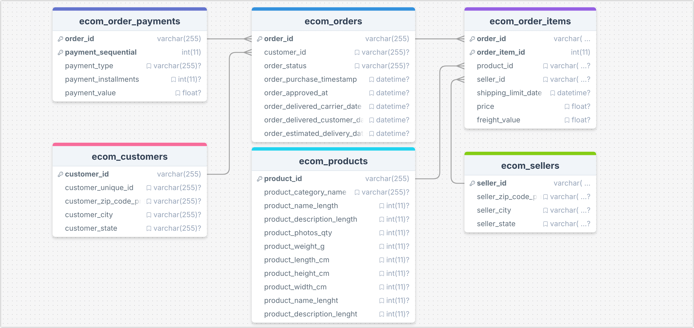
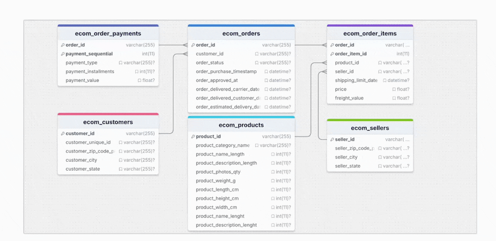

# 基于 TapFlow 构建实时宽表

TapFlow 是一个编程框架，支持实时数据复制、数据处理和物化视图创建。它提供 API、Python SDK 和命令行工具（Tap Shell），便于高效构建和管理数据同步任务。本文将演示如何使用 Tap Shell 和 Python SDK 来构建一个实时宽表，以支持电商应用中的订单信息多表联合的高效查询。

```mdx-code-block
import Tabs from '@theme/Tabs';
import TabItem from '@theme/TabItem';
```

## 背景介绍

随着业务和数据规模的快速增长，某电商企业 **XYZ** 在订单和库存管理上面临挑战。订单数据和库存信息分布在不同数据库表中，运营人员在查询订单详情时需要跨表联查，存在以下痛点：

- **查询延迟高**：订单详情查询依赖复杂的跨表联查，尤其在高峰期时查询性能受到影响。
- **数据不一致**：高并发场景下，多个表之间的同步难以保证，增加了数据不一致的风险。
- **实时性不足**：订单状态或库存发生变化后，系统更新缓慢，用户难以及时获取最新信息。



为了解决这些问题，企业通过 **TapFlow** 构建实时宽表，将订单、客户、支付、产品等数据整合到 MongoDB 中，为高并发的手机端 API 提供支持。具体流程如下：

1. **数据整合**：TapFlow 利用 CDC 技术监控源表中的实时变更，捕获订单、客户、支付等数据的更新并传输至 MongoDB。
2. **宽表生成**：通过 TapFlow 的 Lookup 功能，将多表数据关联整合到订单宽表中，例如将客户信息、产品信息和支付详情嵌入到订单记录中，简化查询操作。
3. **实时更新**：每当源数据发生变化，TapFlow 会将增量更新同步到 MongoDB 宽表中，确保查询内容的实时性。




通过 TapFlow，XYZ 电商企业实现了订单和库存信息的实时同步和快速查询，运营人员能够即时获取最新订单数据，极大提升用户体验。同时，TapFlow 将订单、客户、商品和物流信息整合为宽表存储在 MongoDB 中，以支持高并发的手机端 API 查询需求，降低跨表联查的资源消耗，显著提升查询效率和系统性能。

接下来，我们将介绍如何通过 TapFlow 完成上述需求。

## 准备工作

安装 Tap Shell 并添加 MySQL/MongoDB 数据源，具体操作，见[快速入门](../quick-start.md)。


## 步骤一：构建实时宽表

本案例中，我们通过 Tap Shell 定义的 MySQL 数据源名称为 `MySQL_ECommerce`，MongoDB 数据源名称为 `MongoDB_ECommerce`，接下来，我们将通过命令的形式构建实时宽表。

```mdx-code-block
<Tabs className="unique-tabs">
<TabItem value="基于交互式命令实现" default>
```

1. 执行 `tap` 进入 Tap Shell 命令交互窗口。

2. 指定数据流任务的源表。

   ```python
   # 创建数据流任务对象，并设置主表 "ecom_orders" 作为数据流的起点
   orderFlow = Flow("Order_SingleView_Sync") \
         .read_from("MySQL_ECommerce.ecom_orders");  # 设置 MySQL 源表 ecom_orders
   ```

3. 通过添加 `lookup` 处理节点，实现多表的 LEFT JOIN 关联，每个 `lookup` 命令将从表的数据嵌入到主表的指定路径中，通过 `relation` 参数定义关联键，使 `orderFlow` 数据流包含丰富的订单、客户、支付、商品和卖家信息。

   ```python
   # 将 'ecom_customers' 表作为嵌入的文档，关联到订单表的 customer_id 字段
   orderFlow.lookup("MySQL_ECommerce.ecom_customers", 
                     path="customer_info",                   # MongoDB 中的嵌入路径
                     type="object",                          # 嵌入类型为对象
                     relation=[["customer_id", "customer_id"]]);  # 使用 customer_id 作为关联键
   
   # 将 'ecom_order_payments' 表作为嵌入数组，关联到订单表的 order_id 字段
   orderFlow.lookup("MySQL_ECommerce.ecom_order_payments", 
                     path="order_payments",                  # MongoDB 中的嵌入路径
                     type="array",                           # 嵌入类型为数组
                     relation=[["order_id", "order_id"]]);   # 使用 order_id 作为关联键
   
   # 将 'ecom_order_items' 表作为嵌入数组，关联到订单表的 order_id 字段
   orderFlow.lookup("MySQL_ECommerce.ecom_order_items", 
                     path="order_items",                     # MongoDB 中的嵌入路径
                     type="array",                           # 嵌入类型为数组
                     relation=[["order_id", "order_id"]]);   # 使用 order_id 作为关联键
   
   # 将 'ecom_products' 表作为嵌入对象，关联到 order_items 表的 product_id 字段
   orderFlow.lookup("MySQL_ECommerce.ecom_products", 
                     path="order_items.product",             # 嵌入路径指向 order_items.product
                     type="object",                          # 嵌入类型为对象
                     relation=[["product_id", "order_items.product_id"]]);  # 使用 product_id 作为关联键
   
   # 将 'ecom_sellers' 表作为嵌入对象，关联到 order_items 表的 seller_id 字段
   orderFlow.lookup("MySQL_ECommerce.ecom_sellers", 
                     path="order_items.seller",              # 嵌入路径指向 order_items.seller
                     type="object",                          # 嵌入类型为对象
                     relation=[["seller_id", "order_items.seller_id"]]);  # 使用 seller_id 作为关联键
   ```

4. 将数据流的输出指定为 MongoDB 重名为 `orderSingleView` 的集合，形成一个实时物化视图，包含完整的订单、客户、支付、商品和卖家数据。

   ```python
   # 指定数据写入的目标 MongoDB 集合名称
   orderFlow.write_to("MongoDB_ECommerce.orderSingleView");
   # 保存任务配置
   orderFlow.save()
   ```

5. 执行 `orderFlow.start()` 启动任务，任务启动成功后可通过 status 命令查看任务运行状态，示例如下：

   ```python
   status Order_SingleView_Sync
   job current status is: running, qps is: 3521.2, total rows: 99441, delay is: 332ms 
   ```

6. （可选）进入目标 MongoDB 数据库，查看其数据条目是否和源库一致。

   ```python
   use MongoDB_ECommerce
   count orderSingleView
   ```

</TabItem>
<TabItem value="基于 Python 编程实现">

以下是一个完整的 Python 示例代码，它展示了如何通过 TapFlow 将多个 MySQL 表实时关联生成一个 MongoDB 宽表视图，可通过 `python real_time_order_view.py` 来执行：

- 主表：`ecom_orders`，包含订单基本信息。
- 关联表：`ecom_customers`（客户信息）、`ecom_order_payments`（支付信息）、`ecom_order_items`（商品信息）等。
- 输出：MongoDB 数据库中的 `orderSingleView` 集合，包含完整订单及其关联的客户、支付、商品和卖家信息。

```python title="real-time-wide-table.py"
# 导入 TapFlow 依赖模块
from tapflow.lib import *
from tapflow.cli.cli import init

# 初始化配置信息
init()

# 创建数据流任务
orderFlow = Flow("Order_SingleView_Sync")

# 指定主表 ecom_orders
orderFlow.read_from("MySQL_ECommerce.ecom_orders")

# 关联客户信息表
orderFlow.lookup("MySQL_ECommerce.ecom_customers", 
                 path="customer_info", 
                 type="object", 
                 relation=[["customer_id", "customer_id"]])

# 关联支付信息表
orderFlow.lookup("MySQL_ECommerce.ecom_order_payments", 
                 path="order_payments", 
                 type="array", 
                 relation=[["order_id", "order_id"]])

# 关联订单商品表
orderFlow.lookup("MySQL_ECommerce.ecom_order_items", 
                 path="order_items", 
                 type="array", 
                 relation=[["order_id", "order_id"]])

# 关联商品信息表
orderFlow.lookup("MySQL_ECommerce.ecom_products", 
                 path="order_items.product", 
                 type="object", 
                 relation=[["product_id", "order_items.product_id"]])

# 关联卖家信息表
orderFlow.lookup("MySQL_ECommerce.ecom_sellers", 
                 path="order_items.seller", 
                 type="object", 
                 relation=[["seller_id", "order_items.seller_id"]])

# 指定目标集合
orderFlow.write_to("MongoDB_ECommerce.orderSingleView")

# 保存并启动任务
orderFlow.save()
orderFlow.start()
print("实时宽表任务已启动。")

# 检查任务运行状态
while True:
    status = orderFlow.status()
    if status == "running":
        print(f"任务状态：{status}")
        break
    elif status == "error":
        print("任务启动失败，请检查配置或日志。")
        break
```

程序执行的示例输出如下：

```bash
Flow updated: source added
Flow updated: source added
Flow updated: new table ecom_customers added as child table                          
Flow updated: source added
Flow updated: new table ecom_order_payments added as child table                     
Flow updated: source added
Flow updated: new table ecom_order_items added as child table                        
Flow updated: source added
Flow updated: new table ecom_products added as child table                           
Flow updated: source added
Flow updated: new table ecom_sellers added as child table                            
Flow updated: sink added
实时宽表任务已启动。
任务状态：running
```


</TabItem>
</Tabs>


## 步骤二：实时效果验证

电商公司 **XYZ** 需要处理用户订单，并在系统中追踪每个订单的详细信息。每当用户下单时，订单的基础信息、客户信息、订单项信息、商品信息和卖家信息都需要被记录在数据库中，并在订单完成发货时更新状态。通过 TapFlow，我们可以将这些信息实时同步到 MongoDB，供前端 API 查询，确保用户随时看到最新的订单信息。

接下来，我们通过手动向 MySQL 写入数据的方式来模拟真实业务场景下的数据流转效果。

1. 登录源 MySQL 数据库，执行下述命令模拟用户创建新订单时的情形。

   ```sql
   -- 插入客户信息
   INSERT INTO ecom_customers (customer_id, customer_unique_id, customer_zip_code_prefix, customer_city, customer_state)
   VALUES ('CUST12345', 'UNIQUE_CUST_00123', '10001', 'New York', 'NY');
   
   -- 插入订单信息
   INSERT INTO ecom_orders (order_id, customer_id, order_status, order_purchase_timestamp, order_approved_at, order_estimated_delivery_date)
   VALUES ('ORD789654', 'CUST12345', 'pending', NOW(), NOW(), '2024-11-10');
   
   -- 插入订单项信息（包含商品和卖家信息）
   INSERT INTO ecom_order_items (order_id, order_item_id, product_id, seller_id, shipping_limit_date, price, freight_value)
   VALUES ('ORD789654', 1, 'PROD56789', 'SELL34567', '2024-11-05', 199.99, 15.0);
   
   -- 插入商品信息
   INSERT INTO ecom_products (product_id, product_category_name, product_weight_g, product_length_cm, product_height_cm, product_width_cm)
   VALUES ('PROD56789', 'electronics', 1200, 20, 10, 8);
   
   -- 插入卖家信息
   INSERT INTO ecom_sellers (seller_id, seller_zip_code_prefix, seller_city, seller_state)
   VALUES ('SELL34567', '90001', 'Los Angeles', 'CA');
   
   -- 插入支付信息
   INSERT INTO ecom_order_payments (order_id, payment_sequential, payment_type, payment_installments, payment_value)
   VALUES ('ORD789654', 1, 'credit_card', 1, 199.99);
   ```

   :::tip

   数据插入操作执行完毕后，TapFlow 将自动解析 Binlog 以获取数据实时变动，随后经过任务加工整合并写入至 MongoDB 的`orderSingleView` 集合。

   :::

2. 随后执行下述命令，由于订单变更，更新该订单的的发货、支付和订单数据。

   ```sql
   -- 更新订单状态和发货日期
   UPDATE ecom_orders
   SET order_status = 'shipped', order_delivered_carrier_date = NOW()
   WHERE order_id = 'ORD789654';
   
   -- 更新支付信息，将支付金额增加
   UPDATE ecom_order_payments
   SET payment_value = 220.0, payment_installments = 2
   WHERE order_id = 'ORD789654' AND payment_sequential = 1;
   
   -- 更新订单项信息，比如调整价格和运费
   UPDATE ecom_order_items
   SET price = 210.0, freight_value = 18.0
   WHERE order_id = 'ORD789654' AND order_item_id = 1;
   ```

3. 登录至目标 MongoDB 数据，查看合集中 `order_id` 为 `ORD789654` 的数据，可以看到实时反映了源表的数据变化，同时以嵌套 JSON 结构存储，便于后端 API 快速对接，实现高效的数据查询和展示，显著提升业务响应速度和用户体验。

   ```sql
   # 下述示例中对关键信息高亮展示，省略了关联性较低的数据
   {
     "_id": {
       "$oid": "67262caa09771da27c15c713"
     },
     // highlight-next-line
     "order_id": "ORD789654",		// 新增的订单
     "customer_id": "CUST12345",
     // highlight-next-line
     "order_status": "shipped",	// 更新发货状态
     "order_purchase_timestamp": "2024-11-02T10:20:00.000Z",
     "order_approved_at": "2024-11-02T10:22:00.000Z",
     // highlight-next-line
     "order_delivered_carrier_date": "2024-11-02T18:00:00.000Z",	// 更新发货时间
     "order_estimated_delivery_date": "2024-11-10T00:00:00.000Z",
     "order_payments": [
       {
         "payment_type": "credit_card",
       	// highlight-start
         "payment_installments": 2,	// 支付分期更新
         "payment_value": 220,				// 支付金额更新
       	// highlight-end
         "payment_sequential": 1
       }
     ],
     "order_items": [
       {
         "order_item_id": 1,
       	// highlight-start
         "price": 210,						// 商品价格更新
         "freight_value": 18,		// 运费更新
       	// highlight-end
         "product_id": "PROD56789",
         "shipping_limit_date": "2024-11-05T00:00:00.000Z",
         "seller": {...},
         "product": {...},
         }
       }
     ],
     ...
   }
   ```

   ## 扩展阅读

   [将数据发布为 API](../../user-guide/data-service/create-api-service.md)


