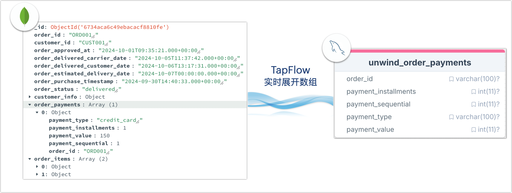

# 基于 TapFlow 展开文档数组至 MySQL

TapFlow 提供强大的数据转换和处理功能，轻松将嵌套数组结构的文档模型转换为关系型表格结构。本文演示如何将 MongoDB 中的嵌套数组字段展开并实时同步至 MySQL 中的平面表，以支持高效的关系型数据库查询和数据分析。

## 需求背景

在现代电商应用中，订单信息通常包含多个支付记录、商品项和客户信息等数据，这些数据通常以嵌套数组的形式存储在 MongoDB 等 NoSQL 数据库中，以简化应用端设计和查询（例如支付记录和商品项）。然而，当需要进行复杂分析或将数据集成到其他关系型系统时，这种结构会带来挑战。

本案例中，某电商公司希望对订单的支付记录进行独立分析，以生成细化的报表和多维度的统计，帮助业务决策。然而，MongoDB 中嵌套数组结构的数据在生成报表时不易展开，不符合关系型数据库的分析方式，导致查询效率低、分析逻辑复杂，示例数据如下：

```json
{
    "_id": ObjectId("66f7e633f72882271da1a2ec"),
    "order_id": "0005a1a1728c9d785b8e2b08b904576c",
    "customer_id": "16150771dfd4776261284213b89c304e",
    "order_status": "delivered",
    "order_payments": [
        {
            "payment_type": "credit_card",
            "payment_installments": 3,
            "payment_value": 157.60,
            "payment_sequential": 1,
            "order_id": "0005a1a1728c9d785b8e2b08b904576c"
        },
        ...
    ],
    ...
}
```

为了更好地支持传统的关系型分析需求，我们提出了一种方案：通过 TapFlow 将 MongoDB 订单集合中的嵌套数组（如支付记录）展开为 MySQL 中的独立行，并实时同步至关系型数据库 MySQL 中。这样既保留了文档模型的灵活性，又使得分析团队可以利用 SQL 查询实现高效的报表生成和数据挖掘，流程如下：



此外，TapFlow 的实时同步能力也保障了 MySQL 中的数据可准确反映最新数据，不仅帮助该企业提升了查询性能，还保证了数据的时效性，使得分析团队能够随时获取最新的业务数据，支持快速而准确的业务决策。

## 准备工作

安装 TapData Shell 并添加 MySQL/MongoDB 数据源，数据源名称分别命名为 MySQL_Demo 和 MongoDB_Demo，具体操作，见[快速入门](../quick-start.md)。

## 操作步骤

接下来，我们介绍如何展开 `order_payments` 数组，同时重命名字段以方便后续的业务识别。

1. 执行 `tap` 进入 TapData Shell 命令交互窗口。

2. 创建名为 `MySQL_to_MongoDB_Order` 的数据流任务，并指定 `order_collection` 集合作为数据源。

   ```python
   # 创建数据流任务对象并设置源表
   Unwind_MongoDB_Array = Flow("MySQL_to_MongoDB_Order") \
          .read_from("MongoDB_Demo.order_collection") 
   ```

3. 执行下述命令，首先使用 `include` 仅保留 `order_payments` 数组字段，然后通过 `flat_unwind` 展开数组，使每个 `order_payments` 项变成单独的行，字段名称间采用下划线（_）分隔。

   ```python
   # 仅保留并展开 order_payments 数组字段
   Unwind_MongoDB_Array.include("order_payments") \
          .flat_unwind(path="order_payments", index_name="", array_elem="OBJECT", joiner="_")
   ```

4. 通过 `rename_fields` 将字段重命名，移除其前缀以符合目标 MySQL 表的字段命名规范。

   ```python
   # 重命名展开后的字段，以简化字段名称
   Unwind_MongoDB_Array.rename_fields({
       "order_payments_order_id": "order_id",
       "order_payments_payment_type": "payment_type",
       "order_payments_payment_installments": "payment_installments",
       "order_payments_payment_value": "payment_value",
       "order_payments_payment_sequential": "payment_sequential"
   })
   ```

5. 指定 MySQL 目标表 `unwind_order_payments`，并设置主键 `order_id` 和 `payment_sequential` 用于数据更新，最后保存当前数据流配置。

   ```python
   # 指定 MySQL 目标表，并保存任务配置
   Unwind_MongoDB_Array.write_to("MySQL_Demo.unwind_order_payments", pk=["order_id", "payment_sequential"]).save()
   ```

   如果目标表不存在，TapFlow 将自动创建。

6. 启动数据流任务。

   ```python
   # 启动数据流任务
   Unwind_MongoDB_Array.start()
   ```

   任务启动后，TapFlow 将持续捕获源 MongoDB 的数据变动，并将数每个 `order_payments` 数组元素实时加工并同步到 MySQL 目标表中。

7. 在任务运行过程中，您可以通过 `status MySQL_to_MongoDB_Order` 命令来查看任务的状态和运行统计信息。

   除此以外，您也可以[通过 Web UI 查看任务状态](../../user-guide/data-development/monitor-task)。

## 测试效果

登录目标 MySQL 数据库，查询 `unwind_order_payments` 表中的数据：

```sql
-- 查看转换后的表数据
SELECT * FROM unwind_order_payments LIMIT 1;
```

结果示例如下，可以看到 `order_payments` 数组的每个元素，已经通过 TapFlow 实时转换为关系型表结构的独立行，仅保留了所需的字段且名称清晰直观，便于后续查询与维护。

```sql
-- 查询结果示例
order_id|payment_installments|payment_sequential|payment_type|payment_value|
--------+--------------------+------------------+------------+-------------+
ORD001  |                   1|                 1|credit_card |          150|
```

