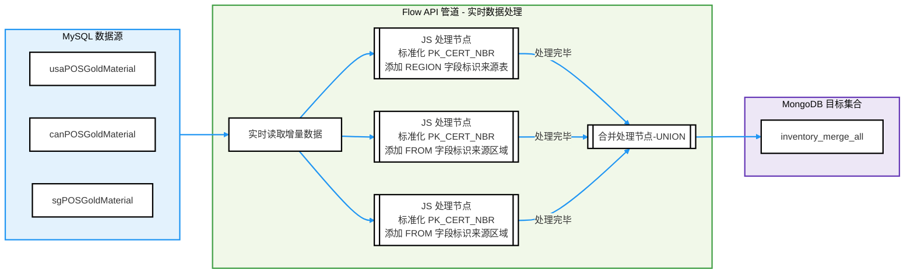

# 基于 TapFlow 实现多表合并与数据标准化

TapFlow 提供了强大的数据转换和整合功能，能够将多个区域的 MySQL 库存表合并为 MongoDB 集合。本案例将演示如何利用 TapFlow 的数据处理能力，将不同区域的 POS（Point of Sale）库存数据表进行标准化，然后合并为 MongoDB 中的统一集合，以支持跨区域的统一库存查询和分析。

```mdx-code-block
import Tabs from '@theme/Tabs';
import TabItem from '@theme/TabItem';
```

## 需求背景

某全球零售公司在加拿大、美国和新加坡分别维护独立的 POS 库存表，用于记录区域仓库的库存情况。这些库存表存储于 MySQL 数据库中，表结构一致，方便区域性的查询与管理。

随着业务规模的扩大，公司需要实现全球库存的统一管理与分析，以支持实时的库存更新和业务决策。例如，跨区域的库存查询、汇总和数据分析对于优化库存策略和提升供应链效率至关重要。然而，由于库存数据分散在不同的表中，缺乏统一的存储与查询方式，面临着以下挑战：

- **跨区域查询困难**：跨区域查询需要多表联接，查询效率低，特别是在需要高并发查询的情况下。
- **数据整合复杂**：各区域库存表的字段格式略有不同，如 `PK_CERT_NBR` 字段，导致难以直接进行统一的分析和报告生成。
- **实时性不足**：无法实时获取所有区域的库存变化，影响决策效率。

为解决这些问题，TapFlow 提供了一种整合方案，通过 `union` 函数实现多表合并，并通过 JavaScript 节点对关键字段标准化处理，最终统一整合至 MongoDB 中，形成支持实时查询的跨区域数据视图，数据流向图如下：



## 准备工作

安装 Tap，并确保已经成功连接 MySQL 和 MongoDB 数据库，详细的安装和配置步骤见[快速入门](../quick-start.md)。

本案例中，为便于阅读，我们假设 3 个区域的的表都存储在同一数据库中，对应的 MySQL 数据源名称为 **MySQL_Demo**，而作为目标库的 MongoDB 数据源名称为 **MongoDB_Demo**。

## 操作步骤

```mdx-code-block
<Tabs className="unique-tabs">
<TabItem value="基于交互式命令实现" default>
```

接下来，我们将展示如何使用 TapFlow 将不同区域的库存数据整合至 MongoDB。此过程中，我们将通过 JavaScript 处理为每条记录添加区域标识字段，并将 `PK_CERT_NBR` 字段值进行标准化处理，从而方便后续的查询和分析。


1. 执行 `tap` 进入 TapShell 命令交互窗口。

2. 为数据流添加 JavaScript 处理逻辑。

   为每条记录添加 `FROM` 字段标识来源区域（如 `usaWarehouse`），并对 `PK_CERT_NBR` 字段进行标准化处理，提取分隔符 `|` 前的内容作为新字段 `NBR`，无分隔符时则直接使用原值，以便统一格式并支持后续的数据分析和整合。如需了解更多，见 [标准 JS](../../appendix/standard-js.md) 和[增强 JS](../../appendix/standard-js.md) 内置函数。

   ```python
   usaWarehouseJs = '''
   record.FROM = 'usaWarehouse';
   if (record.PK_CERT_NBR) {
       var certNbr = record.PK_CERT_NBR;
       record.NBR = certNbr.includes('|') ? certNbr.split('|')[0] : certNbr;
   }
   return record;
   '''
   
   canWarehouseJs = '''
   record.FROM = 'canWarehouse';
   if (record.PK_CERT_NBR) {
       var certNbr = record.PK_CERT_NBR;
       record.NBR = certNbr.includes('|') ? certNbr.split('|')[0] : certNbr;
   }
   return record;
   '''
   
   sgWarehouseJs = '''
   record.FROM = 'sgWarehouse';
   if (record.PK_CERT_NBR) {
       var certNbr = record.PK_CERT_NBR;
       record.NBR = certNbr.includes('|') ? certNbr.split('|')[0] : certNbr;
   }
   return record;
   '''
   ```

3. 创建名为 `Inventory_Merge` 的数据流，使用 `union` 函数将来自不同区域的库存表进行合并，并应用刚刚创建的 JavaScript 逻辑进行字段标准化处理。

   ```python
   # 定义数据流任务，合并区域表并应用 JS 数据处理逻辑
   inventoryFlow = Flow("Inventory_Merge") \
       .read_from("MySQL_Demo.usaPOSGoldMaterial").js(usaWarehouseJs).union() \
       .read_from("MySQL_Demo.canPOSGoldMaterial").js(canWarehouseJs).union() \
       .read_from("MySQL_Demo.sgPOSGoldMaterial").js(sgWarehouseJs).union()
   ```

4. 定义数据写入的目标 MongoDB 集合为 `cn_can_sg_inventory_merge`，同时设置联合主键字段为 `INVNT_ID`、`SEQ_NBR`、`FROM`，以确保在数据写入过程中，每条记录的唯一性和准确性。

   ```python
   # 指定 MongoDB 目标集合并设置主键
   inventoryFlow.write_to("MongoDB_Demo.inventory_merge_all", pk=["INVNT_ID", "SEQ_NBR", "FROM"]).save();
   ```

5. 启动数据流任务。

   ```python
   inventoryFlow.start();
   ```

6. （可选）在任务运行期间，可以通过 `status Inventory_Merge` 查看任务的运行状态与统计信息，或在[Web UI 查看任务状态](../../user-guide/data-development/monitor-task)。

   ```python
   # 任务状态输出示例
   job current status is: running, qps is: 62808.0, total rows: 2998889, delay is: 7006ms 
   ```


</TabItem>
<TabItem value="基于 Python 编程实现">

以下是完整的 Python 示例代码，展示了如何通过 TapFlow 将来自多个区域的库存表合并为一个 MongoDB 集合，同时标准化字段值。运行此脚本可通过 `python inventory_merge.py` 来执行：

- **数据源**：来自 MySQL 的 `usaPOSGoldMaterial`、`canPOSGoldMaterial` 和 `sgPOSGoldMaterial` 三个区域的库存表。
- **处理逻辑**：使用 JavaScript 对字段进行标准化，并通过 `union` 合并不同区域的数据。
- **输出**：处理结果实时保存至 MongoDB 集合 `inventory_merge_all`，包含不同区域合并后的库存记录，每条记录带有区域标识和标准化的 `NBR` 字段。

```python title="inventory_merge.py"
# 导入 TapFlow 依赖模块
from tapflow.lib import *
from tapflow.cli.cli import init

# 初始化配置信息
init()

# 定义 JavaScript 处理逻辑
usaWarehouseJs = '''
record.FROM = 'usaWarehouse';
if (record.PK_CERT_NBR) {
    var certNbr = record.PK_CERT_NBR;
    record.NBR = certNbr.includes('|') ? certNbr.split('|')[0] : certNbr;
}
return record;
'''

canWarehouseJs = '''
record.FROM = 'canWarehouse';
if (record.PK_CERT_NBR) {
    var certNbr = record.PK_CERT_NBR;
    record.NBR = certNbr.includes('|') ? certNbr.split('|')[0] : certNbr;
}
return record;
'''

sgWarehouseJs = '''
record.FROM = 'sgWarehouse';
if (record.PK_CERT_NBR) {
    var certNbr = record.PK_CERT_NBR;
    record.NBR = certNbr.includes('|') ? certNbr.split('|')[0] : certNbr;
}
return record;
'''

# 创建数据流任务并合并区域数据
flow = Flow("Inventory_Merge")
flow.read_from("MySQL_Demo.usaPOSGoldMaterial").js(usaWarehouseJs).union() \
    .read_from("MySQL_Demo.canPOSGoldMaterial").js(canWarehouseJs).union() \
    .read_from("MySQL_Demo.sgPOSGoldMaterial").js(sgWarehouseJs).union()

# 指定 MongoDB 目标集合并设置主键
flow.write_to(
    "MongoDB_Demo.inventory_merge_all", 
    pk=["INVNT_ID", "SEQ_NBR", "FROM"]
)

# 保存任务配置
flow.save()

# 启动数据流任务
flow.start()
print("多表合并数据流任务已启动。")

# 输出任务状态
while True:
    status = flow.status()
    print(f"任务状态：{status}")
    if status == "running":
        print("任务已成功启动并运行中。")
        break
    elif status == "error":
        print("任务启动失败，请检查配置或日志。")
        break
```

程序执行的示例输出如下：

```bash
Flow updated: source added
Flow updated: custom function added
Flow updated: source added
Flow updated: custom function added
Flow updated: source added
Flow updated: custom function added
Flow updated: sink added
多表合并数据流任务已启动。
任务状态：running
任务已成功启动并运行中。
```


</TabItem>
</Tabs>


## 测试效果

为了验证数据整合效果，我们首先登录源 MySQL 数据库，通过以下 SQL 语句统计每个区域库存表的记录数量以及总记录数：

```sql
SELECT COALESCE(table_name, 'Total') AS table_name, COUNT(*) AS record_count
FROM (
    SELECT 'sgPOSGoldMaterial' AS table_name FROM sgPOSGoldMaterial
    UNION ALL
    SELECT 'canPOSGoldMaterial' AS table_name FROM canPOSGoldMaterial
    UNION ALL
    SELECT 'usaPOSGoldMaterial' AS table_name FROM usaPOSGoldMaterial
) AS combined
GROUP BY table_name
WITH ROLLUP;
```

执行结果如下：

```
table_name        | record_count |
------------------+--------------+
canPOSGoldMaterial|       753000 |
sgPOSGoldMaterial |        53446 |
usaPOSGoldMaterial|       693000 |
Total             |      1499446 |
```

随后，我们登录 MongoDB 数据库，执行下述查询语句验证 `inventory_merge_all` 的数据量是否与源表一致，同时检查分区域的记录分布：

```javascript
db.inventory_merge_all.aggregate([
    {
        $facet: {
            // 统计总记录数
            total_count: [
                { $count: "total_records" }
            ],
            // 按来源区域统计记录数
            per_region_count: [
                { $group: { _id: "$FROM", record_count: { $sum: 1 } } }
            ]
        }
    }
]);
```

查询结果示例如下，确认与源表一致：

```json
{
  "total_count": [
    {
      "total_records": 1499446
    }
  ],
  "per_region_count": [
    {
      "_id": "usaWarehouse",
      "record_count": 693000
    },
    {
      "_id": "canWarehouse",
      "record_count": 753000
    },
    {
      "_id": "sgWarehouse",
      "record_count": 53446
    }
  ]
}
```

接下来，我们执行下述查询，验证 `NBR` 字段的标准化效果：

```javascript
db.inventory_merge_all.find(
    { NBR: { $exists: true } },  // 确保标准化的 NBR 字段存在
    { _id: 0, FROM: 1, NBR: 1 } // 仅返回 FROM 和 NBR 字段
).limit(1).pretty();
```

查询结果示例：

```json
{
  "FROM": "canWarehouse",
  "NBR": "P28877"
}
```

通过 TapFlow 的实时同步与整合能力，企业成功将区域库存表整合至 MongoDB，实现了全球库存的统一管理和高效分析。统一的 `FROM` 字段提供了区域来源标识，而 `NBR` 字段的标准化则提升了查询和分析效率。这一解决方案显著优化了跨区域库存管理流程，并为实时决策提供了可靠的数据支持。


