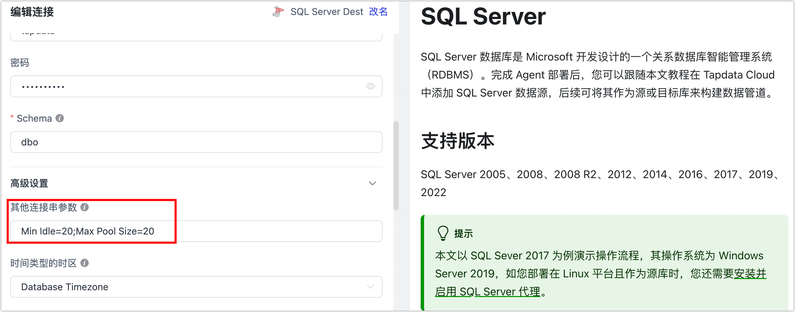

# 任务日志错误与排查指南

本文档旨在为您提供一个详细的指南，用于识别和解决在数据同步任务日志中常见的错误。我们将深入探讨各种常见错误的原因，并提供清晰、实用的排查步骤，帮助用户快速定位并解决问题。


## 查看任务日志

通过[任务的监控页面](../user-guide/data-pipeline/copy-data/monitor-task#error-code)下方，即可查看任务的运行日志，针对常见的问题，Tapdata 已将其固化为特定的[错误码](error-code.md)方便您查找，同时提供了错误原因及其解决方案。如为找到相关错误码，您也可以基于本文提供的日志关键字来进行排查或联系技术支持。

## Oracle

### ORA-01555, snapshot too old

**发生场景**：变更频繁的数据库，在全量同步期间容易发生此报错，导致无法完成全量数据同步。

**解决方案**：调整 Oracle 的 undo size，如暂时无法调整可减少对该库的并发同步任务数并重试。


### ORA-01325, archive log mode must be enabled to build into the logstream

**发生场景**：Oracle 作为源库时，执行增量数据同步期间发生此报错，无法同步增量数据。

**解决方案**：开启 Oracle 的归档日志，具体操作，见 [Oracle 数据源准备工作](../prerequisites/on-prem-databases/oracle.md)。


### ORA-00257

**发生场景**：Oracle 作为源库时，但是没有配置 archive log 归档时间，需要手动清理归档，如果日志已经写满空间，数据库将无法继续对外提供服务。

**解决方案**：步骤如下：

1. 在 sqlplus 中，首先查看 archive log 的存储配置： `show parameter recover；`，假设使用默认的闪回，可以从 **db_recovery_file_dest_size** 的 **size** 看到 配置的大小。

2. 通过下述命令查看过去一段时间，每天的 archived_log 占据的磁盘大小。

   ```sql
   select trunc(COMPLETION_TIME) as "Date",
        count(*) as count,
        (sum(blocks*block_size))/1024/1024/1024 size_g
   from v$archived_log
   group by trunc(COMPLETION_TIME)
   order by 1;
   ```

   

3. 按照预期存储的 archived_log 时间，调整 db_recovery_file_dest_size 的大小。

   例如通过命令: `alter system set db_recovery_file_dest_size=100g;` 来调整

   除此以外，推荐通过脚本的方式，定期清理过期的 archive log。


### ORA-06550 、PLS-00201、ORA-00942

**发生场景**：Oracle 作为源库时，无法执行全量同步或增量同步。

**解决方案**：通常为权限分配问题，授权方法，见 [Oracle 数据源准备工作](../prerequisites/on-prem-databases/oracle.md)。


### ORA-01400: cannot insert NULL into...

**发生场景**：Oracle 作为目标库时，任务日志提示上述错误。

**解决方案**：检查源库的表主键是否存在空值，如存在可调整一下源表数据，或者增加一个行过滤器节点来排除掉空值主键。


## MongoDB

###  Failed to resume change stream, Resume of change stream was not possible, as the resume point may no longer be in the oplog

**发生场景**：MongoDB 作为源库时，任务暂停时间过长或目标库写入相对较慢，导致断点被覆盖，无法继续执行增量数据同步。

**解决方案**：通过 `rs.printReplicationInfo()` 查看 oplog 窗口周期，推荐窗口保持至少 3 天以应对一些突发情况，然后重新启动任务。


## MySQL

### Failed to authenticate to the MySQL database ...

**发生场景**：MySQL 8.0 作为源库，连接测试正常，但任务进入增量数据同步阶段时报错。

**解决方案**：登录 MySQL 数据库，执行 `select host,user,plugin,authentication_string from mysql.user;` 命令查看对应用户的加密方式，发现当前加密方式为 `caching_sah2_password`，执行下述格式的命令，将其修改为 `caching_sah2_password`，随后重启相关任务。

```sql
-- 需要替换您的用户名、密码、登录主机等信息
ALTER USER 'username'@'localhost' IDENTIFIED WITH mysql_native_password BY 'password';
```


### Row size too large

**发生场景**：MySQL 的 VARCHAR 类型的最大长度为 65535 个字节，但是 MySQL 一行记录最大支持 65,535 bytes，所以当多个字段加起来超过 65535 个字节时，引发此类报错。

**解决方案**：调整任务配置，在目标节点中，将 VARCHAR 类型调整为 TEXT 类型 或 BLOB 类型，然后尝试重新启动任务来修复。


## Redis

### Could not get a resource from pool

**发生场景**：针对 Redis 执行连接测试时提示该错误，在 Reids 数据库处于负载非常高的场景可能出现此报错，例如 CPU 或内存占用率很高。

**解决方案**：尝试调大 Redis 数据库的资源分配，随后重新执行连接测试。


## SQL Server

###  HikariPool-1082 - Connection is not available, request timed out after 30000ms

**发生场景**：SQL Server 作为目标库，开启了多线程写入，任务一启动即失败。此场景下，由于启用了多线程写入会导致连接数过多，大量线程同时请求，连接开销过大，引发此类报错。

**解决方案**：选择并执行下述任一方案，完成操作后重置并重启任务。

* 尝试关闭任务里目标节点的多线程写入。

  

* 在连接管理页面中，找到 SQL Server 连接，通过连接串参数设置将连接参数的值调大一些（例如 `Min Idle=20;Max Pool Size=20`），示例如下：

  


### 不能将值 NULL 插入到列...

**发生场景**：SQL Server 作为目标库，手动调整了目标表的非空约束，从而引发此类错误。

**解决方案**：调回目标表的非空约束，然后重启任务。

:::tip

在任务运行阶段，请勿手动调整目标表的结构以免因表结构变更引发任务中断，如需调整表结构，应当开启任务的 DDL 操作同步，并在源库调整表结构，更多介绍，见[处理 DDL 变更](../best-practice/handle-schema-change.md)。

:::

## ElasticSearch

### exception [type=illegal_argument_exception, reason=Limit of total fields [1000] has been exceeded]]

**发生场景**：ElasticSearch 作为目标库，无法执行数据同步，日志提示上述错误。

**解决方案**：有 ElasticSearch 的 mapping 默认存在映射保护，可执行下述格式的命令调大限制，然后重新启动任务。

```bash
# 替换为 ElasticSearch 的服务地址和端口
curl -H "Content-Type: application/json" -XPUT http://esHost:9200/_all/_settings -d '{"index.mapping.total_fields.limit": 5000}'
```


### Preview of field's value: 'NaN']]

**发生场景**：从 MongoDB 同步到 ElasticSearch，任务运行一段时间后，日志提示上述错误后任务停止。

**解决方案**：在 MongoDB 中，同一个字段有NaN和float两种类型，ElasticSearch 无法完成数据写入导致报错，可为任务的链路中增加一个 [JS 处理节点](../user-guide/data-pipeline/data-development/process-node#js-process)，内容为 `MapUtils.removeNullValue(record);`，随后启重新启动任务。