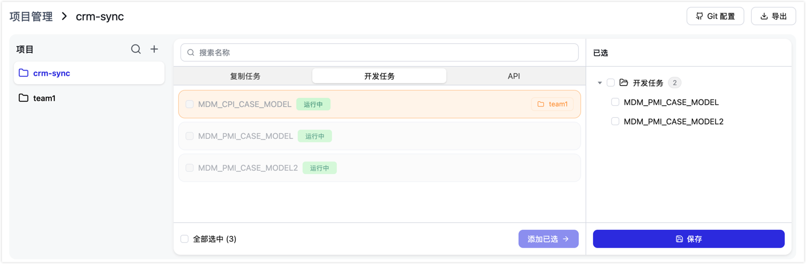
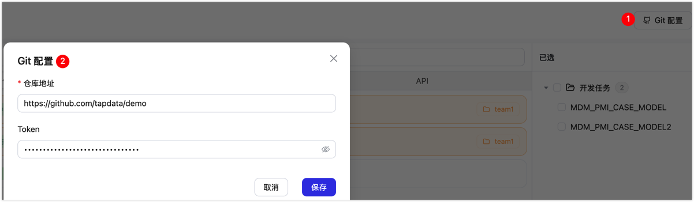
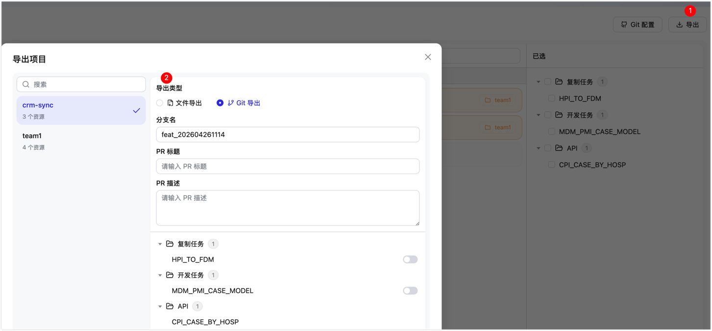

# 创建项目并部署

工程师在完成 TapData 连接和任务配置后，可通过本文的步骤将配置打包为项目、导出并部署到目标环境，支持通过 GitHub Actions 自动触发部署或手动触发部署。

:::tip
本文同时介绍自动化部署和手动导入导出两种使用方式。如果您计划通过 GitHub 和 GitHub Actions 实现自动化流转，可结合阅读[搭建自动化部署流水线](setup-pipeline.md)；如果当前仅需手动导入导出，继续阅读本文并参考文末的“附录：手动导入配置”即可。
:::

## 场景说明

本文以一个典型的数据集成场景为例，团队需要将 Oracle 源库的数据实时同步至 Doris 数据仓库，构建实时数仓链路。该团队已在开发环境完成了宽表同步任务和对外 API 的配置验证。现在需要将这套配置迁移到系统集成测试（SIT）环境进行验证，最终发布到生产环境。

以下步骤将完整演示从创建项目、导出配置，到自动部署、手动发布的全流程。

:::tip
为保障各环境的任务配置可通过连接名称引用数据源，推荐各环境的连接名称保持一致，部署时系统根据连接名从 GitHub Secrets / Variables 匹配并注入该环境的真实地址和密码。
:::

## 步骤一：创建项目并选择资源

将本团队的任务和 API 打包为一个项目，作为后续导出和部署的基本单元。

1. [登录 TapData 管理平台](../../log-in.md)，在左侧导航栏选择**高级设置 → 项目管理**。
2. 点击左侧面板顶部的 **+** 新建项目，填写项目名称（本例填入 `dw-pipeline`，建议与 GitHub 租户仓库名保持一致）。
3. 在中间面板通过标签切换查看**复制任务**、**开发任务**或 **API**，勾选 `CRM_TO_DW`、`ORDER_TO_DW` 和 `customer-api`，点击**添加已选 →** 移入右侧已选列表。

   

   :::tip
   选择任务或 API 时，系统会自动识别并包含其所依赖的数据连接（本例中会自动带入 `oracle-source` 和 `doris-target`），无需手动添加。
   :::
4. 点击**保存**，完成项目创建。

## 步骤二：关联 Git 仓库

将项目与 GitHub 租户仓库关联，后续导出时配置文件可直接推送到仓库并创建 PR，无需手动下载上传。

1. 点击页面右上角的 **Git 配置**。
2. 在弹出的对话框中填写 GitHub 租户仓库的 URL 和 Personal Access Token。

   
3. 点击**保存**。

:::tip
如暂不集成 GitHub，可跳过此步骤，直接进入[步骤三](#步骤三导出配置)，选择手动下载文件的方式导入。
:::

## 步骤三：导出配置

将当前开发环境的项目配置导出，提交到 GitHub 仓库，为后续各环境的部署做准备。

1. 在项目管理页面，点击右上角**导出**，在弹出的导出对话框中，左侧选择要导出的项目。
2. 在右侧选择**导出类型**：

   
   - **Git 导出**（已关联 Git 仓库时可用）：配置文件直接推送到 GitHub 仓库并创建 PR。填写以下信息：
     | 字段    | 说明                                 |
     | ----- | ---------------------------------- |
     | 分支名   | 系统自动生成，以 `feat_` 开头，包含当前时间戳，也可手动修改 |
     | PR 标题 | 简要描述本次变更内容，便于 Review 时识别           |
     | PR 描述 | 详细说明变更原因和影响范围（可选）                  |
   - **文件导出**：将配置打包为压缩包文件下载到本地，适用于未配置 Git 集成的场景，后续通过手动导入完成部署（见[附录：手动导入配置](#附录手动导入配置)）。
3. 在资源列表中确认本次导出的任务和 API，确认无误后点击**确认导出**，完成提交。

   :::tip
   导出时连接信息默认脱敏，数据库密码等敏感字段不会写入配置文件。如目标环境导入后需要任务重新全量同步（如新增源表、变更主键），在此处开启**重跑**；常规变更保持默认（不重跑），任务从上次断点继续，对业务影响最小。
   :::

<details>
<summary>导出文件结构说明</summary>

导出的配置以目录形式组织（Git 导出时即为仓库中的文件夹，文件导出时打包为 tar 文件），结构如下：

```
{项目名}_tapdata_export/
├── GroupInfo.json          # 项目元数据：项目名称、关联 Git 仓库、资源清单
├── Connection/             # 连接配置（自动包含所有任务和 API 依赖的连接）
│   ├── {id}_Connection_Config.json    # 连接参数（账号密码等敏感字段已脱敏）
│   └── {id}_Connection_Metadata.json # 连接的表结构元数据
├── Task/                   # 任务配置
│   ├── {id}_MigrateTask.json          # 复制任务
│   └── {id}_SyncTask.json             # 开发任务
├── API/                    # API 配置
│   ├── {id}_Module.json               # API 定义（路径、字段、查询逻辑）
│   └── MetadataDefinition.json
└── User/                   # 用户与角色信息（用于目标环境还原操作人身份）
    ├── Users.json
    ├── Roles.json
    ├── RoleMappings.json
    └── UserIdEmailMap.json
```

**说明：**

- **连接数量**：Connection 目录下的连接由系统根据任务和 API 的依赖关系自动识别并导出，无需手动选择。
- **敏感信息脱敏**：连接的账号、密码等凭据字段在导出时自动清空。如采用自动化部署时，系统会从 GitHub Secrets / Variables 中获取该环境的真实凭据注入；采用手动导入时，则需手动更新连接信息。
- **用户数据**：User 目录包含操作人的账号和角色信息，用于在目标环境建立对应的用户上下文；密码以哈希形式存储，不含明文。

</details>

## 步骤四：（可选）合并 PR，自动部署到开发验证环境

如已配置开发验证环境（`dev`），可在 GitHub 侧合并 PR 后自动部署，提前验证配置文件是否能成功导入。若仅规划测试和生产两套环境，可跳过开发验证阶段，并按实际流程调整租户仓库的部署 Workflow。

1. 进入 GitHub 租户仓库，打开刚创建的 Pull Request，Review 配置文件内容无误后点击 **Merge**。
2. PR 合并触发 GitHub Actions `TapData Deploy` Workflow，自动将配置部署到开发验证环境。
3. 如预览结果显示连接、任务或 API 有变更，在 Actions 页面完成 `deploy` 审批，审批通过后继续导入资源。
4. 部署完成后，登录开发验证环境 TapData 管理平台，确认 `CRM_TO_DW`、`ORDER_TO_DW` 任务和 `customer-api` 已正确导入，连接测试通过。

## 步骤五：创建 Tag，自动部署到系统集成测试环境

配置变更确认可发布到测试环境后，手动打一个 Git Tag，触发系统集成测试（SIT）环境的自动部署。

```bash
git tag v1.0.0
git push origin v1.0.0
```

Tag 推送后，GitHub Actions 自动触发系统集成测试环境的部署流程。如预览结果显示连接、任务或 API 有变更，同样需要通过 `deploy` 审批后继续导入资源。部署完成后，在系统集成测试环境完成业务验证（功能正确性、数据量、同步延迟等），确认无问题后进入下一步。

## 步骤六：手动触发，发布到生产环境

系统集成测试验证通过后，手动触发生产部署，指定与测试环境相同的 Tag，确保生产环境部署的是同一版本配置。官方租户模板的手动发布选项默认包含 `dev`、`sit` 和 `lpt`；如需发布到生产环境 `prod`，先在租户仓库 Workflow 中补充该选项。若企业还有性能验证或用户验收流程，可先按同样方式发布到 `lpt` 或 `aat`。

1. 进入 GitHub 租户仓库 → **Actions** → 选择 `TapData Deploy`。
2. 点击 **Run workflow**，**Branch** 选择 Tag 名（如 `v1.0.0`），**Target environment** 选择生产环境 `prod`；如需先发布到性能验证或用户验收环境，也可选择已配置的 `lpt` 或 `aat`。
3. 点击 **Run workflow**。如预览结果显示连接、任务或 API 有变更，在 Actions 页面完成 `deploy` 审批后继续部署。
4. 部署完成后，登录目标环境验证任务状态和 API 可用性，确认无误后正式上线。

## 回滚

若部署至任一环境后，发现不符合预期（如任务状态异常），可选择回滚到上一个稳定版本：

1. 进入 GitHub 租户仓库 → **Actions** → 选择 `TapData Rollback`。
2. 点击 **Run workflow**，填写目标环境（如 `prod`）和要回滚到的 Tag（如 `v0.9.0`）。
3. 回滚流程自动停止当前任务、清理现有配置，并从目标 Tag 重新导入。
4. 完成后登录目标环境验证，确认无误后手动启动任务。

回滚只影响指定的目标环境，其他环境不受干扰。

## 常见问题

**Q：项目导入的规则是什么？**

无论是自动部署还是手动导入，目标环境中已有的连接、任务和 API 会按导入内容更新；如无变化，则保持不变；目标环境中不存在的资源会自动创建。采用 GitHub 集成自动部署时，新增连接的真实地址、账号和密码会按连接名称从对应 Environment 的 Secrets / Variables 注入；采用手动导入时，连接凭据不会自动注入，导入后需要您在目标环境中手动补全或调整。

**Q：提示 `Could not find reusable workflow`？**

- 检查 Worker 仓库可见性是否为 `Internal`。
- 检查租户仓库 Workflow 中的 Worker 仓库路径是否已替换为真实值。

**Q：部署成功了，但数据库密码没有注入成功？**

- 检查连接凭据是否配置在对应 Environment 的 Secrets / Variables 中，而不是仓库级 Secrets 中。
- 检查变量名称是否与 TapData 中的连接名称严格对应。

**Q：执行导入脚本时报错？**

- 检查 `{ENV}_TAPDATA_ACCESS_CODE` 是否配置正确且仍然有效。
- 查看 GitHub Actions 执行日志中 TapData API 返回的具体错误信息，再进一步定位问题。


## 附录：手动导入配置

适用于未配置 GitHub 集成，或需要直接在目标环境导入某个版本配置的场景。

1. 在**高级设置 → 导出/导入**页面，点击**导入**。
2. 上传从开发环境导出的压缩包文件。
3. 选择冲突处理策略（跳过 / 更新已存在的配置）。
4. 点击**开始导入**，系统校验文件格式，并显示导入预览（涉及哪些连接、任务、API）。
5. 确认无误后执行导入，查看导入结果（成功 / 失败明细）。
6. 导入完成后，登录目标环境 TapData 管理平台，补充或调整连接的真实地址、账号和密码等信息，然后确认数据库连接、任务状态和 API 可用性，确认无误后正式启动任务。
