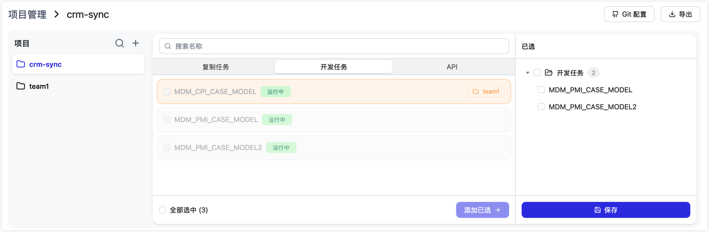
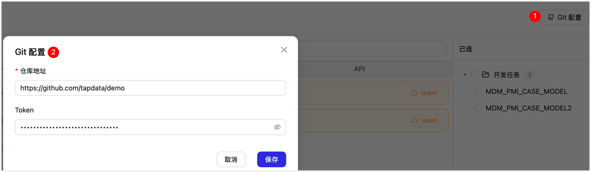
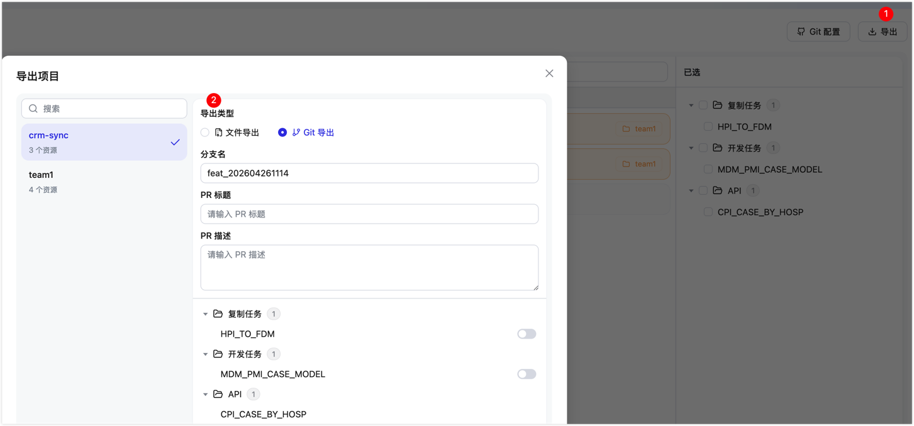
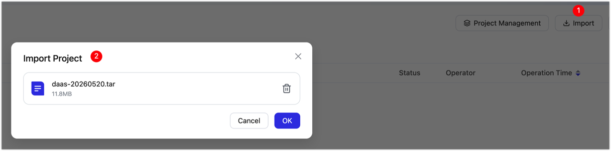

# 创建项目并部署

工程师在完成 TapData 连接和任务配置后，可通过本文的步骤将配置打包为项目、导出并部署到目标环境，支持通过 GitHub Actions 自动触发部署或手动触发部署。

:::tip
本文同时介绍自动化部署和手动导入导出两种使用方式。如果您计划通过 GitHub 和 GitHub Actions 实现自动化流转，可结合阅读[搭建自动化部署流水线](setup-pipeline.md)；如果当前仅需手动导入导出，继续阅读本文并参考文末的附录：手动导入配置即可。
:::

## 场景说明

本文以一个典型的数据集成场景为例，团队需要将 Oracle 源库的数据实时同步至 Doris 数据仓库，构建实时数仓链路。该团队已在开发环境完成了宽表同步任务和对外 API 的配置验证，现在需要将这套配置迁移到测试或验收环境进行验证，最终发布到生产环境。

以下步骤将完整演示从创建项目、导出配置，到自动部署、手动发布的全流程。

:::tip
为保障各环境的任务配置可通过连接名称引用数据源，推荐各环境的连接名称保持一致，并使用字母、数字和下划线命名。部署时系统根据连接名从 GitHub Secrets / Variables 匹配并注入该环境的真实地址和密码。
:::

## 步骤一：创建项目并选择资源

将本团队的任务和 API 打包为一个项目，作为后续导出和部署的基本单元。

1. [登录 TapData 管理平台](../../log-in.md)，在左侧导航栏选择**高级设置 → 项目管理**。
2. 点击左侧面板顶部的 **+** 新建项目，填写项目名称（本例填入 `dw-pipeline`，建议与 GitHub 租户仓库名保持一致）。
3. 在中间面板通过标签切换查看**复制任务**、**开发任务**或 **API**，勾选 `CRM_TO_DW`、`ORDER_TO_DW` 和 `customer-api`，点击**添加已选 →** 移入右侧已选列表。

   

   :::tip 依赖连接与服务索引提示
   - **依赖连接自动带入**：选择任务或 API 时，系统会自动识别并包含其所依赖的数据连接（本例中会自动带入 `oracle_source` 和 `doris_target`），无需手动添加。
   - **服务索引纳管**：如果项目包含数据服务 API，且希望目标环境自动创建 API 相关的 MongoDB 服务索引，请在源环境进入对应 API 的**服务索引**配置页面，点击加载索引并勾选需要管理的目标索引。只有主动勾选纳管的索引声明，才会随项目导出并在自动化部署时生效。目标数据库账号还需要具备创建索引的权限；如权限不足，请由 DBA 根据部署提示手动创建。
   :::
4. 点击**保存**，完成项目创建。

## 步骤二：关联 Git 仓库

:::tip
如暂不集成 GitHub，可跳过此步骤，直接进入[步骤三](#步骤三导出配置)，选择手动下载文件的方式导入。若使用 Git 导出，请确认填写的是可推送的仓库地址，且 Personal Access Token 对租户仓库具备写入内容和创建 Pull Request 的权限。
:::

将项目与 GitHub 租户仓库关联，后续导出时配置文件可直接推送到仓库并创建 PR，无需手动下载上传。

1. 点击页面右上角的 **Git 配置**。
2. 在弹出的对话框中填写 GitHub 租户仓库的 URL 和 Personal Access Token。

   
3. 点击**保存**。


## 步骤三：导出配置

将当前开发环境的项目配置导出，提交到 GitHub 仓库，为后续各环境的部署做准备。

1. 在项目管理页面，点击右上角**导出**，在弹出的导出对话框中，左侧选择要导出的项目。
2. 在右侧选择**导出类型**：

   
   - **Git 导出**（已关联 Git 仓库时可用）：配置文件直接推送到 GitHub 仓库并创建 PR。填写以下信息：
     | 字段    | 说明                                 |
     | ----- | ---------------------------------- |
     | 分支名   | 系统自动生成，以 `feat_` 开头，包含当前时间戳，也可手动修改 |
     | PR 标题 | 简要描述本次变更内容，便于 Review 时识别           |
     | PR 描述 | 详细说明变更原因和影响范围（可选）                  |
   - **文件导出**：将配置打包为压缩包文件下载到本地，适用于未配置 Git 集成的场景，后续通过手动导入完成部署（见[附录：手动导入配置](#附录手动导入配置)）。
3. 在资源列表中确认本次导出的任务和 API，确认无误后点击**确认导出**，完成提交。

   :::tip 导出安全脱敏与全量重跑策略
   - **脱敏机制**：采用 **Git 导出** 时，系统会强制对数据库密码、连接串等敏感凭据执行彻底脱敏，确保敏感信息绝不上代码库，并在后续部署时通过 GitHub Environment 自动注入；采用**文件导出**时，保留完整配置，便于离线手动迁移。
   - **全量重跑**：如目标环境导入后需要任务重新全量同步（如新增源表、变更主键），在此处开启**重跑**；常规变更保持默认（不重跑），任务从上次断点继续，对业务影响最小。
   :::

<details>
<summary>导出文件结构说明</summary>

导出的配置以目录形式组织（Git 导出时即为仓库中的文件夹，文件导出时打包为 tar 文件），结构如下：

```
{项目名}_tapdata_export/
├── GroupInfo.json          # 项目元数据：项目名称、关联 Git 仓库、资源清单
├── Connection/             # 连接配置（自动包含所有任务和 API 依赖的连接）
│   ├── {id}_Connection_Config.json    # 连接参数（Git 导出时已脱敏；文件导出可能包含敏感信息）
│   └── {id}_Connection_Metadata.json # 连接的表结构元数据
├── Task/                   # 任务配置
│   ├── {id}_MigrateTask.json          # 复制任务
│   └── {id}_SyncTask.json             # 开发任务
├── API/                    # API 配置
│   ├── {id}_Module.json               # API 定义（路径、字段、查询逻辑）
│   └── MetadataDefinition.json
└── User/                   # 用户与角色信息（用于目标环境还原操作人身份）
    ├── Users.json
    ├── Roles.json
    ├── RoleMappings.json
    └── UserIdEmailMap.json
```

**说明：**

- **连接数量**：Connection 目录下的连接由系统根据任务和 API 的依赖关系自动识别并导出，无需手动选择。
- **敏感信息处理**：Git 导出会自动清空连接的账号、密码等凭据字段；自动化部署时，系统会从 GitHub Secrets / Variables 中获取该环境的真实凭据注入。文件导出保留完整配置，导出的压缩包可能包含敏感信息，应妥善保管；采用手动导入时，可按目标环境需要更新连接信息。
- **用户数据**：User 目录包含操作人的账号和角色信息，用于在目标环境建立对应的用户上下文；密码以哈希形式存储，不含明文。

</details>

## 步骤四：（可选）合并 PR，自动部署到开发验证环境

如已配置开发验证环境（`dev`），可在 GitHub 侧合并 PR 后自动部署，提前验证配置文件是否能成功导入。若仅规划测试和生产两套环境，可跳过开发验证阶段，并按实际流程调整租户仓库的部署 Workflow。

1. 进入 GitHub 租户仓库，打开刚创建的 Pull Request，Review 配置文件内容无误后点击 **Merge**。
2. PR 合并触发 GitHub Actions `TapData Deploy` Workflow，自动将配置部署到开发验证环境。
3. 如预览结果显示连接、任务或 API 有变更，在 Actions 页面完成 `deploy` 审批，审批通过后继续导入资源。

   <details>
   <summary>展开查看：部署预览报告（Step Summary）审查要点</summary>

   流水线在运行记录的 **Summary** 页面输出结构化的增删改（`➕ Add` / `✏️ Update` / `🗑️ Delete`）预览报告，重点关注以下审查要点：

   - **数据连接（Connections）**：核对连接参数变动，确保目标环境凭据与地址匹配。
   - **复制 / 开发任务（Tasks）**：支持查看 DAG 算子节点与连线的增删改细节（含具体参数变更前后的 `From` / `To` 值）。
   - **数据服务 API（APIs）**：核对接口路径与暴露字段；若仅修改了服务索引配置，会明确标记 `(serving-index declarations only)`，提示接口契约未变。
   - **服务索引独立审核（Serving Indexes）**：独立列出计划创建的 MongoDB 服务索引名称、字段与升降序方向。目标数据库账号无创建索引权限时，可由 DBA 根据报告中的 `createIndex` 命令手动创建；以部署后的导入结果为准。注意：若关联同步任务配置了“清空目标表”（`dropTable` 模式），重跑该任务会连带清空刚刚创建好的服务索引。
   - **孤儿索引告警（Orphan indexes）**：提示目标集合中存在、但未被任何 API 声明的冗余索引（如历史回滚残留），避免写入放大并防止触及 MongoDB 64 索引配额上限，需由 DBA 手动核对清理。

   </details>

4. 部署完成后，登录开发验证环境 TapData 管理平台，确认 `CRM_TO_DW`、`ORDER_TO_DW` 任务和 `customer-api` 已正确导入，连接测试通过。

## 步骤五：创建 Tag，自动部署到测试或验收环境

配置变更确认可发布到下一个验证环境后，手动打一个 Git Tag。官方模板默认将 Tag 部署到测试/验收环境。

```bash
git tag v1.0.0
git push origin v1.0.0
```

Tag 推送后，GitHub Actions 自动触发对应验证环境的部署流程。如预览结果显示连接、任务或 API 有变更，同样需要通过 `deploy` 审批后继续导入资源。部署完成后，在测试或验收环境完成业务验证（功能正确性、数据量、同步延迟等），确认无问题后进入下一步。

## 步骤六：手动触发，发布到生产环境

测试或验收环境验证通过后，手动触发生产部署，指定与验证环境相同的 Tag，确保生产环境部署的是同一版本配置。官方租户模板的手动发布选项默认未包含 `prod`；如需发布到生产环境，先在租户仓库 Workflow 中补充该选项。

1. 进入 GitHub 租户仓库 → **Actions** → 选择 `TapData Deploy`。
2. 点击 **Run workflow**，**Branch** 选择 Tag 名（如 `v1.0.0`），**Target environment** 选择生产环境 `prod`。
3. 点击 **Run workflow**。如预览结果显示连接、任务或 API 有变更，在 Actions 页面完成 `deploy` 审批后继续部署。
4. 部署完成后，登录目标环境验证任务状态和 API 可用性，确认无误后正式上线。

## 回滚

若部署至任一环境后，发现不符合预期（如任务状态异常），可选择回滚到上一个稳定版本：

1. 进入 GitHub 租户仓库 → **Actions** → 选择 `TapData Rollback`。
2. 点击 **Run workflow**，填写目标环境（如 `prod`）和要回滚到的 Tag（如 `v0.9.0`）。
3. 回滚流程自动停止当前任务、清理现有配置，并从目标 Tag 重新导入。
4. 完成后登录目标环境验证，确认无误后手动启动任务。

回滚只影响指定的目标环境，其他环境不受干扰。

:::caution 回滚时的索引与数据库名说明
- **索引安全保护（只增不删）**：出于生产数据安全与系统稳定性考虑，**回滚流程仅还原任务和 API 配置，绝不会在目标数据库中自动删除已创建的索引**，避免因误删生产索引导致数据库性能剧烈波动。因此，回滚后留存的未用索引会在下一次部署预览中提示为“孤儿索引（Orphan indexes）”，可由 DBA 评估确认后在数据库中手动执行删除。
- **数据库名保持当前变量设置**：若您使用了 DSN 格式配置连接凭据，回滚操作仅回退项目本身的配置与代码逻辑，数据连接所指向的数据库名依然由当前 GitHub Environment 中的 `_DSN` 变量决定，不会随 Git Tag 的回退而自动改变。
:::

## 常见问题

**Q：项目导入的规则是什么？**

无论是自动部署还是手动导入，目标环境中已有的连接、任务和 API 会按导入内容更新；如无变化，则保持不变；目标环境中不存在的资源会自动创建。采用 GitHub 集成自动部署时，新增连接的真实地址、账号和密码会按连接名称从对应 Environment 的 Secrets / Variables 注入；采用手动导入时，连接凭据不会自动注入，导入后需要您在目标环境中手动补全或调整。

**Q：提示 `Could not find reusable workflow`？**

- 检查 Worker 仓库可见性是否为 `Internal`。
- 检查租户仓库 Workflow 中的 Worker 仓库路径是否已替换为真实值。

**Q：部署成功了，但数据库密码没有注入成功？**

- 检查连接凭据是否配置在对应 Environment 的 Secrets / Variables 中，而不是仓库级 Secrets 中。
- 检查变量名称是否与 TapData 中的连接名称严格对应；连接凭据配置在 Environment 下时，名称不要再添加环境前缀。
- 检查 TapData 连接名称是否只包含字母、数字和下划线，且以字母或下划线开头。若连接名包含 `-`、空格或中文，GitHub Secret / Variable 可能无法按同名规则创建，建议先调整连接名称后再导出。

**Q：Git 导出提示 `git-receive-pack not permitted` 或无法推送？**

- 检查 Git 配置中的 Personal Access Token 是否对租户仓库具备 `Contents` 读写和 `Pull requests` 读写权限。
- 检查 Fine-grained PAT 的 **Resource owner** 和 **Repository access** 是否包含当前租户仓库。
- 如果本次提交包含 `.github/workflows/` 文件，还需确认 Token 具备 Actions / Workflows 相关写入权限。

**Q：导入失败并提示 `标签不存在`？**

目标环境中缺少源环境任务引用的标签、Agent 或其他运行资源时，导入可能失败。请先在目标环境创建同名资源，或在源环境移除不适用于跨环境部署的绑定后重新导出。

**Q：执行导入脚本时报错？**

- 检查 `{ENV}_TAPDATA_ACCESS_CODE` 是否配置正确且仍然有效。
- 查看 GitHub Actions 执行日志中 TapData API 返回的具体错误信息，再进一步定位问题。

**Q：为什么 API 标记为更新，但提示 `serving-index declarations only`？**

在 TapData 中，服务索引的声明保存在 API 的配置定义中。当您仅在管理平台修改了 API 的服务索引配置（如勾选或取消勾选索引），API 的元数据也会随之更新。为避免审批人误以为 API 的请求路径、输入输出参数或接口契约发生了变动，流水线会自动识别并在更新摘要中标记 `(serving-index declarations only)`，提示审批人仅涉及索引声明变动。

**Q：部署预览报告中提示存在孤儿索引（Orphan indexes），该如何处理？**

孤儿索引是指在目标集合中真实存在、但未被任何 API 声明的索引（系统默认的 `_id_` 索引除外）。孤儿索引通常由于历史版本迭代或此前执行过版本回滚残留产生。
- **影响**：多余的未用索引会带来数据库写入性能损耗（写入放大），并且会占用 MongoDB 单个集合最多 64 个索引的配额。
- **处理建议**：平台出于数据安全考虑不会在部署或回滚时自动删除任何已有索引。建议运维或 DBA 结合业务实际情况核对预览报告中的孤儿索引清单，确认已无其他业务使用后，在数据库侧手动执行删除（如 `db.collection.dropIndex(...)`）。


## 附录：手动导入配置

适用于未配置 GitHub 集成，或需要直接在目标环境导入某个版本配置的场景。

1. 在**高级设置 → 导出/导入**页面，点击**导入**。
2. 上传从开发环境导出的压缩包文件。
3. 选择冲突处理策略（跳过 / 更新已存在的配置）。
4. 点击**确定**，系统校验文件格式，并显示导入预览（涉及哪些连接、任务、API）。

   下图展示导入预览页面，用于确认即将新增或更新的资源。

   

5. 确认无误后执行导入，查看导入结果（成功 / 失败明细）。
6. 导入完成后，登录目标环境 TapData 管理平台，补充或调整连接的真实地址、账号和密码等信息，然后确认数据库连接、任务状态和 API 可用性，确认无误后正式启动任务。
