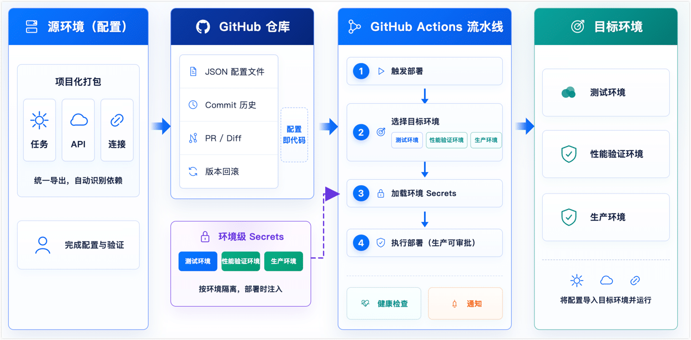

# 功能概述

项目管理功能帮助数据集成团队将 TapData 环境中的连接、任务、API 等配置资源打包为可版本化的交付单元，结合 GitHub 自动化流水线，在开发、测试、生产等多套环境之间实现快速部署与配置追溯，替代人工手动迁移。

## 背景介绍

在实际项目中，企业通常需要同时维护多套 TapData 环境，并为每套环境准备对应的源库、目标库或服务端点，例如开发、测试、性能验证和生产环境。

当数据集成业务逐步走向稳定运行，团队通常会面临一个共同的挑战：如何将经过测试验证的配置，安全、准确地迁移到下一个环境，最终发布到生产环境？

在没有自动化流程的情况下，通常需要在测试环境配置好任务和 API 后，工程师登录生产环境，逐一手动创建连接、任务和 API。一旦任务或连接数量增多，漏配某个依赖连接、配错参数的概率就会显著上升，而这类问题往往在生产故障发生后才被发现。更为棘手的是缺少过程审计，即谁改了什么、什么时候改的，很难通过有效的记录追踪。

为此，TapData 推出了项目管理与自动化部署能力，将上述过程标准化、自动化，让配置像代码一样实现版本控制、审计追溯与一键发布。

什么是项目

在 TapData 中，**项目（Project）** 是将同一业务目标下的任务、API 及其依赖连接组织在一起，用于统一管理、导出、部署和版本追溯的基本单元。

通过项目，原本分散的资源可以按业务场景归组，在多环境之间作为完整整体打包迁移，降低遗漏依赖配置的风险，并按项目粒度管理导出结果和变更历史。

## 整体工作链路

当 TapData 数据集成链路有新的需求，开发人员在源环境中完成任务、API 和连接等资源的配置与验证，并通过项目化打包能力将配置导出，提交到 GitHub 仓库进行版本管理。

当需要发布至下一个环境时，GitHub Actions 流水线会自动触发部署流程，选择或判定目标环境，例如测试环境、性能验证环境或生产环境，并从对应的 Environment Secrets 中加载该环境的数据源连接信息，如数据库连接字符串、账密等。

随后，流水线将配置导入目标环境并运行，同时执行健康检查和结果通知。整个过程无需工程师逐一登录各环境手动配置，实现配置版本化、凭据隔离和多环境自动化部署。

## 核心能力

- **项目化快速打包**：将任务、API、连接等资源聚合为项目统一管理，自动包含所有依赖项，确保整体迁移完整一致。
- **配置即代码易于审计**：配置托管至 GitHub，每次变更均有 Git 记录，支持随时审计、对比差异及一键回滚。
- **自动化分钟级发布**：结合 GitHub Actions 实现跨环境自动化部署，支持条件触发与人工审批，内置健康检查与通知。
- **跨环境配置/凭据复用**：同一份配置可在多环境复用。真实连接凭据在部署时根据环境自动注入，无需修改任务逻辑。
- **隔离敏感信息提升安全性**：导出时自动脱敏，密码等凭据不入代码库，通过 GitHub Secrets 或 Excel 模板独立管理与动态注入。
- **平滑切换与快速回滚**：支持先部署至备用环境，验证通过后无感知切换流量；遇错可秒级回滚，保障高可用。

## 适用场景

项目管理与自动化部署能力特别适用于以下业务场景：

- **多套环境的自动化部署**：当企业存在开发、测试、生产等多套独立环境，且需要将数据集成配置在各环境中快速、准确地同步时，可通过项目打包和自动化流水线实现一键部署，确保各环境配置严格一致。
- **大规模团队协同开发**：当多名工程师共同维护大量数据集成任务时，配置极易发生冲突或被误改。引入项目管理后，所有变更均可接入 Git 工作流，通过 Pull Request 进行团队审查，让变更过程可见、可控。
- **强安全合规与操作审计**：适用于对变更留痕和信息安全有严格要求的企业规范。Git 原生提供完整的变更时间线和操作人审计记录；同时实现配置与凭据分离，数据库密码等敏感信息不再明文流转，而是通过 Secrets 动态安全注入。
- **核心业务高可用升级**：针对要求“零停机”发布的关键线上业务，支持在独立的备用环境中充分验证新版配置，再平滑切换业务流量；一旦发现异常，可通过指定历史版本实现秒级快速回滚，最大程度降低生产故障风险。
