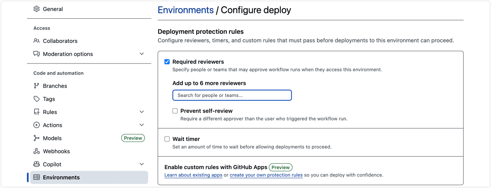

# 搭建自动化部署流水线

本文面向运维与实施人员，介绍如何在使用 GitHub 和 GitHub Actions 将 TapData 项目发布到多套环境前，完成仓库、环境、凭据和自托管运行器准备。

## 准备工作

在开始配置之前，请确保已具备以下资源和信息：

| 所需资源 | 具体要求 |
| ---- | ---- |
| **GitHub 组织** | 至少拥有 1 个 GitHub 组织管理员权限。Worker 仓库与租户仓库可放在同一组织下。 |
| **TapData 环境** | 建议准备开发、测试和生产三套 TapData 环境；如暂不需要开发环境，可至少准备测试和生产两套环境。 |
| **内网部署服务器** | 至少 1 台 Linux 服务器（推荐 Ubuntu 20.04+）作为自托管运行器，并同时可访问 GitHub 和所有环境的 TapData 服务端口。服务器需安装 `git`、`bash`、`jq`、`curl`，并注册 `tapdata` 标签。更多介绍，见[添加自托管的运行器](https://docs.github.com/zh/actions/how-tos/manage-runners/self-hosted-runners/add-runners)。 |
| **数据库账号信息** | 已从 DBA 处获取各环境数据库的连接地址、账号和密码。 |
| **部署审批人账号** | 至少指定 1 个 GitHub 账号作为资源导入审批人。 |


## 架构与规划要点

### 仓库规划

自动化部署依赖两类 GitHub 仓库协同工作：

| 仓库类型 | 用途 | 可见性 |
| ------ | ---- | ----- |
| **Worker 仓库**（1 个） | 存放共享的部署脚本和 Workflow，方便跨仓库调用，由运维团队维护 | Internal |
| **租户仓库** | 存放从 TapData 导出的配置文件，每个团队或业务域独立一个租户仓库 | Internal 或 Private |

### 环境规划

推荐按开发、测试和生产三类业务环境规划。对客沟通时可直接使用业务环境名称；GitHub Environment 和 Workflow 中使用的是流水线可识别的环境代码。

| 业务阶段 | 默认环境代码 | 默认触发方式 | 说明 |
| ------ | ------------ | ---------- | ---- |
| 开发环境 | `dev` | `main` 分支合并后自动触发 | 可选；如不需要开发自动部署，可调整租户仓库 Workflow。 |
| 测试/验收环境 | `sit` | 推送 Git Tag 后自动触发 |  可选 |
| 生产环境 | `prod` | 手动触发 | 推荐在测试或验收通过后，由运维手动发布。 |
| 资源导入审批门 | `deploy` | 由部署流程自动进入 | 必选；不是业务环境，不存放 TapData 地址或连接凭据。 |

:::tip

本文后续以“测试/验收环境”描述业务阶段。`sit` 仅表示官方模板中的默认环境代码；如需改为 `test` 或 `uat` 等自定义代码，需要同步修改租户仓库 Workflow、Worker 脚本校验逻辑、Secrets / Variables 前缀和回滚选项。

:::


**扩展阅读：按客户环境调整部署流程**

由于环境数量和命名风格可能不同，调整时需要同时修改 GitHub Environment、URL / Access Code、租户仓库 Workflow 和发布步骤，不建议只改其中一处。

| 客户环境流程 | 推荐配置方式 | 调整说明 |
| ---------- | ------------ | ------ |
| 开发 → 测试 → 生产 | 保持开发、测试、生产三类业务环境和 `deploy` 审批门 | `main` 合并到开发环境，Tag 发布到测试环境，生产手动发布。 |
| 开发 → UAT → 生产 | 使用测试/验收环境承载客户口径的 UAT | 无需增加额外环境；按默认环境代码配置 `DEV_*`、测试环境前缀和 `PROD_*` 变量即可。 |
| 测试 → 生产 | 仅保留测试、生产业务环境和 `deploy` 审批门 | 如不需要开发自动部署，可删除租户仓库 Workflow 中 `push.branches` / `push.paths` 的自动触发配置，仅保留 Tag 和手动发布。 |

如下展示租户仓库 Workflow 中 `workflow_dispatch.target_env.options` 的配置位置；如需生产发布，请在该选项中加入 `prod`。

```yaml
# 省略其他配置项
  workflow_dispatch:
    inputs:
      target_env:
        description: 'Target environment'
        required: true
        type: choice
        options:
          - dev
          - sit
          - prod
# 省略其他配置项
```

:::tip

回滚流程也需要同步检查，在 `tapdata-rollback.yml` 的 `workflow_dispatch.target_env.options` 中仅保留实际可回滚的环境。

:::

### 权限与安全设计

TapData 导出的配置文件在导出时自动脱敏，代码仓库中只存放业务配置逻辑。各环境的真实连接凭据独立存储在对应的 GitHub Environment Secrets / Variables 中，部署时按环境自动注入。

- 在租户仓库的 `main` 分支开启分支保护：禁止直接推送、要求 Pull Request、要求 Code Review 和 Workflow 检查通过后再合并。
- `deploy` 审批人应为独立的运维人员，不建议由开发人员审批自己提交的变更。
- 组织级 Secrets / Variables 用于存放共享配置，例如 `GH_DEPLOY_TOKEN`、各环境的 TapData 地址和 Access Code。
- Environment 级 Secrets / Variables 用于存放各连接在不同环境下的真实连接信息。

### GitHub 权限与凭据配置

自动化部署涉及 GitHub 仓库访问、TapData 环境访问和数据库连接凭据，建议按下表拆分配置，避免把所有信息都放在同一层级。

| 配置项 | 配置位置 | 用途 | 建议配置 |
| ---- | ------ | ---- | ------- |
| `GH_DEPLOY_TOKEN` | GitHub 组织级或租户仓库级 Secret | Runner 拉取 Worker 仓库脚本、读取租户仓库配置，以及 TapData Git 导出时向租户仓库推送分支并创建 PR | Fine-grained PAT 需至少包含 Worker 仓库读取权限，以及租户仓库 `Contents` 和 `Pull requests` 读写权限；如需要写入 `.github/workflows/`，还需补充 Workflows 写入权限。Classic PAT 可使用 `repo` 和 `workflow` 权限。 |
| `{ENV}_TAPDATA_ACCESS_CODE` | GitHub 组织级或租户仓库级 Secret | 获取指定 TapData 环境的访问 Token | 每个业务环境配置一份，例如测试环境和生产环境各配置一份。 |
| `{ENV}_TAPDATA_URL` | GitHub 组织级或租户仓库级 Variable | 指定目标 TapData 环境地址 | 每个业务环境配置一份，例如测试环境和生产环境各配置一份。 |
| 数据库连接凭据 | 租户仓库对应业务 Environment 的 Secrets / Variables | 部署时注入连接的真实地址、账号和密码 | 配置在开发、测试、生产等业务 Environment 下，不配置在 `deploy` 下。 |
| Runner Group 访问 | GitHub 组织 **Settings → Actions → Runner groups** | 允许租户仓库使用自托管运行器 | 将 Runner Group 授权给实际执行部署的租户仓库；仅在明确接受风险时允许公共仓库使用。 |

:::tip

如在组织级配置 Secrets / Variables，请确认对应配置已授权给租户仓库使用；如只服务单个租户仓库，也可以直接配置在该租户仓库下。

:::

### 连接凭据命名规则

连接相关的 Secrets / Variables 命名规则为：将 TapData 中的连接名称转换为全大写后直接匹配。由于 GitHub Secret / Variable 名称仅支持字母、数字和下划线，且需以字母或下划线开头，建议 TapData 连接名称也采用相同规则，例如连接名 `oracle_source` 对应前缀 `ORACLE_SOURCE`。不建议在连接名称中使用空格、连字符（`-`）或中文，否则部署时可能无法匹配到对应凭据。

## 初始化步骤

以下步骤用于将前面的规划落实为可执行的 GitHub 自动化部署链路。

### 步骤一：初始化 GitHub 仓库结构

为实现部署逻辑与业务配置分离，我们采用双仓库架构，其中 **Worker 仓库** 由运维团队统一维护存放核心部署脚本，**租户仓库**由各业务团队各自维护存放项目配置，通过调用 Worker 仓库逻辑完成部署，无需关心底层实现。

1. 基于 TapData 提供的官方 Worker 仓库（[tapdata/tapdata-cicd-worker](https://github.com/tapdata/tapdata-cicd-worker/tree/main)），在您的 GitHub 组织下创建独立副本，可通过 **Use this template** 或克隆后推送到新仓库的方式完成，并将仓库命名为 `tapdata-cicd-worker`、可见性设为 **Internal**。

   仓库包含部署和回滚的编排逻辑及与 TapData API 交互的底层脚本：

   ```text
   tapdata-cicd-worker/
   ├── .github/workflows/
   │   ├── tapdata-deploy.yml       # 核心部署逻辑
   │   └── tapdata-rollback.yml     # 核心回滚逻辑
   ├── conf/
   │   └── Task_Run_Order.json      # 任务执行顺序配置
   ├── scripts/                     # 底层交互脚本
   └── tenant-template/.github/workflows/
       ├── tapdata-deploy.yml       # 租户仓库调用模板
       └── tapdata-rollback.yml     # 租户仓库回滚调用模板
   ```

2. 为业务团队创建一个存放配置的租户仓库，仓库名称建议与 TapData 平台中的项目名称保持一致（例如 `user-center-sync`），并确认默认分支为 `main`。如仓库默认分支仍为 `master`，请先在 GitHub 仓库设置中切换为 `main`，或同步调整 Workflow 中监听的分支名。

3. 租户仓库只需创建两个轻量级的 Workflow 路由文件（从 Worker 仓库的 `tenant-template/.github/workflows/` 目录复制），用于把触发事件转发给 Worker 仓库处理：
   - **`tapdata-deploy.yml`**：负责监听配置文件的合并（如 `main` 分支的 `*_tapdata_export/**` 路径变更）、Tag 推送以及手动触发动作，默认将租户仓库名作为项目名。
   - **`tapdata-rollback.yml`**：负责接收手动触发的回滚指令（指定环境和回滚版本）。
   
   :::tip
   在复制过来的这两个路由文件中，须将 `{WORKER_REPO}` 占位符替换为您刚刚创建的 Worker 仓库路径，例如 `your-org/tapdata-cicd-worker`。如 TapData 项目名与租户仓库名不一致，还需调整 `project` 入参。
   :::

4. 将修改好的 Workflow 文件提交并推送到租户仓库的 `main` 分支。


### 步骤二：配置 GitHub Secrets 和 Variables

为了让 GitHub Actions 能够顺利连接并操作不同环境的 TapData 服务，需要配置仓库访问凭据、TapData 访问凭据和服务地址。以下以组织级配置为例；如只服务单个租户仓库，也可进入租户仓库配置同名 Secrets / Variables。

1. 登录具备仓库权限的 GitHub 账号，进入个人 **Settings → Developer settings → Personal access tokens**。
   
2. 点击生成新 Token，名称可填 `tapdata-deploy`，有效期建议设置为 90 天以内，并按前文权限表授予最小可用权限，生成后请立即复制并妥善保存该 Token。
   
   :::tip
   如果您的 Worker 仓库和租户仓库在同一个 GitHub 组织下，建议使用更安全的 **Fine-grained PAT**。如无法为不同仓库设置不同权限，请通过 **Only select repositories** 将 Token 范围限制在 Worker 仓库和实际租户仓库内。
   :::

3. 进入 **组织设置 → Secrets and variables → Actions**，或进入租户仓库的 **Settings → Secrets and variables → Actions**。

4. 在 **Secrets** 标签卡下添加以下内容（加密存储）：

   
   
   | Secret 名称 | 内容说明 |
   | ----------- | ---- |
   | `GH_DEPLOY_TOKEN` | 刚刚在第一步中申请并保存的 PAT。 |
   | 测试环境对应的 `{ENV}_TAPDATA_ACCESS_CODE` | 测试环境 TapData 实例的访问码；沿用官方模板时为 `SIT_TAPDATA_ACCESS_CODE`。 |
   | `PROD_TAPDATA_ACCESS_CODE` | 生产环境 TapData 实例的访问码。 |
   | `{ENV}_TAPDATA_ACCESS_CODE` | 可选，如启用开发环境，按环境代码补充对应访问码，例如 `DEV_TAPDATA_ACCESS_CODE`。 |
   | `VAULT_ENCRYPTION_KEY` | 可选，用于加密流水线生成的 `vault.json` 凭据文件。 |

5. 在 **Variables** 标签卡下添加以下内容（明文存储）：

   | Variable 名称 | 示例值 |
   | ------------- | ------ |
   | 测试环境对应的 `{ENV}_TAPDATA_URL` | 测试环境地址，如 `http://10.0.0.2:3030`；沿用官方模板时为 `SIT_TAPDATA_URL`。 |
   | `PROD_TAPDATA_URL` | 生产环境地址 |
   | `{ENV}_TAPDATA_URL` | 可选，如启用开发环境，按环境代码补充对应地址，例如 `DEV_TAPDATA_URL`。 |

   :::tip
   如需获取 TapData Access Code，可使用管理员身份登录对应环境的 TapData 平台，进入**系统设置 → 用户管理**查看对应用户信息；部分场景下，也可由该用户登录后在右上角的**个人设置**中复制访问码。
   :::

### 步骤三：创建 Environment 并配置连接信息

1. 进入租户仓库的 **Settings → Environments**。
2. 创建实际启用的业务 Environment（通常对应开发、测试和生产环境）以及固定审批门 `deploy`。
3. 为 `deploy` 配置 **Required reviewers**，作为资源导入审批门；建议添加运维或发布负责人团队，并开启 **Prevent self-review**，避免触发部署的人审批自己的变更。

   下图展示为 `deploy` Environment 配置审批人的位置。

   

4. `deploy` 仅作为审批门使用，不需要配置 TapData 地址、Access Code 或连接凭据；这些信息应配置在测试、生产及其他业务 Environment 中。
5. 如需对生产发布流程本身增加环境级审批，可在 `prod` Environment 中另行配置 **Required reviewers**。
6. 为开发、测试和生产等实际启用环境配置对应环境下的真实连接信息。连接凭据应配置在对应 Environment 下，名称不需要再添加环境前缀，通常有两种保存方式：

   * **URI 格式**：适用于 MongoDB 等将用户名、密码包含在连接串中的场景，建议作为 Secret 保存，名称为 `{前缀}_URI`，例如 `FDM_URI`。
   * **Host:Port 格式**：适用于 PostgreSQL、Oracle、MySQL 等场景，地址和账号可存为 Variable，密码存为 Secret，名称分别为 `{前缀}_URL`、`{前缀}_USER`、`{前缀}_PASSWORD`，对应示例为 `ORACLE_SOURCE_URL`、`ORACLE_SOURCE_USER`、`ORACLE_SOURCE_PASSWORD`。

   如果多个连接可共用同一套默认连接信息，也可以配置 `DEFAULT_URL`、`DEFAULT_USER` 和 `DEFAULT_PASSWORD` 作为兜底值。

### 步骤四：安装自托管运行器

由于 GitHub 托管运行器无法直接访问企业内网中的 TapData 服务和数据库，需要在内网部署至少 1 台自托管运行器来执行部署任务，推荐注册到租户组织层级供多个仓库共享使用。

1. 进入 GitHub 组织的 **Settings → Actions → Runners**，点击 **New self-hosted runner**。
2. 在准备好的 Linux 服务器上，按 GitHub 页面提供的安装向导完成下载、注册和服务启动，注册时添加 `tapdata` 标签。
3. 如使用 Runner Group，进入 **Settings → Actions → Runner groups**，确认该 Runner Group 已授权给需要执行部署的租户仓库；仅在明确接受安全风险时，才为公共仓库开启 **Allow public repositories**。

   下图展示 Runner Group 的 Repository access 配置区域。

   

4. 安装完成后，返回 Runners 页面确认运行器状态为 `Idle`，并确保其带有 `tapdata` 标签且可访问所有目标环境的 TapData 服务端口。

## 完成验证

在开始第一次自动化部署前，请对照以下清单进行最终检查：

- [ ] Worker 仓库可见性为 `Internal`，并包含部署与回滚工作流及核心脚本。
- [ ] 租户仓库 Workflow 中的 `{WORKER_REPO}` 已替换为真实路径。
- [ ] 租户仓库默认分支为 `main`，或 Workflow 中的监听分支已按实际分支调整。
- [ ] GitHub Secrets / Variables 已配置 `GH_DEPLOY_TOKEN`、实际业务环境的 Access Code 及 TapData URL，并已授权给租户仓库使用。
- [ ] 租户仓库中已创建实际启用的业务 Environment 和固定审批门 `deploy`。
- [ ] 如客户不需要开发自动部署，租户仓库 Workflow 的自动触发配置已同步调整。
- [ ] 开发、测试和生产等实际启用环境下已按命名规范配置好连接信息。
- [ ] 至少有 1 台自托管运行器处于 `Idle` 状态，带有 `tapdata` 标签，Runner Group 已授权给租户仓库，并可访问所有目标 TapData 环境。

完成以上检查后，即可继续阅读 [创建项目并部署](deploy-project.md)，将 TapData 配置打包并发布到目标环境。
