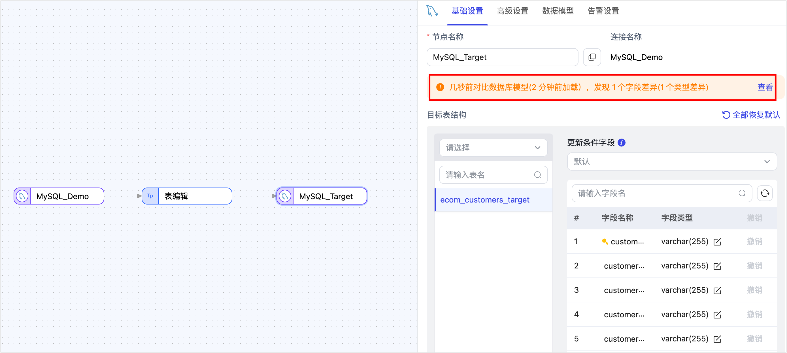
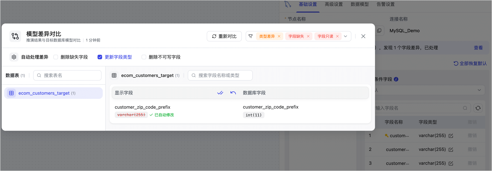

# 对比数据模型

import Content from '../reuse-content/_all-features.md';

<Content />

TapData 提供目标模型对比功能，帮助用户在任务配置阶段识别并处理目标表与推演模型的结构差异，通过灵活的自动处理策略保障同步稳定。

## 背景介绍

在构建数据复制或转换任务时，TapData 会基于源端表结构自动推演生成逻辑模型（字段、数据类型、主键等），并在需要时尝试在目标端建表或调整表结构，以确保同步过程完整和一致。

但在实际生产环境中，目标端的表可能由外部系统预先建立，并被多个业务同时依赖，通常不希望这些表结构被自动修改，这就可能导致 TapData 推演的模型与实际表结构不一致，例如字段缺失、类型不符或包含不可写字段（如只读列、系统维护字段等）。这些差异不仅容易引发任务失败，也会迫使用户额外配置字段处理节点或手动规避冲突字段，增加了运维和排错成本。

为解决上述问题，TapData 推出了目标模型对比功能，帮助用户快速识别目标表与推演模型的差异，并提供灵活的处理选项，保障数据同步在复杂环境下稳定运行。

## 前提条件

- 任务的目标节点必须是关系型数据库，例如 MySQL、PostgreSQL 等。
- 配置任务时，目标表处理策略需设置为 保持**目标端原有表结构和数据**（默认选项）。

## 操作步骤

1. [登录 TapData 平台](log-in.md)。
2. 创建[数据复制任务](copy-data/create-task.md)或[数据转换任务](data-development/create-task.md)。
3. 在任务启动前，单击任务的目标节点，可查看到系统自动对比源端模型与目标表结构的差异结果。

4. 如模型对比出现不一致，可基于目标模型对比和使用场景，选择删除缺失字段、更新字段类型或删除不可写字段，以保障数据同步任务的正常运行。
 例如本案例中存在字段类型不一致的情况，我们选择更新字段类型来保持与目标表的类型一致。

 关于模型差异定义及可能出现的场景说明如下：
   - **删除不可写字段**：当目标表中存在不可写入字段（如只读列、系统维护字段），且源端模型也包含这些字段时，可能导致写入失败。
   - **删除缺失字段**：当目标表缺少源端模型中的某些字段（如反向同步场景下源端存在 no_pk_hash 而目标端未定义）时，字段无法正确映射，可能引发写入异常。
   - **更新字段类型**：当推演出的字段类型与目标表实际类型不一致时，可能导致类型冲突或写入报错。
   - **字段未定义类型**：通常表示源端缺少该字段，或模型未完整加载，建议在连接管理中重新加载源端模型并重试。
   - **类型差异（一般）**：如字段长度或精度范围存在轻微差异，通常不会影响同步。
5. 任务配置完成后，单击**启动**。
 任务启动成功后，系统将自动跳转到任务监控页面，可查看任务运行状态和同步进度。