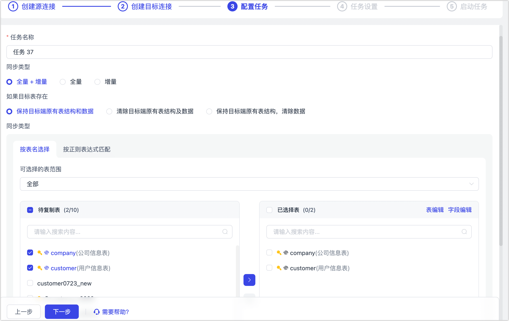
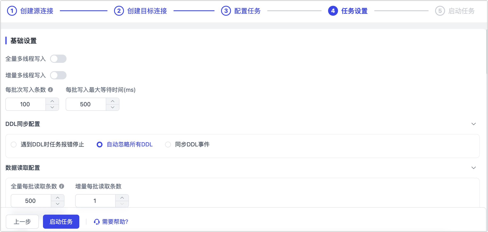
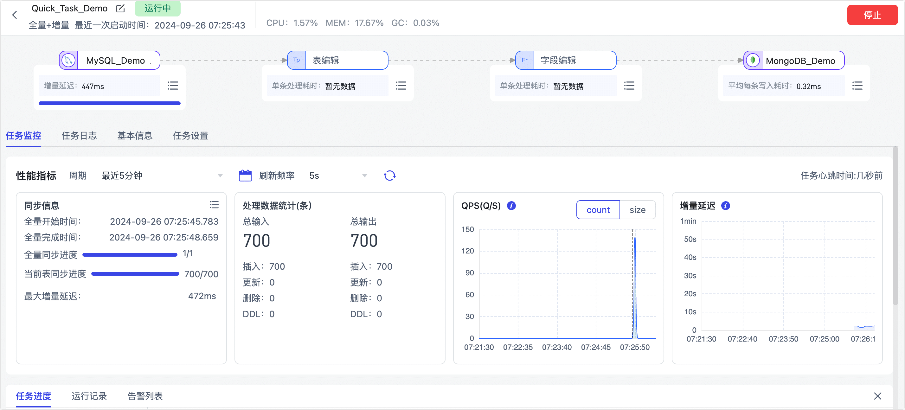

# 快速创建数据复制任务

import Content from '../../reuse-content/_cloud-features.md';

<Content />

数据复制功能可以帮助您实现同/异构数据源间的实时同步，适用于数据迁移/同步、数据灾备、读性能扩展等多种业务场景。TapData 支持通过表单式引导快速创建复制任务，本文介绍具体操作流程。

## 操作步骤

  
最佳实践

  为构建高效可靠的数据复制任务，推荐在开始配置任务前，推荐阅读<a href="../../../best-practice/data-sync">数据同步最佳实践</a>。

1. [登录 TapData 平台](../log-in.md)。

2. 在左侧导航栏，单击**数据复制**。

3. 单击页面右侧的**快速创建任务**，跳转到任务表单填写页面

4. 首先选择作为源库的数据源，您可以选择**创建新的连接**或**选择已有连接**。

   

   :::tip

   接下来，本文以**选择已有连接**为例，演示如何将 MySQL 实时同步至 MongoDB，其他数据源也可参考此流程。关于如何提前创建数据源，见[连接数据源](../../prerequisites/README.md)。

   :::

5. 选择**已有连接**并选择作为源库的 MySQL 数据源，然后单击**下一步**。

6. 选择**已有连接**并选择作为目标库的 MongoDB 数据源，然后单击**下一步**。

7. 在**配置任务**步骤，根据下述说明配置任务详情。

   

   * **任务名称**：填写具有业务意义的名称。
   * **同步类型**：默认为**全量+增量**，也可单独选择**全量**或**增量**。
     全量表示将源端的存量数据复制到目标端，增量表示将源端实时产生的新数据或数据变更复制到目标端，二者结合可用于实时数据同步场景。
   * **重复处理策略**：根据业务需求选择，默认为**保持目标端原有表结构和数据**。 
   * **选择表**：根据业务需求选择。
     * **按表名选择**：在待复制表区域框选中表，然后单击向右箭头完成设置。
     * **按正则表达式匹配**：填写表名的正则表达式即可，此外，当源库新增的表满足表达式时，该表也会被自动同步至目标库。
   * **选择可见的表范围**：默认展示全部表，您也可以选择过滤**仅有主键表**或**仅无主键表**，其中，主键表包含具有唯一索引的无主键表。由于无主键表采用全主键的方式来实现数据更新，可能因索引长度超限而报错，且性能可能受限，因此推荐您为无主键表单独建立数据复制任务，避免任务出错，提升数据更新的性能。

8. 单击**下一步**，配置任务的更多设置。

   

   * **基础设置**
     * **全量多线程写入**：全量数据写入的并发线程数，默认为 **8**，可基于目标端写性能适当调整。 
     * **增量多线程写入**：增量数据写入的并发线程数，默认未启用，启用后可基于目标端写性能适当调整。 
     * **每批次写入条数**：全量同步时，每批次写入的条目数。 
     * **每批写入最大等待时间**：根据目标库的性能和网络延迟评估，设置最大等待时间，单位为毫秒。 
     * **DDL 同步配置**：选择 DDL 事件处理策略，默认为**自动忽略所有 DDL**。选择为**同步 DDL 事件**后，您还可以选择要采集的 DDL 事件，通常包含**新增字段**、**修改字段名**、**修改字段属性**、**删除字段**。更多介绍，见[处理 DDL 变更](../../case-practices/best-practice/handle-schema-change.md)。 
     * **数据读取配置**：选择全量和增量阶段每批读取的条目数，默认值分别为 500 和 1，以及选择是否启用**多表并发读取**（适用于小表较多的场景）。
     * **数据写入配置**：选择数据写入策略：
       * **按事件类型处理**：选择此项后，还需要选择插入、更新、删除事件的数据写入策略。
       * **统计追加写入**：只处理插入事件，丢弃更新和删除事件。
   * **高级设置**
     * **事件处理出现异常时**：默认为重试，也可以选择跳过异常事件，任务继续运行。
     * **其他设置**：设置任务开始的时间、共享挖掘、定期调度任务、动态调整内存、增量数据处理模式、处理器线程数、Agent 等。

   * **告警设置**：默认情况下，节点的平均处理耗时连续 1 分钟大于等于 5 秒，则发送系统通知和邮件通知，您也可以根据业务需求调整规则或关闭告警。

9. 配置完毕后，单击**启动任务**。

10. 启动成功后会自动跳转至任务监控页面，您可以查看任务的 RPS（每秒处理记录数）、延迟、任务事件等信息。

   此外，为保障任务的正常运行，TapData 会基于节点配置和数据源特征进行预检查，您可在页面下方查看到打印的日志信息。

   

## 扩展阅读

* [处理节点](process-node.md)：通过组合多个处理节点和多个数据源，可实现更加复杂和个性化的数据流转能力。
* [常见问题](../../faq/data-pipeline.md)：介绍数据复制功能使用过程中，可能遇到的问题及解决方案。

