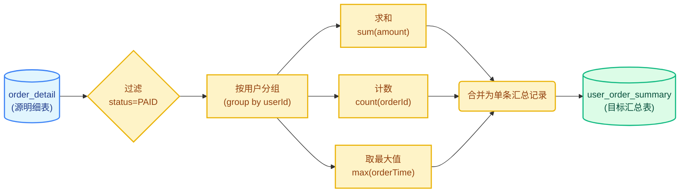
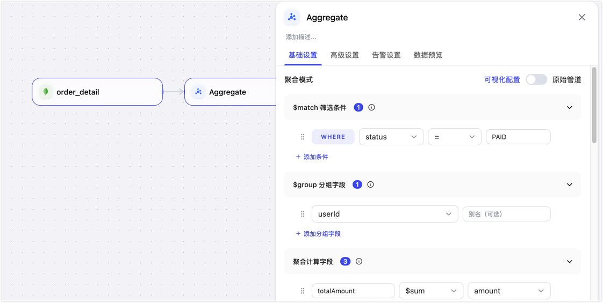

# 聚合计算节点

聚合计算（Aggregate）节点用于对明细或模型数据进行分组、汇总和派生计算，并持续输出为可供下游报表或 API 直接消费的结果集合（如 ADM），从而有效减少重复计算、统一统计口径并提升查询效率。

## 前提条件

- 聚合计算节点适用于**数据转换任务**以及**实时数据中心**（如 FDM 构建 MDM 模型的链路）。
- 仅当上游节点（数据源）为 **MongoDB** 数据库时，才支持使用此节点。

## 注意事项

- 聚合逻辑越复杂，对上游数据质量、目标库性能和索引设计的要求越高。
- 聚合计算节点更适合生成稳定复用的结果集合。如果只是临时分析或一次性查询，可以先在分析工具中验证统计口径。
- 更新和删除事件会影响聚合结果，建议在上线前准备包含新增、更新、删除的数据样例进行验证。


## 支持的聚合函数与过滤条件

TapData 支持丰富的聚合函数与过滤条件，满足复杂的数据处理需求：

<details>
<summary>支持的聚合函数</summary>

| 函数          | 用途                             |
| ----------- | ------------------------------ |
| `$sum`      | 求和，例如统计销售额。也可用于计数场景。           |
| `$avg`      | 求平均值，例如统计平均客单价。                |
| `$min`      | 求最小值，例如统计首次下单时间。               |
| `$max`      | 求最大值，例如统计最近下单时间。               |
| `$count`    | 计数，节点会转换为 `$sum: 1`。           |
| `$first`    | 取分组内第一条记录的指定字段值，例如获取首个订单状态。    |
| `$last`     | 取分组内最后一条记录的指定字段值，例如获取最后一次处理结果。 |
| `$push`     | 将分组内指定字段的值追加为数组，保留重复值。         |
| `$addToSet` | 将分组内指定字段的值追加为数组，并自动去重。         |

:::tip

`$first` 和 `$last` 的结果取决于进入聚合阶段的数据顺序。如果需要严格按时间或业务字段取首条/末条记录，建议使用原始管道模式，并在 `$group` 前通过 `$sort` 明确排序规则。

:::

</details>

<details>
<summary>支持的聚合过滤条件</summary>

| 操作       | 说明                  |
| -------- | ------------------- |
| `=`      | 等于。                 |
| `≠`      | 不等于。                |
| `>`      | 大于。                 |
| `≥`      | 大于等于。               |
| `<`      | 小于。                 |
| `≤`      | 小于等于。               |
| `IN`     | 在指定列表中，多个值以英文逗号分隔。  |
| `NOT IN` | 不在指定列表中，多个值以英文逗号分隔。 |
| `REGEX`  | 正则匹配。    

</details>


## 适用场景与示例

在实际业务中，BI 报表、用户画像系统或业务 API 往往需要的是统计后的指标数据。通过引入**聚合计算节点**，您可以将高频的统计需求（如用户画像指标、运营看板统计）前置到数据处理链路中，实现一次计算、多方消费，避免下游重复扫描海量明细。

以**生成用户订单汇总表**为例：假设我们需要从海量订单明细 `order_detail` 中筛选出“已支付”的订单，按用户 ID 分组，计算每个用户的累计消费、订单总数和最近下单时间，并将结果写入 `user_order_summary` 供下游查询。



**数据转换效果对照：**

| 处理阶段       | 数据示例说明                                                                                                                            |
| ---------- | --------------------------------------------------------------------------------------------------------------------------------- |
| **源端明细输入** | 包含多条记录：`{orderId: "O1", userId: "U1", status: "PAID", amount: 120.5}{orderId: "O2", userId: "U1", status: "PAID", amount: 300.0}` |
| **聚合结果输出** | 汇总为单条记录：`{userId: "U1", totalAmount: 420.5, orderCount: 2, lastOrderTime: "2026-05-08"}`                                          |

:::tip

使用可视化配置时，分组字段（如 `userId`）默认会作为聚合结果的 `_id`。如果您希望将其输出为普通的顶层字段，可选择使用自定义 Pipeline 并在 `$project` 阶段调整输出结构。

:::

## 操作流程

1. [登录 TapData 平台](../log-in.md)。
2. 在左侧导航栏，单击**数据转换**，然后在页面右侧单击**创建任务**。

   :::tip

   如果您在**实时数据中心**场景下使用该节点：请在配置加工层（MDM）模型时，先单击**保存**，然后进入该模型的**任务配置页面**，即可在链路中添加并使用聚合计算节点。

   :::
3. 在左侧面板的**数据连接**区域，拖入已接入的 MongoDB 数据源，并选择参与聚合的明细集合。
4. 从**处理节点**区域拖入 **Aggregate**（聚合计算节点）节点，并将数据源节点连线至该节点。
5. 单击 Aggregate 节点，在右侧面板完成聚合规则的配置。

   
   - **节点名称**：可设置为便于识别的业务名称，例如**用户订单汇总**。
   - **聚合模式**：默认为**可视化配置**，您还可以按需切换为**原始管道**。
     - **可视化配置**：通过界面点选的方式配置基础聚合逻辑。以用户订单汇总为例，我们希望仅统计已支付订单，按用户汇总累计消费金额、订单数和最近下单时间，用于会员分层、运营看板或用户画像分析。
       - **$match 筛选条件**：设置参与统计的数据范围。字段选择 `status`，操作选择 `=`，值填写 `PAID`，表示只统计已支付订单。
       - **$group 分组字段**：选择聚合维度。此处选择 `userId`，表示按用户生成汇总结果。
       - **聚合计算字段**：设置统计函数、源字段和输出字段。添加 3 个计算字段：使用 `$sum` 统计 `amount` 并输出为 `totalAmount`；使用 `$count` 统计订单数并输出为 `orderCount`；使用 `$max` 统计 `orderTime` 并输出为 `lastOrderTime`。
       - **有效更新字段**：指定仅当哪些源端字段发生变更时，才触发聚合结果更新。建议选择 `status`、`userId`、`amount` 和 `orderTime`，覆盖支付状态、分组字段、金额和下单时间的变化。
       - **分组变更双重聚合**：当源端数据的分组字段发生改变时，同时更新原分组和新分组的聚合结果。如果源端的 `userId` 可能发生变化，建议开启该选项，避免用户归属变更后旧用户汇总值未被扣减。
       :::tip

       使用可视化配置时，分组字段默认会作为 `_id` 输出。如果下游必须使用顶层 `userId` 字段作为更新条件，建议使用原始管道模式，并在 `$project` 阶段调整输出结构。

       :::
     - **原始管道**：适合具备 MongoDB 使用经验的高级用户。当需要自定义输出结构（如将 `_id` 输出为顶层 `userId`）或配置更复杂的聚合阶段时，可切换至此模式直接手写 MongoDB Aggregation Pipeline。下面的 Pipeline 与上述可视化配置保持相同业务口径，并通过 `$project` 将结果整理为更适合下游更新和查询的结构：
     ```json
     [
       {
         "$match": {
           "status": "PAID"
         }
       },
       {
         "$group": {
           "_id": "$userId",
           "totalAmount": {
             "$sum": "$amount"
           },
           "orderCount": {
             "$sum": 1
           },
           "lastOrderTime": {
             "$max": "$orderTime"
           }
         }
       },
       {
         "$project": {
           "_id": 0,
           "userId": "$_id",
           "totalAmount": 1,
           "orderCount": 1,
           "lastOrderTime": 1
         }
       }
     ]
     ```
6. （可选）在聚合计算节点配置面板的**高级设置**标签页中，您可以对节点的执行性能进行调优：
   - **开启并发处理**：默认开启。开启后，节点将使用多线程并发处理接收到的数据，以提升聚合计算的吞吐量。
   - **设置并发数**：当开启并发处理后可配置。默认为 4，您可以根据数据源负载和计算节点的 CPU 资源适当调大该数值（如 8 或 16），以进一步加快处理速度。
7. 从页面左侧拖入目标数据源，用于存放聚合后的结果集合，并将 Aggregate（聚合计算）节点连接至该目标节点。
8. 单击目标节点（本案例为 MySQL 数据库），在右侧面板中选择或输入目标表名称，例如 `user_order_summary`。
9. 根据结果集合的唯一性要求设置更新条件。通常建议使用聚合结果中的分组键作为更新条件，例如自定义 Pipeline 已输出 `userId` 时按 `userId` 更新；如果保留默认聚合结构，则按实际输出中的 `_id` 更新。
10. 确认配置无误后，单击**启动**。

任务启动后，TapData 会根据上游明细数据持续维护聚合结果，当出现新增、更新或删除明细数据时，结果集合会随之更新。
           |

## 结果验证

任务启动后，可以在目标库（本案例为 MySQL 数据库）中查询结果表，确认聚合结果是否符合预期。

示例查询结果：

```sql
-- 查询用户订单汇总表的前 1 条数据
SELECT * FROM user_order_summary LIMIT 1;

-- 示例结果
| userId | totalAmount | orderCount | lastOrderTime |
| -------- | ----------- | ---------- | ------------- |
| U10001  | 420.5     | 2          | 2026-05-08 20:15:00 |

```

若结果不符合预期，请依次检查过滤条件、分组与聚合配置是否正确，确认目标表更新条件与分组键是否一致，并排查源端变更事件是否包含完整的计算数据。

## 最佳实践

- 先确定下游报表或 API 需要的结果结构，再反推聚合字段和分组字段。
- 优先选择稳定的业务维度作为分组字段，例如用户 ID、地区编码、产品 ID、业务日期。
- 目标集合建议为常用查询字段创建索引，例如 `userId`、`region`、`bizDate`。
- 对于复杂统计逻辑，建议先用小范围数据验证 pipeline，再放入正式任务。
- 如果一个聚合逻辑过于复杂，可以先通过模型节点整理明细数据，再使用聚合计算节点生成结果。
