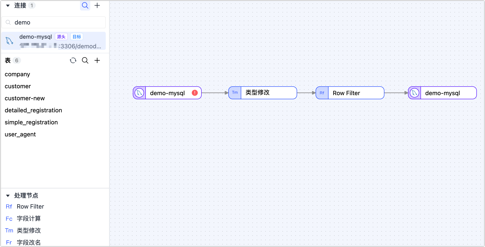
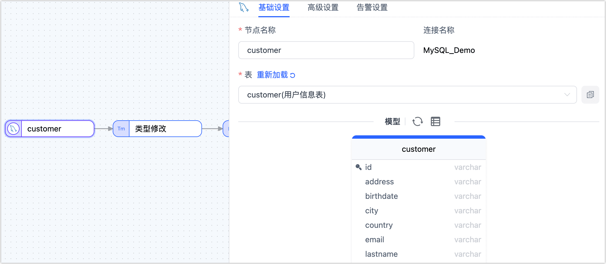
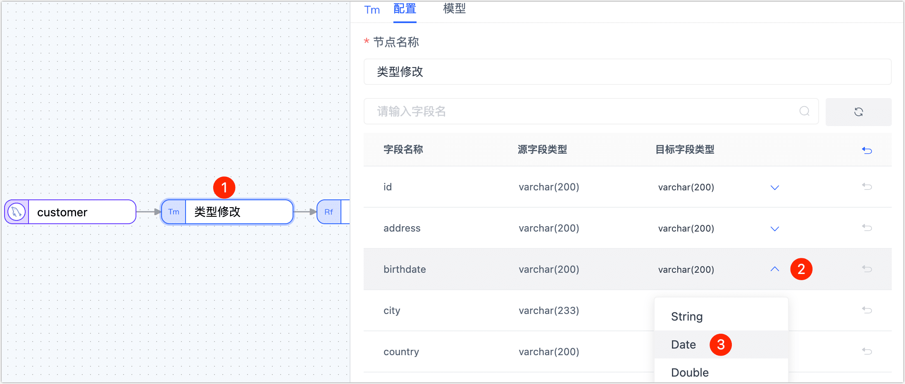
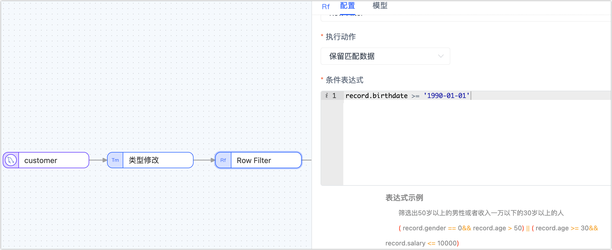
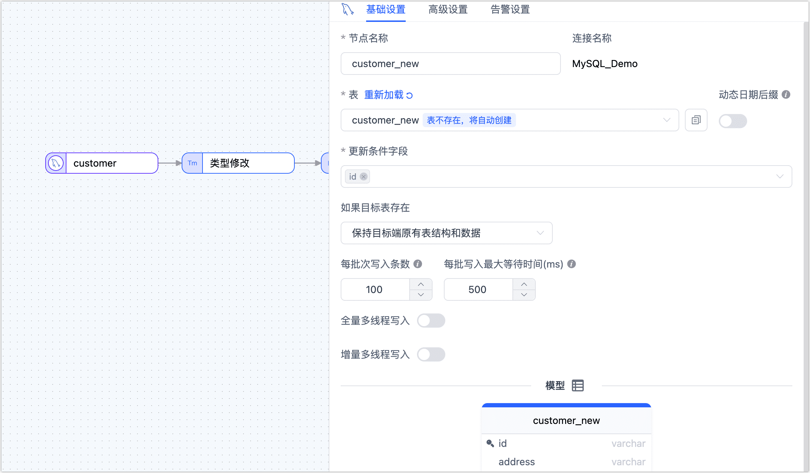
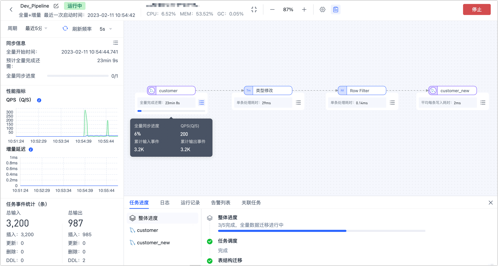

# 创建数据转换任务
import Content from '../../../reuse-content/_all-features.md';

<Content />

TapData 的数据转换任务支持在源/目标节点间增加处理节点，可帮助您快速实现多表合并、数据拆分、字段增减等数据处理需求。本文介绍数据转换任务的创建流程。

## 操作步骤

本案例中，我们将演示如何通过数据转换任务，在不改变源表（**customer** 表）的结构和数据的情况下，将表结构中的 **birthdate** 字段类型从 **STRING** 转换为 **DATE**，同时筛选出生日期晚于 **1991-01-01** 的用户，最后将表结构和筛选后的数据应用至新的表（**customer_new**）中。

1. [登录 TapData 平台](../../log-in.md)。

2. 基于产品类型选择操作入口：
    * TapData Cloud：在左侧导航栏，单击**数据转换**。
    * apdata Enterprise 或 TapData Community：在左侧导航栏，选择**数据管道** > **数据转换**。
3. 单击页面右侧的**创建**，跳转到任务配置页面。

4. 在页面左侧的**连接**区域，依次拖拽作为源和目标的数据连接至右侧画布中。

5. 在页面左侧的**处理节点**区域，依次拖拽**类型修改**节点和 **Row Filter 节点**。

   :::tip

   更多处理节点的介绍及应用场景，见[处理节点](process-node.md)。

   :::

6. 将上述四个节点按照数据流转顺序连接起来，如下图所示。

   

7. 根据下述说明，依次完成各节点配置。

   1. 在画布中，单击最左侧的源节点，根据下述说明完成右侧面板的<span id="full-sql-query">参数配置</span>。

      

      * **基础设置**      
        * **节点名称**：默认为连接名称，您也可以设置一个具有业务意义的名称。
        * **表**：选择要操作的源表，下方将展示表的结构信息，包含列名和列类型，可单击**模型**旁的刷新按钮以重载该表的模型。
      * **高级设置**      
        * **DDL 同步配置**      
          选择是否启用 **DDL 事件采集**，打开该开关后，TapData 会自动采集所选的源端 DDL 事件（如新增字段），如果目标端支持 DDL 写入即可实现 DDL 语句的同步。 
        * **增量同步方式** 
          选择**实时日志解析**或**字段轮询**，选择为**轮询**时，您还需要指定轮询的字段、时间间隔和每次读取行数。**实时日志解析**会使用数据源事务日志进行解析并同步增量事件，**字段轮询**会通过对字段的轮询进行增量事件同步，其中**字段轮询**通常无法同步删除事件。 
        * **数据过滤配置** 
          * **全量自定义查询**：打开该开关后，可填写全量数据同步阶段需要执行的 SQL 查询语句（不对增量阶段生效），可实现自定义的数据提取（如数据过滤、Join 等），例如填写 `SELECT id,name,address FROM customer;`。
            
            :::tip
            
            启用该功能要求目标节点为弱 Scheme 类的数据源（如 MongoDB/Kafka）等。
            
            ::: 
            
          * **过滤设置**：默认关闭，开启后您需要指定数据过滤条件。 
        * **批量读取条数**：全量同步时，每批次读取的记录条数，默认为 **100**。
      * **告警设置**   
        默认情况下，节点的平均处理耗时连续 1 分钟大于等于 5 秒，则发送系统通知和邮件通知，您也可以根据业务需求调整规则或关闭告警。

   2. 单击**类型修改**节点，然后在右侧面板中，修改 **birthdate** 字段的类型为 **Date**。

      

   3. 单击 Row Filter 节点，根据下述说明完成右侧面板的参数配置。

      

      * **执行动作**：选择为**保留匹配数据**。
      * **条件表达式**：填写数据匹配的表达式，本案例填写为 `record.birthdate >= '1990-01-01'`，支持的符号如下：
        * 比较：大于（`>`）、小于（`<`）、大于等于（`>=`）、小于等于（`<=`）、等于（`==`）
        * 逻辑判断：与（`&&`）、或（`||`）、非（`!`）
        * 正则表达式：例如 `/^.*$/.test( )`
        * 条件分组：如需添加多组条件，请先用英文括号包括每组条件，然后在各组条件间加入逻辑判断符号，例如筛选出 50 岁以上的男性或者收入一万以下的 30岁以上的人，即：`( record.gender == 0&& record.age > 50) || ( record.age >= 30&& record.salary <= 10000)`

   4. 单击最后的目标数据节点，根据下述说明完成右侧面板的<span id="target-node-set">参数配置</span>。

      

      * **基础设置**      
        * **节点名称**：默认为连接名称，您也可以设置一个具有业务意义的名称。
        * **表**：选择处理后的数据要写入的表，填写的表不存在时会自动新建该表。
        * **动态日期后缀**：自动为表动态添加日期的后缀，例如 `customer_new_2024_05_23`，适用于每日定期执行批处理的场景，从而快速识别表且不是覆盖前一日的表数据。
        * **更新条件字段**：选择更新条件的判断依据字段。
        * **已有数据处理**：根据业务需求选择，如果目标表没有数据且结构和源表不一致，可选择为**清除目标表原有表结构及数据**。
        * **每批次写入条数**：全量同步时，每批次写入的条目数。
        * **每批写入最大等待时间**：根据目标库的性能和网络延迟评估，设置最大等待时间，单位为毫秒。      
        * **全量多线程写入**：全量数据写入的并发线程数，默认为 **8**，可基于目标端写性能适当调整。      
        * **增量多线程写入**：增量数据写入的并发线程数，默认未启用，启用后可基于目标端写性能适当调整。      
        * **模型**：展示源表的表结构信息，包含字段名称和字段类型。         
      * **高级设置** 
        根据业务需求选择数据写入模式：
        * **按事件类型处理**：选择此项后，还需要选择插入、更新、删除事件的数据写入策略。
        * **统计追加写入**：只处理插入事件，丢弃更新和删除事件。        
      * **告警设置**   
        默认情况下，节点的平均处理耗时连续 1 分钟大于等于 5 秒，则发送系统通知和邮件通知，您也可以根据业务需求调整规则或关闭告警。

8. （可选）单击页面右上角的**设置**，配置任务属性。

   * **任务名称**：填写具有业务意义的名称。
   * **同步类型**：可选择**全量+增量**，也可单独选择**全量**或**增量**。
     全量表示将源端的存量数据复制到目标端，增量表示将源端实时产生的新数据或数据变更复制到目标端，二者结合可用于实时数据同步场景。
   * **任务描述**：填写任务的描述信息。
   * **高级设置**：设置任务开始的时间、[共享挖掘](../../advanced-settings/share-mining.md)、增量数据处理模式、处理器线程数、Agent 等。

9. 单击**保存**或**启动**按钮完成创建，为保障任务的正常运行，TapData 会基于节点配置和数据源特征进行预检查，同时打印日志信息。

   

   :::tip

   如提未通过预检查，请根据当前页面的日志提示进行调整。更多信息，见[任务预检查说明](../pre-check.md)。

   :::

10. 启动成功后会自动跳转至任务监控页面，您可以查看任务的 RPS（每秒处理记录数）、延迟、任务事件等信息。

    

   


## 数据验证

登录至目标库，查看 **customer_new** 表的结构，**birthdate** 列的类型为 **datetime**，然后查看出生日期早于 **1990-01-01** 的用户数量，数量为零，而该表的总记录数为 **31276**，证明已过滤掉了这部分数据。

```sql
mysql> DESC customer_new;
+---------------+--------------+------+-----+---------+-------+
| Field         | Type         | Null | Key | Default | Extra |
+---------------+--------------+------+-----+---------+-------+
| id            | varchar(200) | NO   | PRI | NULL    |       |
| name          | varchar(200) | NO   |     | NULL    |       |
| lastname      | varchar(200) | NO   |     | NULL    |       |
| address       | varchar(200) | NO   |     | NULL    |       |
| country       | varchar(200) | NO   |     | NULL    |       |
| city          | varchar(200) | NO   |     | NULL    |       |
| registry_date | varchar(200) | NO   |     | NULL    |       |
| birthdate     | datetime(3)  | NO   |     | NULL    |       |
| email         | varchar(200) | NO   |     | NULL    |       |
| phone_number  | varchar(200) | NO   |     | NULL    |       |
| locale        | varchar(200) | NO   |     | NULL    |       |
+---------------+--------------+------+-----+---------+-------+
11 rows in set (0.00 sec)

mysql> SELECT COUNT(*) FROM customer_new WHERE birthdate < 1990-01-01;
+----------+
| count(*) |
+----------+
|        0 |
+----------+
1 row in set, 1 warning (0.01 sec)

mysql> SELECT COUNT(*) FROM customer_new
+----------+
| count(*) |
+----------+
|    31276 |
+----------+
1 row in set, 1 warning (0.01 sec)
```


## 扩展阅读

组合多个处理节点和多个数据源，可实现更加复杂和个性化的数据流转，更多介绍，见[处理节点](process-node.md)。
