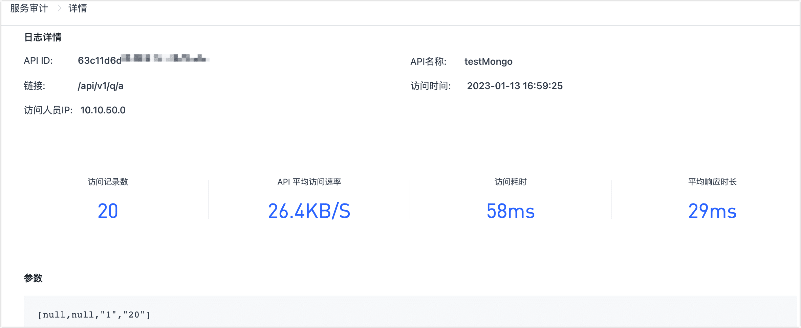

# 服务审计

import Content from '../../reuse-content/_enterprise-features.md';

<Content />

服务审计主要用来查看 API 的访问记录，可查看每次请求的记录包括访问类型、访问人员、IP 地址、访问时间、访问结果、失败原因等等，也可按不同条件进行筛选。

登录至 TapData 平台，单击页面左侧的**数据服务** > **服务审计**即可查看。

单击**详情**可查看到对应请求的详细信息，具体如下：

- **日志详情**：包括请求的基本信息与指标，例如 API 的 ID、名称、请求方法与路径、请求者 IP、状态码、时间戳等。
- **访问行数**：该次访问返回的记录总数（不区分页或流式）。
- **匹配行数**：该次访问中符合查询/过滤条件的记录数（通常等于或小于访问行数）。
- **API 访问速率**：单次请求的数据平均传输速率，用于衡量接口吞吐。
- **请求访问耗时**：从平台接收到请求到完成响应的端到端耗时。
- **数据库响应时长**：该次请求与数据库交互的响应时间。