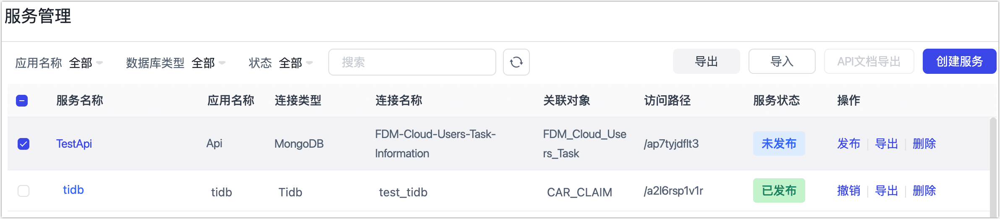

# 创建数据服务

import Content from '../../reuse-content/_enterprise-features.md';

<Content />

为了方便开发人员进行接口对接，同时也方便查看通过 TapData 发布的 API 信息，我们提供了数据服务功能。

## 支持的数据源

目前支持 Doris、MongoDB、MySQL、Oracle、PostgreSQL、SQL Server 和 TiDB。

## 操作步骤

1. [登录 TapData 平台](../log-in.md)。

2. 在左侧导航栏，选择**数据服务** > **服务管理**。

3. 单击页面右上角的**创建服务**，然后根据下述说明完成右侧面板的设置。

   

   * **服务名称**：为 API 指定一个有意义的名称，方便识别和管理。
   * **权限范围**：选择该 API 服务可由哪个角色调用，更多介绍，见[角色管理](../manage-system/manage-role.md)。
   * **所属应用**：选择此 API 所属的业务应用，有助于清晰地对 API 进行分类。更多介绍，见[应用管理](manage-app.md)。
   * **连接类型**、**连接名称**、**对象名称**：选择数据源及其对象（例如 orders-wide-view 这样的视图），作为 API 查询的目标。
   * **访问路径设置**：API 路径遵循 /api/{version}/{prefix}/{base_path} 的格式。
     * `version` 和 `prefix` 可选，用于版本控制或业务标识（如 /api/v1/orders/summary）。
     * `base_path` 必填，用于唯一标识端点，如未填写则会自动生成。
    * **请求参数**：定义客户端在调用 API 时可传入的参数。
      * 选择为**默认查询**时，系统会自动包含三个内置参数：page、limit 和 filter。客户端可通过这些参数动态控制分页和过滤；不支持自定义参数。
      * 选择为**自定义查询**时，您可以自行定义参数（如 region、startDate、userLevel），并在界面中映射到具体的过滤或排序条件。在该模式下，所有过滤逻辑由服务端处理，filter 参数不会默认包含，除非你手动添加。关于支持的类型和配置规则，请参见 API 查询参数。
   * **响应结果**：默认情况下，会返回所选对象的所有字段。您也可以手动调整，只返回选定的字段、为字段设置别名或设置数据脱敏规则等。

4. 单击页面右上角的**保存**，然后单击页面右下角的**生成**。

5. 找到刚创建的服务，单击其右侧的**发布**即可使用相关服务。

   如果后续不再需要该 API 服务，可单击其右侧的**下线**。

6. （可选）单击刚创建的服务，在右侧面板中选择**调试**页签，填写请求参数后单击**提交**来验证服务可用性。

   

7. （可选）对于已创建的数据服务，您可以将其选中并导出备份或分享给其他团队成员，您也可以导入数据服务。

   

   除此以外，对于已发布的数据服务，您还可以将其选中并单击 **API 文档导出**，可在团队内部快速建立 API 的使用资料，导出的 Word 文件为 docx 格式，包含数据服务名称、API 描述、GET/POST 的参数说明和使用示例等信息，具体如下图所示。

   

   
