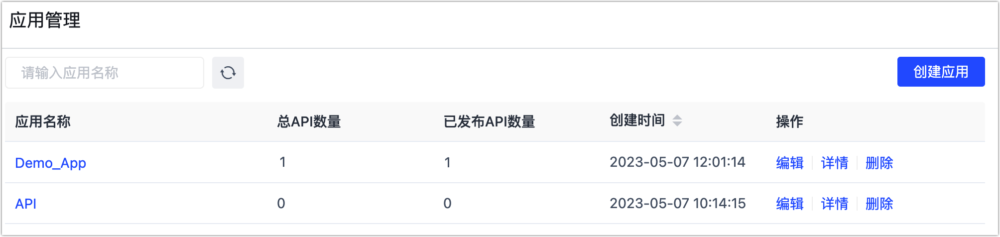

# 应用管理

为更好地管理和区分  API 服务，我们可以基于业务对其进行分类，将不同的 API 划入不同的应用中，本文介绍具体的操作流程。

## 操作步骤

1. 登录 Tapdata 平台。

2. 在左侧导航栏，选择**数据服务** > **应用管理**。

3. 在页面右上角，单击**创建应用**。

4. 在弹出的对话框中，填入应用名称和描述，单击**保存**。

   

   :::tip

   操作完成后，[在创建 API 服务](create-api-service.md)时，即可选择要加入的应用。

   :::

5. （可选）管理已有应用。

   

   * **编辑**：可编辑应用的名称和描述信息。
   * **详情**：可查看该应用中包含的 API 服务详细信息，例如发布状态等。
   * **删除**：如果当前应用中包含 API 服务，您需要在弹出的对话框中，将其中的  API 服务转移至其他应用中后即可删除。