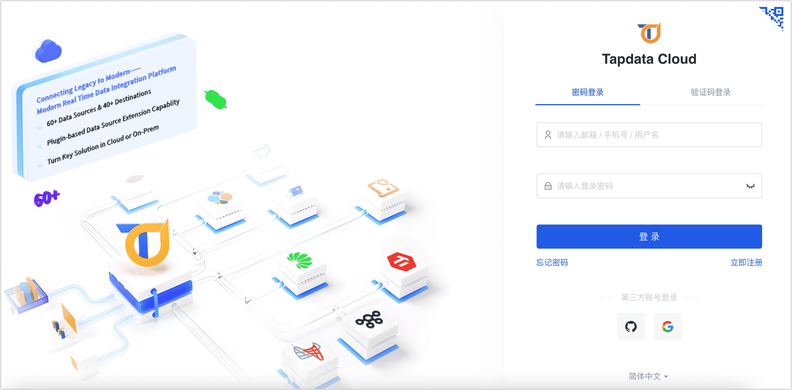
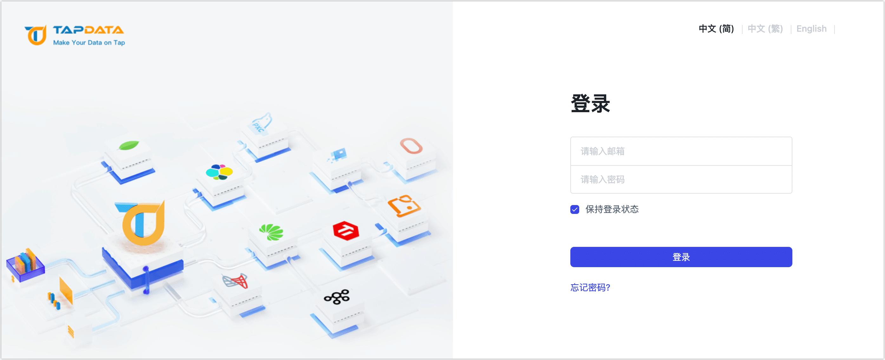

# 登录 TapData 平台
import Content from '../reuse-content/_all-features.md';

<Content />

TapData 提供了界面化操作平台，方便您通过简单的拖拽即可完成数据管道的编排与设置，在使用前，您需要根据选用的产品系列，跟随下述文档指引登录至 TapData 平台。

## TapData Cloud

TapData Cloud 适合需要快速部署、低前期投资场景，帮助您更好地专注于业务发展而非基础设施管理。您只需访问 [TapData Cloud](https://cloud.tapdata.net/console/v3/) 平台，注册账号即可登录，支持邮箱/手机号、微信二维码以及第三方账号（GitHub/Google）注册登录。

## TapData Enterprise

TapData Enterprise 支持部署至本地数据中心，适合对数据敏感性或网络隔离有严格要求的场景。TapData Enterprise 平台由管理员[完成部署](../installation/install-tapdata-enterprise/README.md)操作，基于业务需求为企业内的用户[分配账号](../user-guide/manage-system/manage-user.md)并[授予权限](../user-guide/manage-system/manage-role.md)，普通用户需联系管理员获得登录地址和账号。

## TapData Community

TapData Community 是一个开源的数据集成平台，提供基础的数据同步和转换功能，可通过 Docker 一键部署，帮助您快速探索和实施数据集成项目。默认登录账号为 admin@admin.com，默认密码为 admin，登录后请及时修改密码以保障安全性，您也可以基于业务需求为其他用户[分配账号](../user-guide/manage-system/manage-user.md)。

