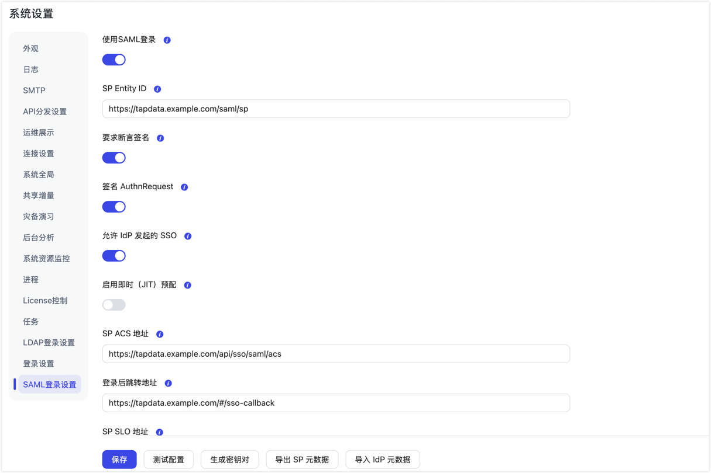
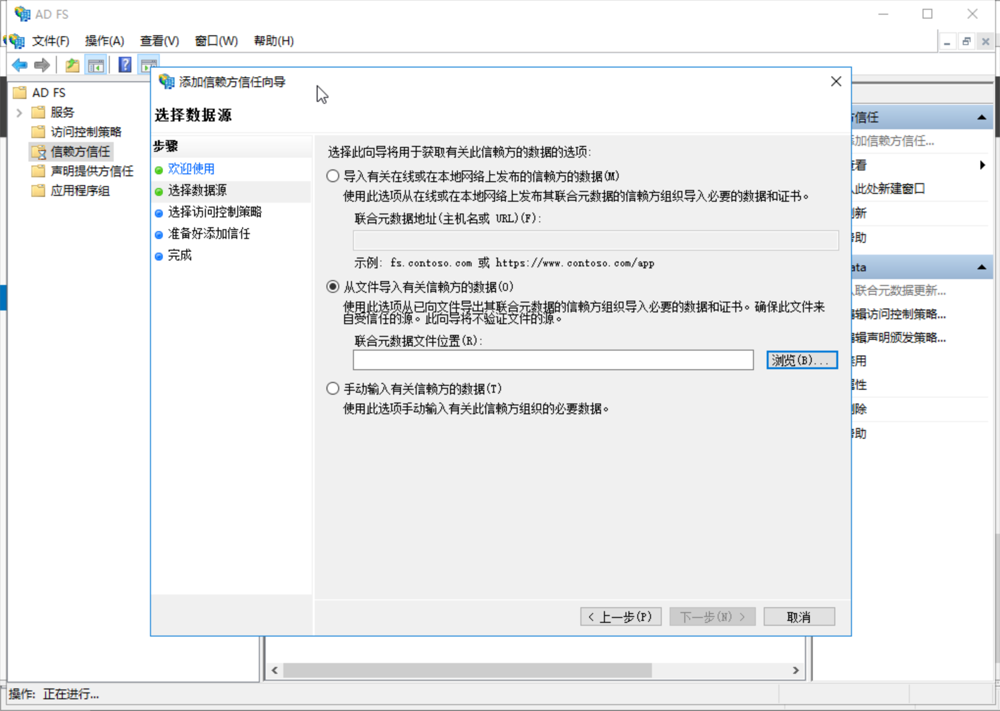
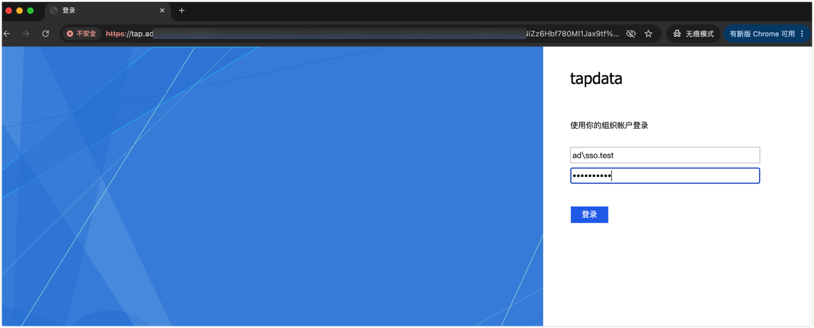
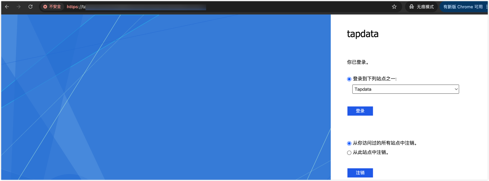
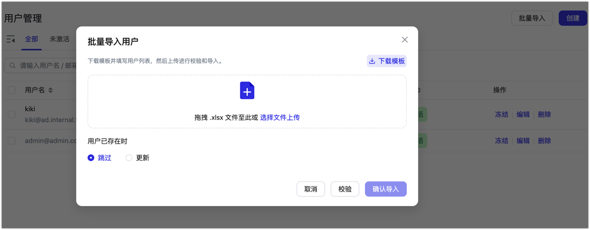
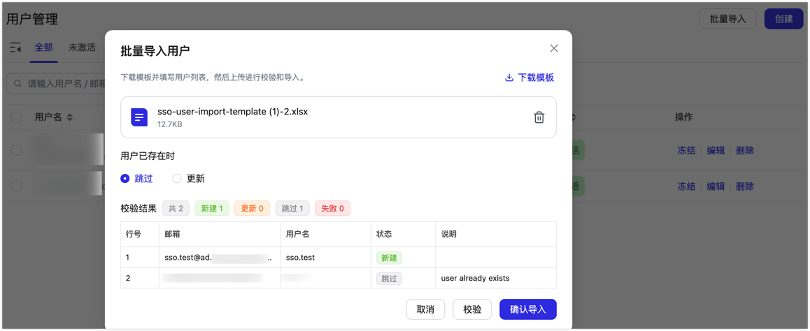

# 配置单点登录（SSO）

import Content from '../../reuse-content/_enterprise-features.md';

<Content />

TapData 支持通过 SAML 2.0 对接企业身份认证系统，实现员工使用企业账号统一登录。本文以 Active Directory Federation Services（AD FS）为例，介绍单点登录的配置与验证流程。

## 背景介绍

企业使用多个业务系统时，分别维护账号密码会增加员工负担，也不利于统一执行多因素认证（MFA）等安全策略。单点登录（SSO）将身份认证交由企业已有的认证平台处理，减少独立密码管理。

TapData 支持两种账号管理模式：
- **预创建/批量导入模式**：由管理员在 TapData 中预先创建或批量导入员工账号并分配角色，只有授权人员可以登录。本文以该模式为主进行演示。
- **即时预配模式（JIT）**：员工首次通过 SSO 登录时，系统自动创建账号。是否启用由企业的账号管理策略决定。

## 准备工作

- **环境与权限**：拥有 TapData 系统管理员账号、AD FS 管理员权限，以及一个已配置有效邮箱的企业测试账号。
- **网络与证书**：浏览器可通过 HTTPS 正常访问 TapData 和 AD FS，证书受信任且服务端时间保持同步。若使用了反向代理，相关地址请填写对外实际访问地址。
- **配置 SSO 主密钥**：TapData 使用环境变量 `SSO_MASTER_KEY` 加密保存私钥。首次配置前，需由部署人员在管理服务启动环境中配置该变量（值为 32 字节随机密钥的 Base64 编码，多节点部署须使用相同值；已有密钥应继续使用）。以下示例仅适用于使用 `systemd`（`tapdata.service`）的 Linux 环境：
  ```bash
  sudo install -d -m 700 /etc/tapdata
  sudo sh -c 'set -eu; umask 077; sso_key=$(openssl rand -base64 32); set -C; printf "SSO_MASTER_KEY=%s\n" "$sso_key" > /etc/tapdata/sso.env'
  ```

  上述命令用于首次生成密钥；文件已存在时不会覆盖。执行 `sudo systemctl edit tapdata.service`，在打开的编辑器中添加并保存：

  ```ini
  [Service]
  EnvironmentFile=/etc/tapdata/sso.env
  ```

  在维护窗口使配置生效，并确认服务恢复：

  ```bash
  sudo systemctl daemon-reload
  sudo systemctl restart tapdata.service
  sudo systemctl status tapdata.service
  ```

  其他部署方式应将变量注入实际管理服务的启动环境并重启服务；Windows 可参考[安装文档](../../installation/install-tapdata-enterprise/install-on-windows.md#准备工作)设置环境变量。

## 配置与验证

1. 登录 TapData 平台，点击右上角设置图标进入**系统设置**，左侧选择 **SAML 登录设置**。

   

   截图仅示意配置字段。初次配置期间，请先保持**使用 SAML 登录**开关处于关闭状态；完成两端配置后再开启，并使用测试账号验证。

2. 根据页面提示填写服务提供方（SP）参数：
   - **SP Entity ID**：TapData 的 SAML 标识，例如 `https://tapdata.example.com/saml/sp`，须与 AD FS 中的信赖方标识一致。
   - **SP ACS 地址**：接收 AD FS 断言响应的地址，格式为对外访问地址加 `/api/sso/saml/acs`，例如 `https://tapdata.example.com/api/sso/saml/acs`。
   - **登录后跳转地址**：登录成功后的跳转地址，格式为对外访问地址加 `/#/sso-callback`，例如 `https://tapdata.example.com/#/sso-callback`（注意勿填写 `/api/sso/saml/login`，避免重定向死循环）。
   - **NameID 格式**：选择邮箱格式 `urn:oasis:names:tc:SAML:1.1:nameid-format:emailAddress`。
   - **要求断言签名**：建议开启，要求 AD FS 对断言进行签名。
   - **签名 AuthnRequest**：按需开启，对发往 AD FS 的认证请求进行签名。
   - **允许 IdP 发起的 SSO**：需要从 AD FS 门户直接单点跳转进入 TapData 时开启。
   - **启用即时（JIT）预配**：本教程采用预创建账号模式，保持关闭；如需首次登录自动创建账号，可根据企业策略开启。

3. 点击**生成密钥对**后点击**保存**，然后点击**导出 SP 元数据**，下载并保存 `tapdata-sp-metadata.xml` 文件。后续已完成对接时切勿重复点击生成密钥对，否则需重新向 AD FS 导入证书。

4. 登录 AD FS 服务器并打开 **AD FS 管理** 控制台，在**信任关系** > **信赖方信任**中点击**添加信赖方信任**，选择**从文件导入有关信赖方的数据**，上传导出的 `tapdata-sp-metadata.xml` 文件，按照向导完成添加。

   

5. 右键单击添加好的信赖方信任，选择**编辑声明颁发策略**，依次添加两条声明规则：
   - **规则 1（获取邮箱）**：模板选择“将 LDAP 属性作为声明发送”，属性存储选择 Active Directory，LDAP 属性选择 `E-Mail-Addresses`，传出声明类型选择 `E-Mail Address`。
   - **规则 2（转为 NameID）**：模板选择“转换传入声明”，传入声明类型选择 `E-Mail Address`，传出声明类型选择 `Name ID`，传出名称 ID 格式选择 `Email`，勾选“传递所有声明值”。

6. 获取 AD FS 的元数据文件。可在浏览器访问或在 PowerShell 中执行以下命令下载（域名替换为实际 AD FS 地址）：
   ```powershell
   Invoke-WebRequest -Uri "https://adfs.example.com/FederationMetadata/2007-06/FederationMetadata.xml" -OutFile "metadata.xml"
   ```

7. 回到 TapData **SAML 登录设置** 页面，点击**导入 IdP 元数据**，上传下载的 `metadata.xml`，确认系统自动解析并回填的 IdP 参数。

8. 参考[管理用户](manage-user.md#操作步骤)，在 TapData 中手动创建一个与 AD FS 测试账号邮箱完全一致的测试用户，为其分配[角色](manage-role.md)并激活账号。

9. 确认**启用即时（JIT）预配**仍处于关闭状态，再打开**使用 SAML 登录**开关并点击**保存**。保留当前管理员浏览器窗口，以便配置异常时继续管理。

10. 打开新的浏览器无痕窗口，访问 TapData 系统地址进行验证。页面跳转至 AD FS 登录页后，按提示使用测试账号登录并完成适用的 MFA 验证；若页面显示**单点登录**按钮，可先单击该按钮。认证成功后，确认返回 TapData，并能访问该账号角色对应的菜单和资源。

    

    登录截图仅作测试环境界面示意；实际部署应使用受信任的 HTTPS 证书。

    如果开启了“允许 IdP 发起的 SSO”，也可访问企业 AD FS 门户（如 `https://adfs.example.com/adfs/ls/idpinitiatedsignon.aspx`）选择 TapData 进行单点登录。

    

11. 使用一个在 AD FS 中有效、但未在 TapData 中创建的测试账号尝试登录。预期 TapData 拒绝登录，用户管理中不新增该账号，以确认关闭 JIT 后的账号管理策略生效。

## 批量导入 SSO 用户

单账号测试验证通过后，如果需要允许其他企业员工登录，可预先批量导入员工账号并分配角色：

1. 以管理员身份进入**系统管理** > **用户管理**，点击**批量导入** > **下载模板**。

   

2. 打开下载的 Excel 模板（`.xlsx`），填写用户信息：
   - **`email`**：必填，员工企业邮箱，须与 AD FS 传递的邮箱完全一致。
   - **`username`**：选填，新用户留空时根据邮箱生成；更新已有用户时留空表示保留原用户名。
   - **`roleNames`**：选填，TapData 角色名称，多个角色用英文逗号分隔。新用户留空时使用系统注册默认角色；更新已有用户时留空则保留其原角色。若填写不存在的角色名称，系统会创建同名的空权限角色，请先核对角色名称和权限。

3. 上传填写好的文件，选择已有用户的处理方式（**跳过**或**更新**），点击**校验**检查数据。选择**更新**时，非空的 `roleNames` 会替换该用户的全部角色关联，请填写需要保留的完整角色集合；留空则保留原角色。

   

4. 核对新建、更新、跳过和失败记录。确认无误后点击**确认导入**，再检查实际导入结果及账号状态；部分记录失败时，根据失败原因处理，不能仅凭其他记录成功就认为整批导入完成。

## 常见问题

- **问：企业认证平台故障或 SSO 配置有误时，如何使用本地账号登录？**
  **答**：访问 `https://tapdata.example.com/?sso=1`（将示例域名和端口替换为实际访问地址）可打开本地账号登录页面，不会关闭系统的 SAML 配置。请使用已设置密码且处于激活状态的本地账号；通过 SSO 导入的新用户没有本地密码，不能作为备用登录账号。

- **问：企业账号认证成功，但无法进入 TapData？**
  **答**：请确认该账号已在 TapData 中创建且处于激活状态，并检查 AD FS 声明规则输出的 NameID 邮箱是否与 TapData 账号邮箱一致。

- **问：登录成功，但页面没有任何菜单或资源权限？**
  **答**：检查该用户在 TapData 中关联的角色权限；若通过批量表格导入建号，请排查 `roleNames` 是否因拼写错误而自动创建了无权限的同名空角色。

- **问：登录时页面反复重定向或循环跳转？**
  **答**：检查**登录后跳转地址**是否为实际 TapData 访问地址加 `/#/sso-callback`（切勿填写 `/api/sso/saml/login`），并核对反向代理的对外域名及浏览器回调请求。

- **问：提示签名验证失败或证书错误？**
  **答**：核对断言签名要求及 AD FS 实际发送的签名；若 AD FS 签名证书已更新，需重新获取其元数据并导入 TapData，核对回填的证书后保存。

- **问：点击“生成密钥对”报错或无响应？**
  **答**：检查管理服务所在环境是否已正确配置 32 字节 Base64 编码的 `SSO_MASTER_KEY` 环境变量并重启生效。
