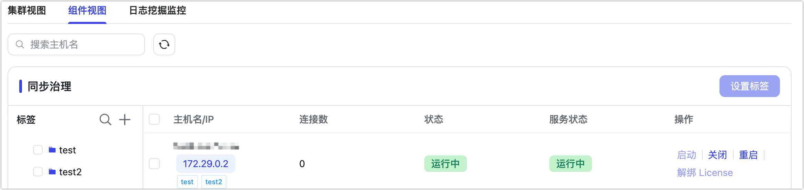

# 管理集群

import Content from '../../reuse-content/_enterprise-features.md';

<Content />

通过集群管理页面，您可以查看当前集群内所有组件的运行状态和对外建立的连接数等信息，同时支持管理操作。

## 操作步骤

1. [登录 Tapdata 平台](../log-in.md)。

2. 在左侧导航栏，选择**系统管理** > **集群管理**，默认展示**集群视图**，可查看各组件的运行状态和连接信息。

   您还可以对服务执行启动/关闭、重启操作，其中关闭与重启操作会影响相关服务的正常运行，请在运维窗口或业务低峰期操作。

   

3. 在此页面，根据业务需求选择下述操作。

   * 单击可下载当前引擎的线程资源使用详情，格式为 JSON。

   * 单击可下载当前引擎的数据源使用详情，格式为 JSON。

   * 单击可调整服务器名称与切换网卡展示信息。

     :::tip

     切换网卡展示信息仅改变集群管理页服务器下 IP 地址的展示，不会影响功能运行。

     :::

   * 单击可增加自定义的服务监控。

4. 单击右上角的**组件视图**，页面将以组件分类展示其状态信息，此外，您还可以为多个同步治理服务（Agent）指定不同的标签，后续在配置数据同步/转换任务时可指定对应标签的 Agent。

   