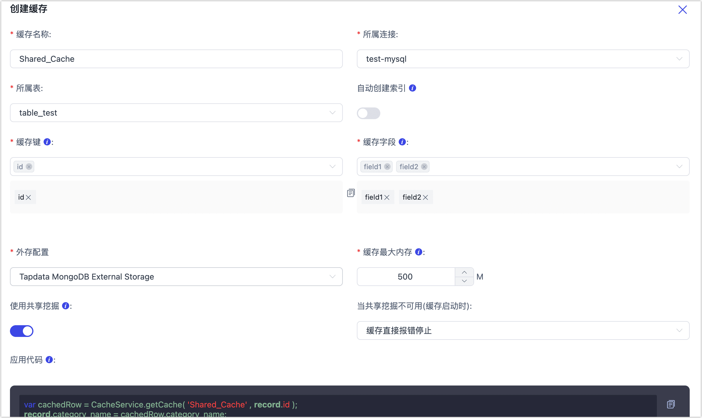

# 管理外存

为便于后续快速读取任务相关信息，Tapdata 会将任务的必要配置、共享缓存等信息存储至内部的 MongoDB 数据库中。为存储更多的数据（如缓存数据），您可以创建一个外部数据库来存储相关数据。

## 前提条件

已创建用作数据存储的外部数据库，当前支持 MongoDB 和 RocksDB。

## 创建外存

1. 登录 Tapdata 平台。

2. 在左侧导航栏，选择**系统管理** > **外存管理**。

3. 在页面右侧，单击**创建外存**。

4. 在弹出的对话框中，根据下述说明完成配置。

   

   * **外存名称**：填写具有业务意义的换成名称，便于后续识别。

   * **外存类型**：支持 **MongoDB** 和 **RocksDB**。

   * **存储路径**：填写数据库连接地址，例如 MongoDB 格式参考：

      `mongodb:/admin:password@127.0.0.1:27017/mydb?replicaSet=xxx&authSource=admin`。

   * **使用 TLS/SSL 连接**：选择是否启用 TSL/SSL 加密，如开启该功能，您还需要上传客户端私钥。

   * **设为默认**：选择是否作为默认外存。

5. 单击**连接测试**，测试通过后单击**保存**。

   :::tip

   如提示连接测试失败，请根据页面提示进行修复。

   :::

## 使用外存

您可以在共享缓存、部分处理节点（如**连接节点**）中使用刚刚配置的外存，示例如下：

* [创建共享缓存](../advanced-settings/share-cache.md)时，可选择外存。

  

* 创建数据复制/开发任务时，增加[处理节点](../data-pipeline/data-development/process-node.md)（如连接节点）时，可选择外存。

  