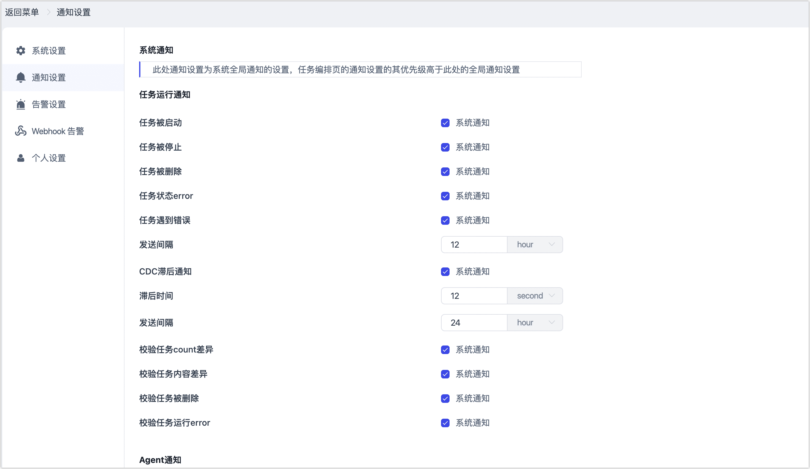
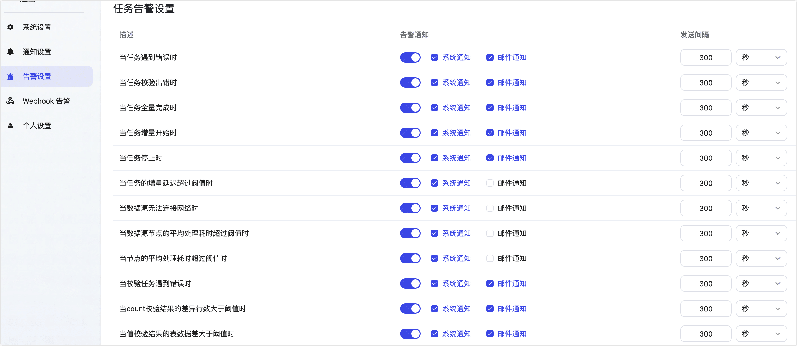
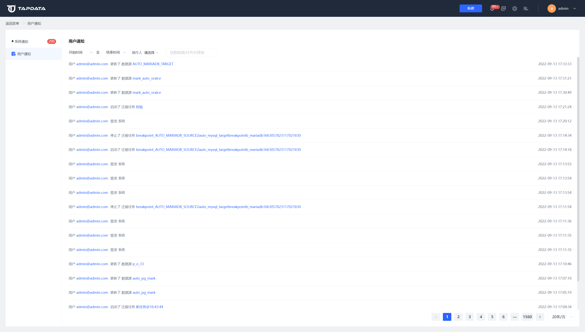

# 通知中心

## 系统通知

系统通知功能主要是系统根据用户自定义的通知规则设置，自动触发发送的通知。主要包括任务运行通知和Agent通知两种类型，具体包含的通知项有：

- 任务被删除
- 任务被停止
- 任务状态error
- 任务遇到错误
- CDC滞后超时
- 数据库DDL变化
- 服务器断开连接
- Agent服务被启动
- Agent服务被停止
- Agent被创建
- Agent被删除

用户在系统通知设置里打开了系统通知选项的通知，都可以在系统通知列表中看到。

### 功能描述

在系统通知列表用户可以看到所有的系统通知，消息通知按照系统定义区分不同的级别，包括：ERROR、WARN、INFO三种级别。

在系统通知列表支持按照消息的不同级别进行筛选，支持按照消息类型进行筛选。

### 通知设置

通过通知设置可以设置接收哪些类型的系统通知，设置入口为右上角的设置图标，然后选择**通知设置**。

## 用户通知

用户通知功能主要用来记录所有的用户操作，用户从登录系统开始进行的所有操作都会以用户通知的形式进行记录。用户可以通过用户通知记录来对用户行为进行审计。

在用户通知页面，可以通过数据源或者任务名称、操作时间和操作人对用户通知进行快速筛选。

