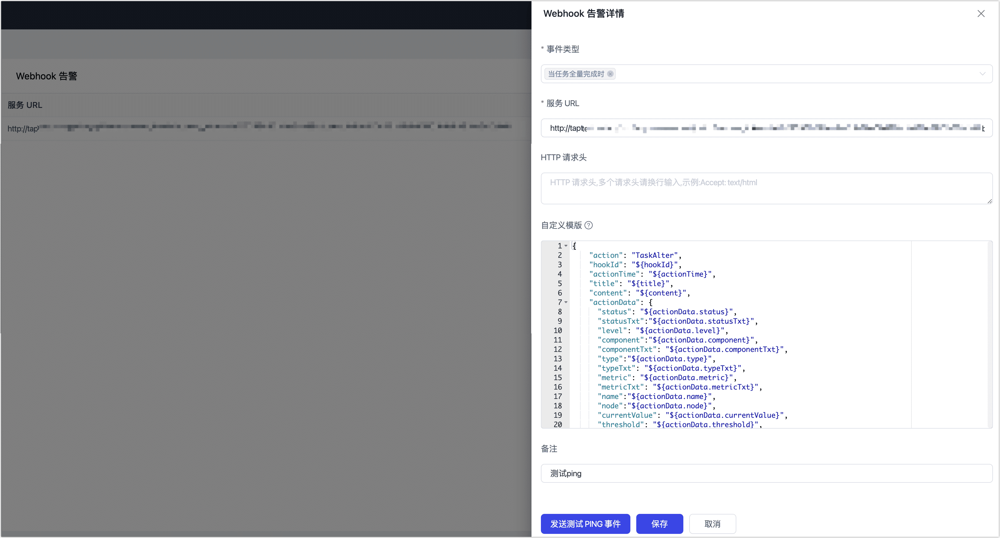

# 通知与告警设置

import Content from '../../reuse-content/_enterprise-and-community-features.md';

<Content />

:::tip

如您的产品为 TapData Cloud，通知消息及其配置入口在页面右上角，支持设置通知规则和告警接收人。

:::

TapData 支持自定义系统和告警设置，同时支持通过 Webhook 对接第三方平台，帮助您快速掌握任务运行状态。

## 通知设置

[登录 TapData 平台](../log-in.md)后，单击右上角的  > **个人设置**，然后再页面左侧选择**通知设置**，即可自定义通知规则设置，自动触发通知发送流程，主要包括任务运行通知和 Agent 通知两种类型，具体包含的通知项如下所示：

### 任务运行通知

用于监控任务生命周期状态变化，并触发相应通知。

| 项目                | 说明                                                         |
| ------------------- | ------------------------------------------------------------ |
| 任务被启动          | 当任务成功启动时触发通知                                     |
| 任务被停止          | 当任务被手动或系统终止时通知                                 |
| 任务被删除          | 当任务被移除时通知                                           |
| 任务状态 error      | 当任务进入 error 状态（运行异常）时通知                      |
| 任务遇到错误        | 任务执行中出现非终止性错误时通知                             |
| 发送间隔            | 相同错误通知之间的最小间隔，单位可选秒或小时，默认为 12 秒。 |
| CDC 滞后通知        | 用于监控增量同步任务中的延迟情况，及时发现滞后风险。         |
| 滞后时间            | 指定多长时间未获取到增量数据，触发滞后预警，默认为 12 秒     |
| 发送间隔            | 控制 CDC 滞后类通知的重复发送频率，避免过多推送，默认为 24 小时 |
| 校验任务 count 差异 | 启用后，当源表与目标表的行数校验不一致时发送通知             |
| 校验任务内容差异    | 启用后，当发现字段级别数据差异时发送通知                     |
| 校验任务被删除      | 校验任务被移除时发送通知                                     |
| 校验任务运行 error  | 任务执行失败时发送通知                                       |

### Agent 通知

用于监控 Agent 服务的运行状态及生命周期变化。

| 项目             | 说明                         |
| ---------------- | ---------------------------- |
| 服务器断开连接   | Agent 无法连接到平台时通知   |
| Agent 服务被启动 | Agent 成功注册上线时通知     |
| Agent 服务被停止 | Agent 服务停止运行时通知     |
| Agent 被创建     | 新 Agent 被注册成功时通知    |
| Agent 被删除     | Agent 被手动或系统移除时通知 |

## 告警设置

通过告警设置，您可以哪些任务事件需要出发告警通知，通知发送方式（如邮件）和发送间隔：

:::tip

相关邮件告警实践案例，见[通过 QQ 邮箱发送告警信息](../../case-practices/best-practice/alert-via-qqmail.md)。

:::

## Webhook 告警

通过 Webhook 告警功能，您只需填写服务 URL 即可与您的告警平台或第三方平台实现快速对接，从而实现更多的通知方式，例如即时通讯平台。

