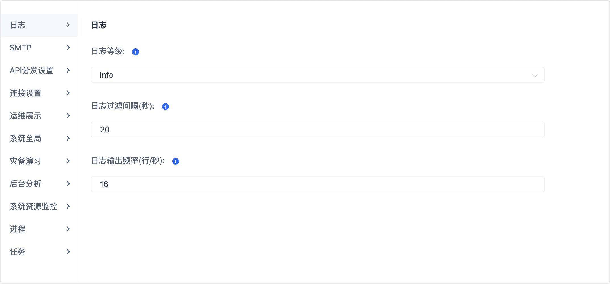
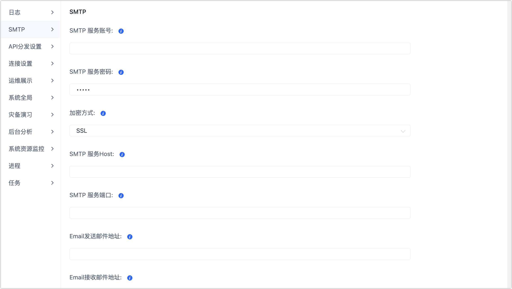
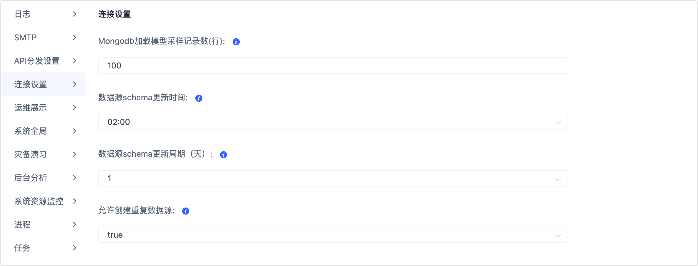
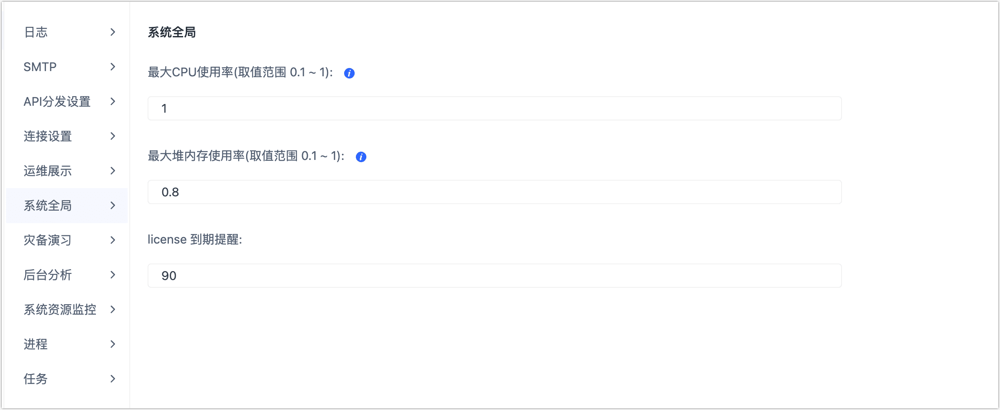
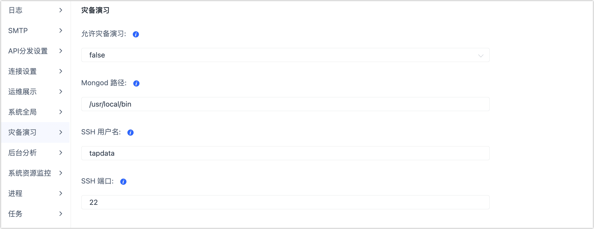

# 系统设置

系统设置功能主要用来对系统的一些参数进行设置，例如日志、SMTP、API 分发等设置。

## 设置入口

在页面右上角，单击图标，然后单击**系统设置**。

## 日志设置

**日志等级**：在日志设置可以设置日志的等级。输入任务日志等级包括: **error**/**warn**/**info**/**debug**/**trace**。用户选择了一个等级，则在日志内只会打印该等级及其以上等级的日志。

**日志过滤间隔(秒)**：设置相同日志在指定时间内只出现一次（1分钟后生效）。

**日志输出频率(行/秒)**：日志设置每秒允许的事件平均数量

## SMTP 设置

配置SMTP服务，设置项包括：

- SMTP 服务账号：设置SMTP账号
- SMTP服务密码：设置SMPT账号的密码
- 加密方式：选择加密方式，支持SSL和TLS
- SMTP 服务Host：设置SMPT服务的主机地址
- SMTP服务端口：设置SMTP服务的端口号
- Email发送邮件地址：设置发送邮件的邮箱地址
- Email接受邮件地址：设置接受邮件的邮箱地址
- 发送Email标题的前缀(可选)：设置邮件标题的前缀

按照设置项设置完成后，可以查看邮件模板。可以通过连接测试来检测配置是否正确。

连接测试通过之后点击保存按钮，保存SMTP设置。

## API 分发设置

设置API分发策略，设置项包括：

- 默认查询返回行数：设置API查询时默认的返回行数
- 最大查询返回行数：设置API查询时的最大返回行数
- 启用API统计：设置是否启用API统计
- API请求缓存最大个数：设置API请求时缓存的最大个数
- API请求汇报频率(秒)：设置API请求时汇报的频率

## 连接设置

设置连接管理的一些配置，设置项包括：

- MongoDB加载模型采样记录数(行)：设置加载MongoDB模型时进行采样记录行数
- 数据源schema更新时间：设置自动更新数据源schema的具体时间
- 数据源schema更新周期（天）：设置数据源schema的更新周期，单位为天
- 允许创建重复数据源：设置是否允许创建重复的数据源

## 运维展示设置

运维展示支持设置项包括：

- 运维运控URL
- 流程引擎版本
- Tapdata agent版本

## 系统全局设置

系统全局设置，支持的设置项包括：

- 最大CPU使用率(取值范围 0.1 ~ 1)
- 最大堆内存使用率(取值范围 0.1 ~ 1)
- License 到期提醒

## 灾备演习设置

灾备演习设置主要的配置项包括：

- 允许灾备演习
- Mongod 路径
- SSH 用户名
- SSH 端口

## 后台分析设置

后台分析设置主要设置数据质量分析间隔，用户根据需要设置即可。

## 系统资源监控设置

系统资源监控设置主要设置系统资源监控的采集频率，用户根据需要设置即可。

## 进程设置

- 进程设置主要用来设置进程心跳的过期时间

- 进程心跳过期时间（秒）

## 任务设置

任务设置主要用来对任务运行时的一些参数进行设置。支持的设置项包括：

- 增量滞后判定时间（秒）：可以设置任务增量延迟超过多少时才算滞后
- 是否在目标端数据集添加创建时间：true or false
- 缓存一份当前整体数据，合并到目标数据集中
- 缓存一份修改前的整体数据，合并到目标数据集中
- 是否传输任务日志到云端
- 增量模式下切换到批量插入模式间隔时间（秒）
- 采样率
- 负载阈值（百分比）
- 负载统计时间（分钟）
- 非法字符替换
- 同步任务心跳超时（毫秒）
- 增量同步任务共享模式
- 增量任务强制使用共享模式
- 自动保存增量事件
- 增量事件保存时长（天）
- 重试间隔（秒）
- 最大重试时间（分钟）

