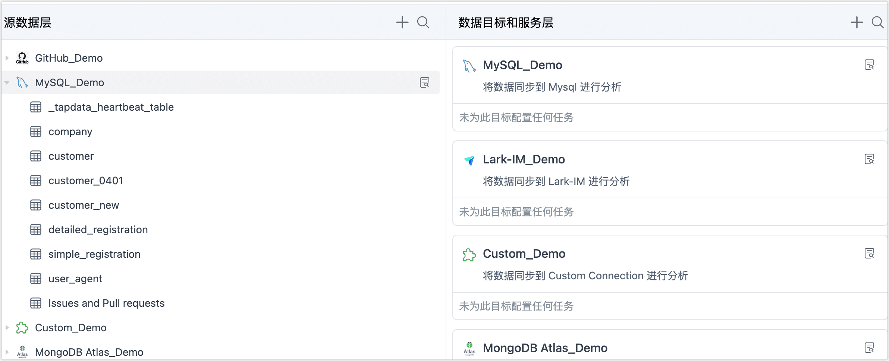
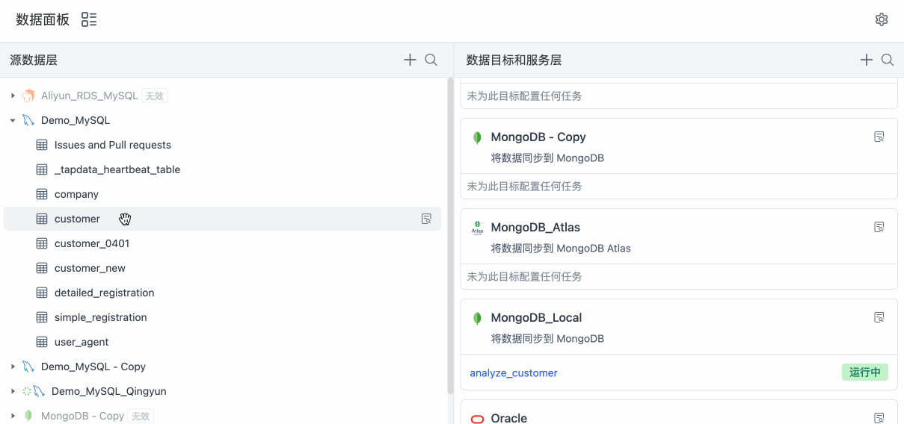

# 一键生成数据管道

在数据集成模式下，您只需要简单地拖动源表至目标库，即可一键生成数据管道，极大简化任务配置流程，实现源目数据的实时同步。本文介绍如何生成数据管道。

## 操作步骤

1. 登录 Tapdata 平台。

2. 在左侧导航栏，单击**实时数据中心**。

3. 在本页面，您可以直观地看到您已录入的数据源信息，Tapdata 将其以源和目标的形式分为左右两列。

   

4. （可选）单击🔍图标，找到您需要同步的源表，将其拖动至右侧目标数据源。

5. 在弹出的对话框中，填写具有业务意义的任务名称并单击确定。

   Tapdata 将自动创建一个数据管道，将您的源表实时同步到选定的目标库中，在本案例中，会将 **company** 表 从MySQL 实时同步至 MongoDB 中。

   

   - **仅保存**：仅保存任务链路，此时，您可以单击目标库卡片中的任务名称，对该任务链路进行个性化定制，例如在跳转的任务配置页面[添加处理节点](../../data-pipeline/data-development/process-node)，实现表结构调整（如增加字段）、合并表、构建宽表等需求，完成设置后单击页面右上角的**启动**。

   - **保存并运行**：无需执行额外的操作，由 Tapdata 自动创建一个数据转换任务并运行，将您的源表实时同步到选定的目标库中。在本案例中，Tapdata Cloud 会将源 MySQL 中的 **customer** 表实时同步到 MongoDB 中。

     您也可以单击目标库卡片中的任务名称，进入任务监控页面查看详细的运行状态，更多介绍，见[监控任务](../../data-pipeline/data-development/monitor-task.md)。

   

   

   
