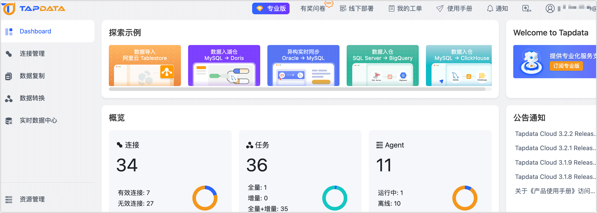
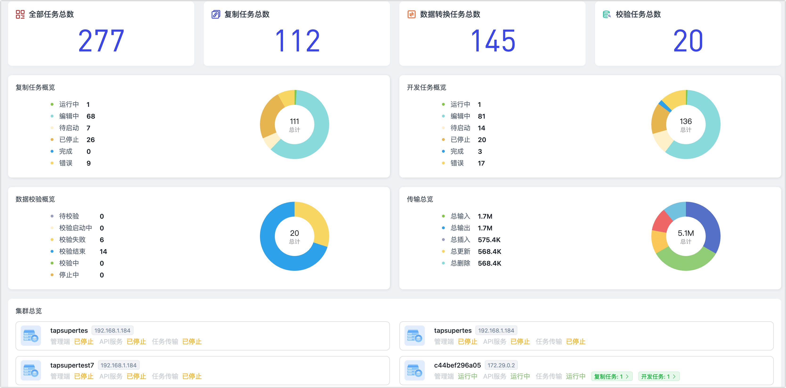

# Dashboard/工作台

登录 Tapdata 平台后，页面将默认展示 Dashboard/工作台，帮助您快速使用产品，了解任务运行状态等，基于您的选用的产品系列，选择查看下述文档。

## Tapdata Cloud

帮助您快速了解和熟悉产品，并可以通过快速创建入口创建 Agent、连接和任务。

* **探索示例**：展示 Tapdata Cloud 在不同场景下的最佳实践，例如数据入湖仓等。

* **概览**：展示 Tapdata Cloud 中 Agent、连接、任务的数量和状态信息。

* **公告通知**：展示最新的公告信息，包括升级变更提醒、版本新特性介绍等内容，点击公告标题可以查看公告详细内容。

* **系统通知**：将鼠标悬浮在右上角的**通知**，可快速获取最近的系统通知和告警信息（例如 Agent 状态通知），此外，您还可以单击**通知**，进入**通知列表**页面设置 Agent 通知的方式（如邮件/短信等）规则和**默认告警接收人**（支持多个邮箱）。

  

## Tapdata On-Prem

当前系统所有任务的数量统计、状态统计和运行数据统计，并可以查看当前系统集群的运行状态。

控制台页面主要包含以下关键指标：

- **全部任务**：展示当前用户全部任务总数量，包括数据复制任务、数据转换任务和数据校验任务。
- **复制任务**：展示当前用户创建的数据复制任务的总数量
- **转换任务**：展示当前用户创建的数据转换子任务的总数量
- **校验任务**：展示当前用户创建的数据校验任务的总数量
- **复制任务概览**：展示当前用户创建的所有数据复制任务的任务状态分布
- **转换任务概览**：展示当前用户创建的数据转换任务的任务状态分布
- **数据校验**：展示当前用户创建的所有数据校验任务的校验结果分布
- **传输总览**：展示当前用户创建的所有数据复制任务和数据转换任务的事件传输统计
- **集群总览**：展示系统集群下各节点服务的当前状态

## 相关文档

只需简单 3 步，即可体验 Tapdata 强大、便捷的数据流转能力：

* [安装 Tapdata](../quick-start/install/README.md)
* [连接数据库](../quick-start/connect-database.md)
* [创建复制/开发任务](../quick-start/create-task.md)

