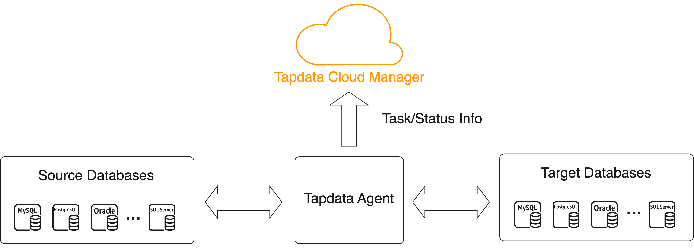

# Configure Network Access

import Content from '../reuse-content/_cloud-features.md';

<Content />

Before deploying the Agent, you need to refer to the requirements in this document and adjust the relevant firewall to ensure its communication ability. The workflow of the Agent is shown below:

| Requirements | Description |
| ---------------------------------- | ------------------------------------------------------------ |
| Agent can connect to source database's port. | Ensure that the Agent can read data from the source database.  |
| Agent can connect to target database's port. | Ensure that the Agent can write data to the target database.  |
| Agent can connect to extranet. | Ensure the Agent can report task status, retrieve configuration, and execute tasks to/from TapData Cloud.  |

If you have subscribed to the [Fully Managed Agent](../billing/purchase#hosted-mode) and the data source you intend to connect with only allows connections from specific IP addresses, then you will need to add the server address of the Agent to the appropriate security settings of the data source. For instance, you might need to add it to the whitelist rules of your self-hosted database's firewall. This ensures that the Agent can establish communication and transfer data with your data source. The server addresses for Agent in various regions are as follows: 

<table>
<thead>
  <tr>
    <th>Cloud Provider</th>
    <th>Region</th>
    <th>Server Address of Agent</th>
  </tr>
</thead>
<tbody>
  <tr>
    <td rowspan="9">Google Cloud</td>
    <td>HongKong</td>
    <td>34.92.78.86</td>
  </tr>
  <tr>
    <td>Sydney</td>
    <td>34.87.244.166</td>
  </tr>
  <tr>
    <td>Singapore</td>
    <td>35.240.192.89</td>
  </tr>
  <tr>
    <td>TaiWan</td>
    <td>35.221.187.67</td>
  </tr>
  <tr>
    <td>Tokyo</td>
    <td>34.146.223.25</td>
  </tr>
  <tr>
    <td>London</td>
    <td>35.246.16.216</td>
  </tr>
  <tr>
    <td>Frankfurt</td>
    <td>34.159.220.196</td>
  </tr>
  <tr>
    <td>N. Virgina</td>
    <td>34.145.229.212</td>
  </tr>
  <tr>
    <td>Oregon</td>
    <td>34.83.4.199</td>
  </tr>
  <tr>
    <td>Alibaba Cloud</td>
    <td>HongKong</td>
    <td>47.242.251.110</td>
  </tr>
</tbody>
</table>
