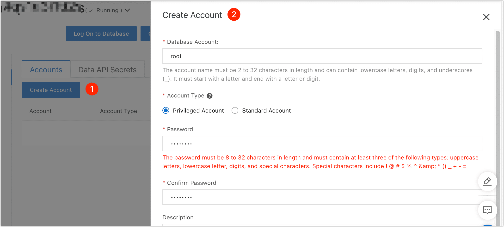
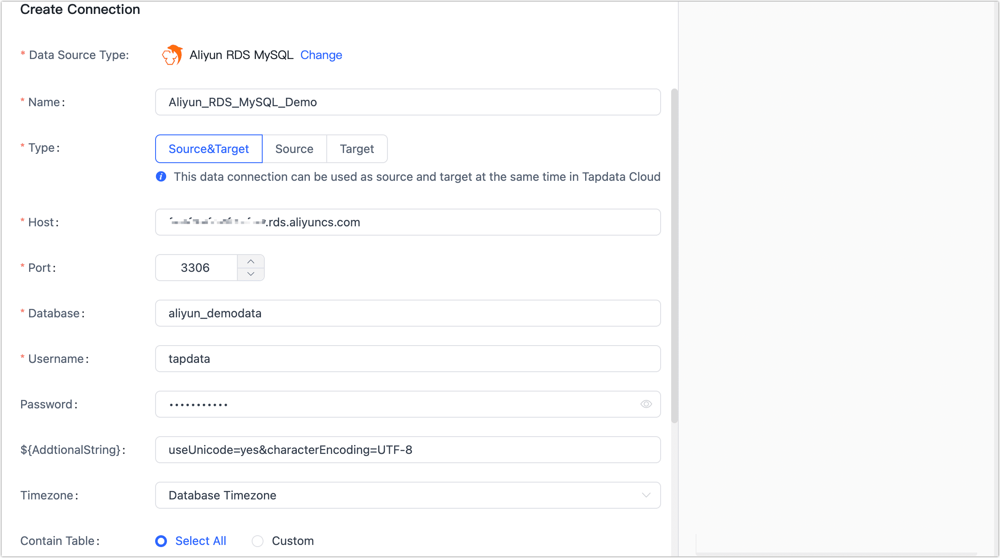

# Aliyun RDS MySQL

import Content from '../../reuse-content/_enterprise-and-cloud-features.md';

<Content />

ApsaraDB RDS MySQL is a relational database service with high availability, scalability, security and reliability provided by Alibaba Cloud. 

TapData extends support for constructing data pipelines with Aliyun RDS MySQL as both the source and target database. This article introduces how to connect to Aliyun RDS MySQL, helping you quickly achieve data migration to the cloud or data flow across different cloud platforms.

## Supported Versions

5.1, 5.5, 5.6, 5.7, 8.0

## Prerequisites

1. Access the [RDS instance list](https://rdsnext.console.aliyun.com/rdsList/basic) on Aliyun Cloud, select the region at the top, and click on the target instance ID.

2. Create a Privileged Account.

   1. In the left navigation, select **Account Management**.

   2. On the right side of the page, click on **Create Account**.

   3. Complete the following settings in the panel on the right.

      

      * **Database Account**: Starts with a lowercase letter, ends with a lowercase letter or number, supports lowercase letters, numbers, and underscores, with a length of 2 to 32 characters.
      * **Account Type**: Choose **Privileged Account**  to have access to the database's Binlog and read-write permissions. For more account types, see [Account Types](https://www.alibabacloud.com/help/en/apsaradb-for-rds/latest/create-an-account-on-an-apsaradb-rds-for-mysql-instance#section-b3f-whz-q2b).
      * **Password**: Length of 8 to 32 characters, with at least three of the following: uppercase letter, lowercase letter, number, special character `!@#$%^&*()_+-=`.
   4. Click **OK**.

3. Create a database.

   1. In the left navigation, select **Database Management**.
   2. Click on **Create Database**, fill in the database name and select the character set in the pop-up dialog.
   3. Click **Create**.

4. Enable external network access address. Skip this step if your Agent-deployed machine and RDS MySQL are in the same intranet.
   1. In the left navigation, select **Database Connection**.
   2. Click on **Enable External Network Address**.
   3. In the pop-up dialog, keep the option: **Add 0.0.0.0/0 to Whitelist** selected.
   4. Click **OK**.
      :::tip
      After completing this operation, you can view the external network connection address on this page, which you will use when connecting to the data source later.
      :::

## Connect to Aliyun RDS MySQL
1. Log in to the [TapData Cloud platform](https://cloud.tapdata.net/console/v3/).

2. In the left navigation, click on **Connection Management**.

3. Click on **Create** on the right side of the page.

4. In the pop-up dialog, search and select **Aliyun RDS MySQL**.

5. On the page that opens, fill in the MySQL connection information according to the instructions below.

   

   * **Connection Information Settings**
      * **Name**: Fill in a meaningful and unique name.
      * **Type**: Supports both source and target databases.
      * **Host**: Database connection address, the external network connection address you obtained during the preparation.
      * **Port**: Database service port, default is **3306**.
      * **Database**: Database name, each connection corresponds to a database. If there are multiple databases, you need to create multiple data connections.
      * **Account**: Fill in the Privileged Account name.
      * **Password**: Password corresponding to the database account.
      * **Connection parameter string**: Additional connection parameters, default empty.
      
   * **Advanced Settings**
      * **Time Zone**: By default, TapData Cloud utilizes the time zone used by the database. However, you also have the flexibility to manually specify the time zone based on your business requirements.
        For instance, let's consider a scenario where the source database operates in the default database time zone (+8:00), while the target database has a specified time zone of +0:00. In this case, if the source database stores a timestamp as **2020-01-01 16:00:00**, the same timestamp will be interpreted as **2020-01-01 08:00:00** in the target database due to the time zone conversion.
      * **Contain Tables**: The default option is **All**, which includes all tables. Alternatively, you can select **Custom** and manually specify the desired tables by separating their names with commas (,).
      * **Exclude Tables**: Once the switch is enabled, you have the option to specify tables to be excluded. You can do this by listing the table names separated by commas (,) in case there are multiple tables to be excluded.
      * **Agent Settings**: Defaults to **Platform automatic allocation**, you can also manually specify an agent.
      * **Model Loading Frequency**: If there are less than 10,000 models in the data source, their information will be updated every hour. But if the number of models exceeds 10,000, the refresh will take place daily at the time you have specified.
      * **Enable Heartbeat Table**: This switch is supported when the connection type is set as the **Source&Target** or **Source**. TapData Cloud will generate a table named **tapdata_heartbeat_table** in the source database, which is used to monitor the source database connection and task health.
        :::tip
        After referencing and starting the data replication/development task, the heartbeat task will be activated. At this point, you can click **View heartbeat task** to monitor the task.
        :::

6. Click **Test**, and when passed, click **Save**.
   :::tip
   If the connection test fails, follow the prompts on the page to fix it.
   :::
