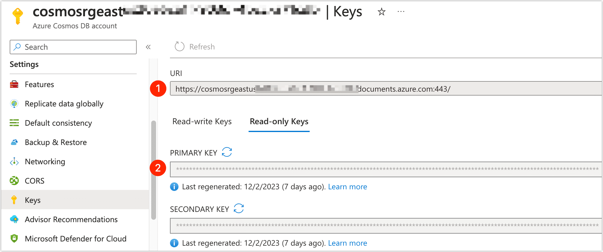
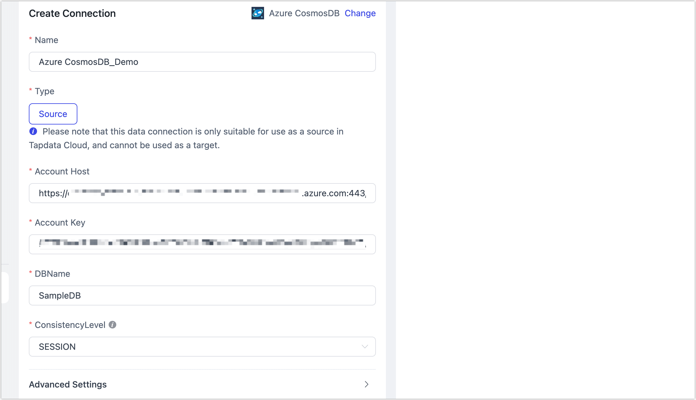

# Azure Cosmos DB

import Content from '../../reuse-content/_enterprise-and-cloud-features.md';

<Content />

Azure Cosmos DB is a fully managed NoSQL and relational database for modern app development including. This article explains how to connect Azure Cosmos DB on the TapData platform, assisting in the rapid circulation of cloud data.

## Prerequisites

Azure Cosmos DB type: [NoSQL](https://learn.microsoft.com/en-us/azure/cosmos-db/distributed-nosql)

## Functionality Limitations

Azure Cosmos DB only supports full data synchronization and does not support incremental data synchronization.

## Preparation

Before connecting the data source, you need to log in to the Azure console to obtain the necessary address and key information for the connection. The specific steps are as follows:

1. Log in to the [Azure Portal](https://portal.azure.com/).

2. At the top of the page, search for and enter the **Azure Cosmos DB** console.

3. Click on the instance name of Azure Cosmos DB Instance Name.

4. In the left navigation bar, select **Settings** > **Keys**.

   

## Steps

1. [Log in to TapData Platform](../../user-guide/log-in.md).

2. In the left navigation panel, click **Connections**.

3. On the right side of the page, click **Create**.

4. In the pop-up **dialog**, search for and select **Azure Cosmos DB**.

5. On the redirected page, fill in the connection information for **Azure Cosmos DB** as per the instructions below.

   

   * **Basic Settings**
     * **Name**: Enter a unique name with business significance.
     * **Type**: Currently only supports being used as a **Source**.
     * **Account Host**, **Account Key**: The connection address and key information (read-only permissions are sufficient) of Azure Cosmos DB. For acquisition methods, see [Preparation](#azure-cosmosdb-keys).
     * **DBName**: The database name.
     * **Consistency Level**: Should match the Azure Cosmos DB settings, default is **SESSION** level. For more, see [Consistency Levels Introduction](https://learn.microsoft.com/en-us/azure/cosmos-db/consistency-levels?WT.mc_id=Portal-Microsoft_Azure_DocumentDB#session).
   * **Advanced Settings**
     * **Contain table**: The default option is **All**, which includes all tables. Alternatively, you can select **Custom** and manually specify the desired tables by separating their names with commas (,).
     * **Exclude tables**: Once the switch is enabled, you have the option to specify tables to be excluded. You can do this by listing the table names separated by commas (,) in case there are multiple tables to be excluded.
     * **Agent settings**: Defaults to **Platform automatic allocation**, you can also manually specify an agent.
     * **Model load time**: If there are less than 10,000 models in the data source, their information will be updated every hour. But if the number of models exceeds 10,000, the refresh will take place daily at the time you have specified.

6. Click **Test**, and when passed, click **Save**.

   :::tip

   If the connection test fails, follow the prompts on the page to fix it.

   :::