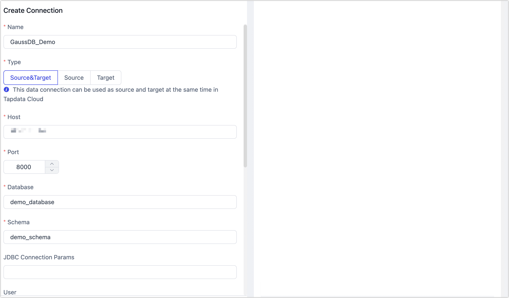

# Huawei Cloud GaussDB

import Content from '../../reuse-content/_enterprise-and-cloud-features.md';

<Content />

GaussDB is a distributed relational database independently developed by Huawei, supporting distributed transactions, cross-AZ deployment, and zero data loss. It offers scalability of over 1000 nodes, PB-level massive storage, providing enterprises with a comprehensive, stable, reliable, scalable, and high-performance enterprise-grade database service. TapData supports using GaussDB as a source or target database, helping you quickly build data flow pipelines. Next, we will introduce how to connect GaussDB data sources in the TapData platform.

```mdx-code-block
import Tabs from '@theme/Tabs';
import TabItem from '@theme/TabItem';
```

## Supported Versions

Huawei Cloud GaussDB Enterprise Edition 2.8 (Primary/Standby)

:::tip

If you are using an on-premises deployment of GaussDB, the supported version is GaussDB Standby 8.1.

:::

## Incremental Synchronization Instructions

To achieve incremental data reading, TapData requires Huawei Cloud GaussDB's [logical decoding function](https://support.huaweicloud.com/intl/en-us/centralized-devg-v2-gaussdb/devg_03_1324.html) to extract changes submitted to the transaction log and parse data changes. The limitations are as follows:

- Supported decoded data types are: BIGINT, BIGSERIAL, CHAR(n), DATE, DOUBLE PRECISION, FLOAT, INTEGER, SERIAL, SMALLINT, SMALLSERIAL, TEXT, TIME[WITHOUT TIME ZONE], TIMESTAMP[WITHOUT TIME ZONE], TINYINT, VARCHAR(n).
- The size of a single tuple should not exceed 1 GB. Considering the decoded result may be larger than the inserted data, it is recommended that the size of a single tuple does not exceed 500 MB.
- To parse the UPDATE and DELETE statements of an [Astore table](https://support.huaweicloud.com/intl/en-us/fg-gaussdb-cent/gaussdb-48-0126.html), the table must be configured with the [REPLICA IDENTITY](https://support.huaweicloud.com/intl/en-us/centralized-devg-v2-gaussdb/devg_03_0520.html#ZH-CN_TOPIC_0000001496777341__li0149195395816) attribute. If the table does not have a primary key, it must be configured as FULL.
- DDL statements are not supported for decoding. Executing certain DDL statements (such as truncating a regular table or exchanging a partition table) may cause data loss during decoding. Additionally, after executing a DDL statement in a transaction, the DDL statement and subsequent statements will not be decoded.
- Interval partition tables are not supported for replication.
- Global temporary tables are not supported.

## Preparations

1. Visit Huawei Cloud GaussDB and [create a database user and grant permissions](https://support.huaweicloud.com/intl/en-us/distributed-devg-v8-gaussdb/gaussdb-12-0022.html).

```mdx-code-block
<Tabs className="unique-tabs">
<TabItem value="As Source Database">
```

* **Full Synchronization**: DATABASE's CONNECT permission, SCHEMA's USAGE permission, table's SELECT or UPDATE permission (UPDATE permission required for locking tables without primary keys), SEQUENCE's SELECT permission.
* **Full + Incremental Synchronization**: REPLICATION permission or inheritance of the built-in role gs_role_replication, DATABASE's CONNECT permission, SCHEMA's USAGE permission, table's SELECT or UPDATE permission (UPDATE permission required for locking tables without primary keys), SEQUENCE's SELECT permission.

</TabItem>

<TabItem value="As Target Database">

- **Database Level Permissions**: Use root or other DATABASE users with the Sysadmin role to log in to the postgres base library, granting users the CREATE and CONNECT permissions on DATABASE. Authorization example: `GRANT CREATE, CONNECT ON DATABASE <database> TO <user>;`
- **SCHEMA Level Permissions**: Use root, other DATABASE users with the Sysadmin role, or use the OWNER user of the database to log in to the database, granting users the CREATE and USAGE permissions on SCHEMA. Authorization example: `GRANT CREATE, USAGE ON SCHEMA <schema> TO <user>;`
- **Table Level Permissions**: Use root, other DATABASE users with the Sysadmin role, or use the OWNER user of the database to log in to the database, granting users the DML-related permissions (SELECT permission needed when handling tables without primary keys) on the tables under the SCHEMA. Authorization example: `GRANT SELECT, UPDATE, INSERT, DELETE, INDEX, ALTER ON ALL TABLES IN SCHEMA <schema> TO <user>;`

</TabItem>
</Tabs>

2. Adjust the `pg_hba.conf` configuration to allow database access, replacing it with the actual IP address and username. In the following example, all users with the IP address 10.10.10.10 are allowed to access the database.

   ```bash
   # The IP address can also be set to 0.0.0.0/0 to allow all IPs
   host all all 10.10.10.10/32 sha256
   
   # Only incremental data synchronization requires the following configuration
   host replication all 10.10.10.10/32 sha256
   ```

3. If incremental data synchronization is needed, you also need to adjust the following GUC parameters. For more details, see [Reset Parameters](https://support.huaweicloud.com/intl/en-us/centralized-devg-v2-gaussdb/devg_03_0355.html).

   * **wal_level**: Set to **logical** to enable logical replication.
   * **max_replication_slots**: Greater than or equal to the required number of physical stream replication slots + backup slots + logical replication slots for each node. The default is 20. It is recommended to set this value based on the number of tasks using this connection as the source +1.
   
   

## Connect to GaussDB

1. [Log in to the TapData platform](../../user-guide/log-in.md).

2. In the left navigation bar, click **Connection Management**.

3. Click **Create** on the right side of the page.

4. In the pop-up dialog box, search for and select **GaussDB**.

5. Complete the data source configuration according to the following instructions.

   

   * **Basic Settings**

     * **Name**: Enter a unique name with business significance.
     * **Type**: Support GaussDB as a source or target database.
     * **Host**: Enter the connection address of GaussDB. If connecting via public network, you also need to [bind an Elastic IP](https://support.huaweicloud.com/intl/en-us/usermanual-gaussdb/gaussdb_01_160.html).
     * **Port**: Enter the GaussDB service port, e.g., **8000**.
     * **Database**: The database name, one connection corresponds to one database. If there are multiple databases, multiple data connections need to be created.
     * **Schema**: The schema name. A database contains one or more schemas, and each schema contains tables and other types of objects.
     * **JDBC Connection Params**: Additional connection parameters, default empty.
     * **User** and **Password**: Enter the username and password to log in to GaussDB, for specific permission requirements, see [Preparations](#prerequisites).
     * **Logical Replicate IP** and **Logical Replicate Port**: Enter the IP address of the main DN, the default port is **8001**.
     * **Log Plugin**: Keep the default **mppdb_decoding**.
     * **Time Zone**: The default is the time zone used by the database, you can also manually specify it according to business needs.
   
   * **Advanced Settings**
   
     * **CDC Log Caching**: [Mining the source database's](../../user-guide/advanced-settings/share-mining.md) incremental logs, this feature allows multiple tasks to share incremental logs from the source database, avoiding redundant reads and thus significantly reducing the load on the source database during incremental synchronization. Upon enabling this feature, an external storage should be selected to store the incremental log.
   
     * **Contain table**: The default option is **All**, which includes all tables. Alternatively, you can select **Custom** and manually specify the desired tables by separating their names with commas (,).
   
     * **Exclude tables**: Once the switch is enabled, you have the option to specify tables to be excluded. You can do this by listing the table names separated by commas (,) in case there are multiple tables to be excluded.
   
     * **Agent settings**: Defaults to **Platform automatic allocation**, you can also manually specify an agent.
     * **Model load time**: If there are less than 10,000 models in the data source, their information will be updated every hour. But if the number of models exceeds 10,000, the refresh will take place daily at the time you have specified.
     
     * **Enable heartbeat table**: This switch is supported when the connection type is set as the **Source&Target** or **Source**. TapData Cloud will generate a table named **tapdata_heartbeat_table** in the source database, which is used to monitor the source database connection and task health.
       :::tip
       After referencing and starting the data replication/development task, the heartbeat task will be activated. At this point, you can click **View heartbeat task** to monitor the task.
       :::
       
     
   * **SSL Settings**: Choose whether to enable SSL connections for the data source, which can further enhance data security. After turn on the switch, you will need to upload CA files, client certificates, client key files, etc. These can be downloaded from the **Database Information** section of the **Basic Information** of the GaussDB instance.

6. Click **Connection Test**, and when passed, click **Save**.

   :::tip

   If the connection test fails, follow the prompts on the page to fix it.

   :::