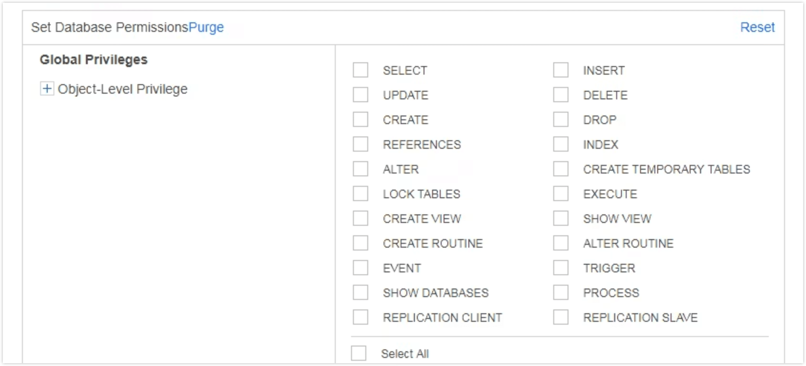
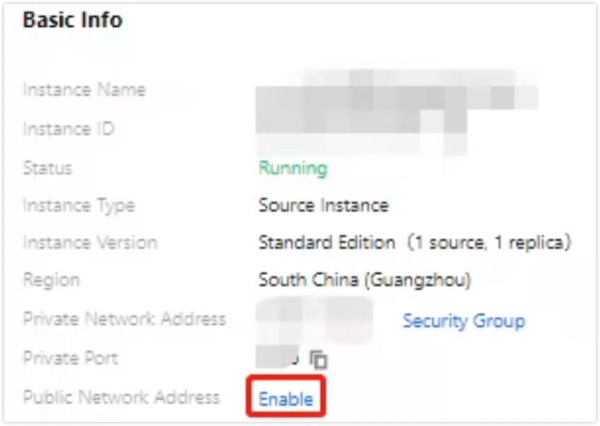
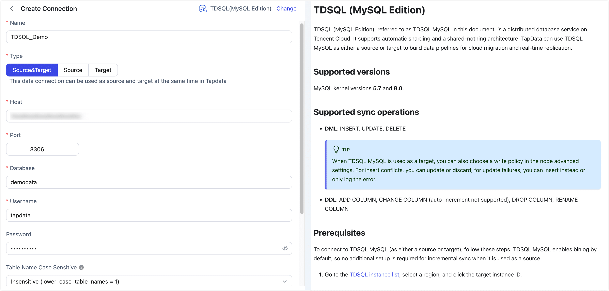
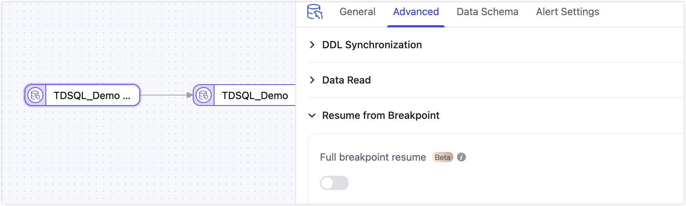

# TDSQL (MySQL Edition)

TDSQL (MySQL Edition), referred to as TDSQL MySQL in this document, is a distributed database service on Tencent Cloud. It supports automatic sharding and a shared-nothing architecture. TapData can use TDSQL MySQL as either a source or target to build data pipelines for cloud migration and real-time replication.

```mdx-code-block
import Tabs from '@theme/Tabs';
import TabItem from '@theme/TabItem';
```

## Supported Versions

MySQL kernel versions **5.7** and **8.0**.


## SQL Operations for Sync

- **DML**: INSERT, UPDATE, DELETE

  :::tip

  When TDSQL MySQL is used as a target, you can also choose a write policy in the node advanced settings. For insert conflicts, you can update or discard; for update failures, you can insert instead or only log the error.

  :::

- **DDL**: ADD COLUMN, CHANGE COLUMN (auto-increment not supported), DROP COLUMN, RENAME COLUMN

## Prerequisites

To connect to TDSQL MySQL (as either a source or target), follow these steps. TDSQL MySQL enables binlog by default, so no additional setup is required for incremental sync when it is used as a source.

1. Go to the [TDSQL instance list](https://console.intl.cloud.tencent.com/tdsqld/instance-tdmysql), select a region, and click the target instance ID.

2. Create an account and grant privileges.
    
    1. On the instance management page, open **Account Management** and click **Create Account**.
    2. In the dialog, enter the account name, host, password, etc., then click **Confirm, Next**.
       The host value is the network egress address. Use `%` to allow access from any IP.
    3. Click **Modify Privileges** next to the account, select the required privileges, and click **Confirm**.
        

        <Tabs className="unique-tabs">
        <TabItem value="As Source" default>

        * **Full sync only**: Grant `SELECT` on the database to be synced
        * **Full + incremental sync**: Grant `SELECT` on the database to be synced, plus replication privileges (`REPLICATION SLAVE`, `REPLICATION CLIENT`)
        
        </TabItem>
        
        <TabItem value="As Target">

        Grant read/write privileges on the target database, including `ALTER`, `CREATE`, `CREATE ROUTINE`, `CREATE TEMPORARY TABLES`, `DELETE`, `DROP`, `INSERT`, `SELECT`, and `UPDATE`.
        
        </TabItem>
        
        </Tabs>


3. On the **Instance Details** page, click **Enable** in the **Public Network Address** section and follow the prompts to obtain the public connection address.

    

    :::tip
    If the TapData host and the TDSQL MySQL instance are in the same private network, you can skip this step.
    :::

## Connect to TDSQL MySQL

1. Log in to TapData.

2. In the left navigation pane, click **Connection**.

3. Click **Create**.

4. In the dialog, search for and select **TDSQL(MySQL Edition)**.

5. On the configuration page, fill in the connection settings as follows.
   

   * Connection settings
      * **Name**: Enter a unique name with business significance.
      * **Type**: Specify whether TDSQL MySQL is used as a source or target.
      * **Host**: The database address. Use the public address obtained in the prerequisites. If TapData and TDSQL MySQL are in the same private network, use the private address.
      * **Port**: The database service port.
      * **Database**: The database name. One connection maps to one database. Create multiple connections if you need to access multiple databases.
      * **Username**: A database account with the required privileges.
      * **Password**: The password for the database account.
      * **Table Name Case Sensitive**: An initialization parameter for newly created distributed TDSQL MySQL instances (default: Insensitive). Use the value that matches your instance configuration.
      * **Connection Parameter String**: Additional parameters. Default: `useUnicode=yes&characterEncoding=UTF-8`. Adjust based on your instance configuration, especially the character set.
      * **Timezone**: Default is UTC+0. If you set a different timezone, it affects fields without timezone information (for example, `datetime`). Fields with timezone information (for example, `timestamp`) and `date`/`time` are not affected.
   * Advanced settings
      - **CDC Log Caching**: Extract the incremental logs from the source database. This allows multiple tasks to share the incremental log extraction process from the same source, reducing the load on the source database. When enabled, you also need to select a storage location for the incremental log information.
     - **Include Tables**: By default, all tables are included. You can choose to customize and specify the tables to include, separated by commas.
     - **Exclude Tables**: When enabled, you can specify tables to exclude, separated by commas.
     - **Agent Settings**: The default is automatic assignment by the platform. You can also manually specify an Agent.
     - **Model Load Time**: If there are less than 10,000 models in the data source, their schema will be updated every hour. But if the number of models exceeds 10,000, the refresh will take place daily at the time you have specified.
     - **Enable Heartbeat Table**: When the connection type is Source or Source and Target, enable this feature. TapData creates and periodically updates `_tapdata_heartbeat_table` in the source (requires write privileges) to monitor connection and task health. The heartbeat task is automatically enabled only after a task referencing the source starts. You can view its status on the edit page of the data source.

6. Click **Test**. After the test passes, click **Save**.

   :::tip

   If the connection test fails, follow the on-screen guidance to troubleshoot.

   :::


## Node Advanced Features

When you use TDSQL MySQL as a source or target in a replication/transformation task, TapData provides additional advanced options to handle complex scenarios and improve performance.




* **As a source node**: Supports **Full Breakpoint Resume**. For large-scale migrations (over 100 million records), you can enable this option to shard and migrate data, reducing the risk of failures caused by interruptions and improving reliability.
* **As a target node**: Choose the table creation type when the target table does not exist (single table or partitioned table). For details, see the [official TDSQL MySQL documentation](https://intl.cloud.tencent.com/document/product/1042/38506).
