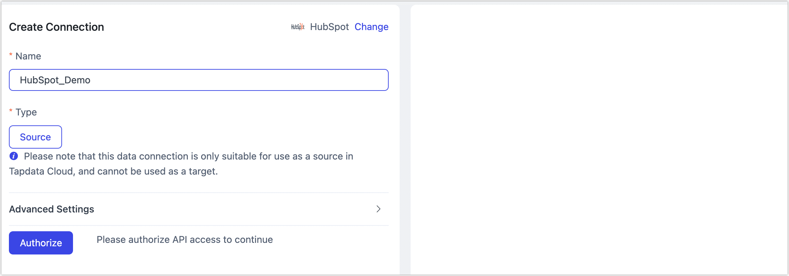

# HubSpot

import Content from '../../reuse-content/_enterprise-and-cloud-features.md';

<Content />

HubSpot's CRM platform contains the marketing, sales, service, operations, and website-building software you need to grow your business. TapData Cloud supports building data pipelines with HubSpot as the source database, allowing you to read HubSpot operational data and sync it to a specified data source. This document explains how to add a HubSpot data source in TapData Cloud.

## Connect HubSpot
1. [Log in to TapData Platform](../../user-guide/log-in.md).

2. In the left navigation panel, click **Connections**.

3. On the right side of the page, click **Create**.

4. In the pop-up dialog, search for and select **HubSpot**.

5. Complete the data source configuration as per the following instructions.

   

   * **Connection Name**: Enter a unique name with business significance.
   * **Connection Type**: Only **Source** is supported.
   * **Advanced Settings**
     * **Agent settings**: Defaults to **Platform Automatic Allocation**, you can also manually specify an agent.
     * **Model load time**: If there are less than 10,000 models in the data source, their information will be updated every hour. But if the number of models exceeds 10,000, the refresh will take place daily at the time you have specified.

6. Click **Authorize**. On the redirected **HubSpot** authorization page, log in and select the account you want to authorize.

   

   After completing the operation, the page will automatically return to the data source configuration page, displaying **Successfully Authorized**.

7. Click **Connection Test**. After passing the test, click **Save**.

   :::tip

   If the connection test fails, please follow the prompts on the page to fix the issue.

   :::