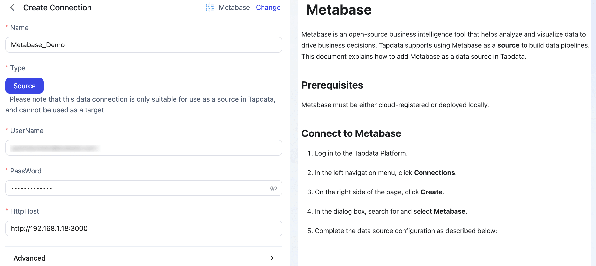

# Metabase

Metabase is an open-source business intelligence tool that helps analyze and visualize data to drive business decisions. Tapdata supports using Metabase as a **source** to build data pipelines. This document explains how to add Metabase as a data source in Tapdata.

## Prerequisites

Metabase must be either cloud-registered or deployed locally.

## Connect to Metabase

1. Log in to the Tapdata Platform.

2. In the left navigation menu, click **Connections**.

3. On the right side of the page, click **Create**.

4. In the dialog box, search for and select **Metabase**.

5. Complete the data source configuration as described below:

   

    * **Connection Settings**
        * **Name**: Enter a unique, descriptive name relevant to your business.
        * **Type**: Only supports Metabase as a **source**.
        * **Username**: Enter the Metabase login account, usually an email address.
        * **Password**: Enter the password for the Metabase account.
        * **HTTP Host**: The Metabase connection URL, including port number (e.g., `http://192.168.1.18:3000`).
    * **Advanced Settings**
        * **Agent Settings**: Defaults to **Platform Automatic Allocation**, you can also manually specify an agent.
        * **Model Load Time**: If there are less than 10,000 models in the data source, their information will be updated every hour. But if the number of models exceeds 10,000, the refresh will take place daily at the time you have specified.

6. Click **Test**. After passing the test, click **Save**.

   :::tip

   If the connection test fails, please follow the prompts on the page to fix the issue.

   :::
