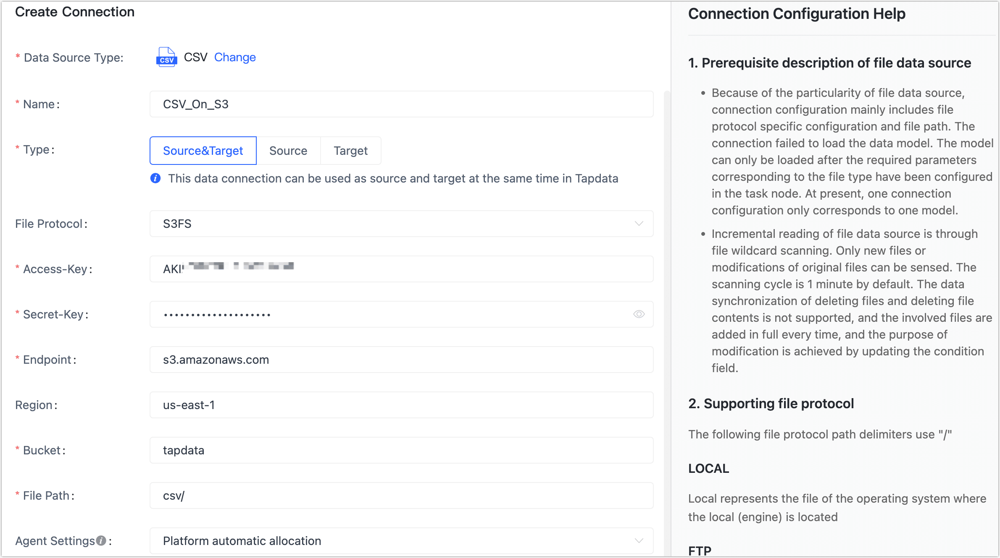

# CSV

import Content from '../../reuse-content/_enterprise-and-cloud-features.md';

<Content />

A comma-separated values (CSV) file is a delimited text file that uses a comma to separate values. Each line of the file is a data record. Each record consists of one or more fields, separated by separator (such as commas, semicolons, or tabs).

TapData supports reading CSV files stored on local, FTP, SFTP, SMB, or S3FS to meet a variety of data flow needs. This article describes how to connect to CSV data sources on TapData Cloud.

## Precautions

- A connection only refers to a model (table). If there are multiple models, you need to create connection for each one separately.
- If the headers of multiple files are inconsistent, TapData uses the union as a model.
- CSV data sources are only available for data transformation tasks.
- By default, TapData checks for changes (such as adding or modifying) to the XML file every minute. TapData synchronizes all files to accurately update the condition field when changes are detected. However, synchronous deletion of files or data is not supported.
- Data types that can be used in CSV files include BOOLEAN, DATETIME, INTEGER, NUMBER, STRING, and TEXT.

## Preparations

Before establishing the connection, it is essential to follow the necessary preparations outlined in the article. These preparations may include authorizing an account and performing other relevant steps to ensure a smooth and secure connection.
This article describes the steps to prepare for creating a CSV data source connection. 

Select the option to read based on the location of the CSV file.

* [Stored on Local/FTP/SFTP/SMB](#stored-on-localftpsftpsmb)
* [Stored on Amazon S3](#stored-on-amazon-s3)
* [Stored on OSS](#stored-on-oss)

### Stored on Local/FTP/SFTP/SMB

import Content1 from '../../reuse-content/_files_on_local.md';

<Content1 />

### Stored on Amazon S3

import Content2 from '../../reuse-content/_files_on_s3.md';

<Content2 />

### Stored on OSS

import Content3 from '../../reuse-content/_files_on_oss.md';

<Content3 />

## Connect to CSV

1. [Log in to TapData Platform](../../user-guide/log-in.md).

2. In the left navigation panel, click **Connections**.

3. On the right side of the page, click **Create**.

4. In the pop-up dialog, select **CSV**.

5. On the page that you are redirected to, follow the instructions below to fill in the connection information for the CSV data source.

   

   :::tip

   For more about how to obtain the information needed for each file protocol, see [Preparations](#preparations).

   :::

   * **Connection name**: Fill in a unique name that has business significance.
   * **Connection type**: Currently only supported as a **Source**.
   * **File Protocol**: Select the following protocol based on the location of the CSV files. This article uses **S3FS** (Amazon S3 bucket) as an illustration of the operation process.
      * **Local**: The file is stored on the device that deployed the TapData Agent. After selecting this item, you also need to fill in the file path.
      * **FTP** (File Transfer Protocol): The file is stored on the FTP server. After selecting this item, you also need to fill in the address, port, username, password, file path, and other information of the FTP server.
      * **SFTP** (Secure File Transfer Protocol): The file is stored on the SFTP server. After selecting this item, you also need to fill in the address, port, user name, password, file path, and other information of the SFTP server.
      * **SMB** (Server Message Block Protocol): The file is stored on the SMB server and is compatible with 1.x, 2.x, 3.x. After selecting this item, you also need to fill in the address, username, password, file path, and other information of the SMB server.
      * **S3FS** (file system according to S3 protocol): The file is stored on the Amazon S3 bucket. After selecting this item, you need to fill in the information such as Accesskey, Secretkey, Endpoint (fixed at **s3.amazonaws.com**), Bucket, and file path.
      * **OSS** (Object Storage Service): The file is stored on the Alibaba Cloud Object Storage. After selecting this item, you need to fill in the Accesskey, Secretkey, Endpoint, Bucket, and file path.
   * **Agent settings**: Defaults to **Platform automatic allocation**, you can also manually specify an agent.
   * **Model load time**: When the number of models in the data source is less than 10,000, the model information is refreshed every hour; if the model data exceeds 10,000, the model information is refreshed every day at the time you specify.

6. Click **Test Connection**, and when passed, click **Save**.

   :::tip

   If the connection test fails, follow the prompts on the page to fix it.

   :::
