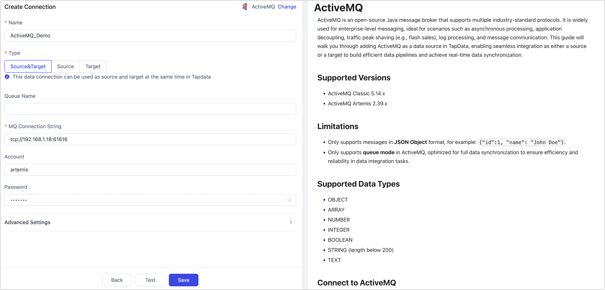

# ActiveMQ

ActiveMQ is an open-source Java message broker that supports multiple industry-standard protocols. It is widely used for enterprise-level messaging, ideal for scenarios such as asynchronous processing, application decoupling, traffic peak shaving (e.g., flash sales), log processing, and message communication. This guide will walk you through adding ActiveMQ as a data source in TapData, enabling seamless integration as either a source or a target to build efficient data pipelines and achieve real-time data synchronization.

## Supported Versions

- ActiveMQ Classic 5.14.x
- ActiveMQ Artemis 2.39.x

## Limitations

- Only supports messages in **JSON Object** format, for example: `{"id":1, "name": "John Doe"}`.
- Only supports **queue mode** in ActiveMQ, optimized for full data synchronization to ensure efficiency and reliability in data integration tasks.

## Supported Data Types

- OBJECT
- ARRAY
- NUMBER
- INTEGER
- BOOLEAN
- STRING (length below 200)
- TEXT

## Connect to ActiveMQ

1. [Log in to Tapdata platform](../../user-guide/log-in.md).

2. In the left navigation bar, click **Connections**.

3. On the right side of the page, click **Create**.

4. On the redirected page, search for and select **ActiveMQ**.

5. Fill in the ActiveMQ connection details as described below.

   

    - **Connection Information Settings**
        - **Name**: Enter a meaningful, unique name.
        - **Type**: Supports using ActiveMQ as either a source or a target.
        - **Queue Name**: Defaults to empty, meaning TapData will load all queues. You can also manually specify queues, separating multiple queue names with commas (`,`).
        - **MQ Connection String**: The connection string in the format `tcp://{host_or_ip}:{port}` (e.g., `tcp://192.168.1.18:61616`).
        - **Account & Password**: Provide the ActiveMQ connection credentials.
    - **Advanced Settings**
        - **Agent Settings**: Defaults to **Platform automatic allocation**, you can also manually specify an agent.
        - **Model Load Time**: If there are less than 10,000 models in the data source, their schema will be updated every hour. But if the number of models exceeds 10,000, the refresh will take place daily at the time you have specified.

6. Click **Test**, and if the test passes, click **Save**.

   If the connection test fails, follow the on-screen instructions to resolve the issue.