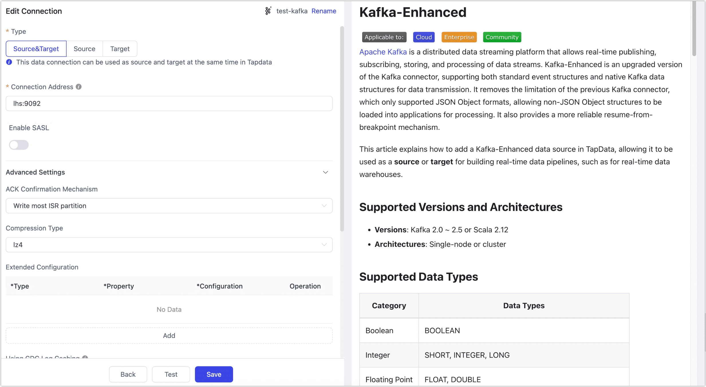
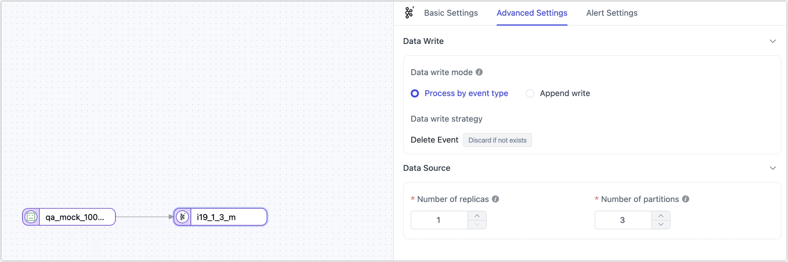

# Kafka-Enhanced

[Apache Kafka](https://kafka.apache.org/) is a distributed data streaming platform that allows real-time publishing, subscribing, storing, and processing of data streams. Kafka-Enhanced is an upgraded version of the Kafka connector, supporting both standard event structures and native Kafka data structures for data transmission. It removes the limitation of the previous Kafka connector, which only supported JSON Object formats, allowing non-JSON Object structures to be loaded into applications for processing. It also provides a more reliable resume-from-breakpoint mechanism.

This article explains how to add a Kafka-Enhanced data source in TapData, allowing it to be used as a **source** or **target** for building real-time data pipelines, such as for real-time data warehouses.

:::tip

Kafka-Enhanced has been supported since version 3.15.

:::

```mdx-code-block
import Tabs from '@theme/Tabs';
import TabItem from '@theme/TabItem';
```

## Supported Versions and Architectures

* **Versions**: Kafka 2.0 ~ 2.5 (built on Scala 2.12)
* **Architectures**: Single-node or cluster

## Supported Data Types

| **Category**   | **Data Types**                                |
| -------------- | --------------------------------------------- |
| Boolean        | BOOLEAN                                       |
| Integer        | SHORT, INTEGER, LONG                          |
| Floating Point | FLOAT, DOUBLE                                 |
| Numeric        | NUMBER                                        |
| String         | CHAR (supported as a source), VARCHAR, STRING, TEXT |
| Binary         | BINARY                                        |
| Composite      | ARRAY, MAP, OBJECT (supported as a source)    |
| Date/Time      | TIME, DATE, DATETIME, TIMESTAMP               |
| UUID           | UUID (supported as a source)                  |

## Structural Modes and Sync Details

When configuring the Kafka-Enhanced connection, you can select from the following two structure modes based on your business needs:

```mdx-code-block
<Tabs className="unique-tabs">
<TabItem value="Standard Structure (Default)">
```
**Description**: Supports synchronization of complete DML operations (INSERT, UPDATE, DELETE). As a source, it parses and restores DML + DDL events for downstream processing; as a target, it stores these events in a standardized format, facilitating future task parsing.

**Typical Use Case**: In the **CDC Log Queue**, use the "Standard Structure" to write relational data change events from MySQL into Kafka, and then consume the data to write it into other databases.

**Sample Data**:

```js
{
    "ts": 1727097087513, 
    "op": "DML:UPDATE",
    "opTs": 1727097087512, 
    "namespaces": [], 
    "table": "table_name",
    "before": {}, 
    "after": {}, 
}
```

- **ts**: The timestamp when the event was parsed, recording the time the event was processed.
- **op**: Event type, indicating the specific operation, such as `DML:INSERT`, `DML:UPDATE`, `DML:DELETE`.
- **opTs**: Event timestamp, indicating when the data change actually occurred.
- **namespaces**: A collection of schema names for multi-schema scenarios.
- **table**: The table name indicating where the data change occurred.
- **before**: Data content before the change, available only for `UPDATE` and `DELETE` operations.
- **after**: Data content after the change, applicable to `INSERT` and `UPDATE` operations.

</TabItem>

<TabItem value="Original Structure">

**Description**: Uses Kafka's native data synchronization method, supporting append-only operations similar to `INSERT`. As a source, it handles complex, unstructured data and passes it downstream; as a target, it allows flexible control over partitions, headers, keys, and values, enabling custom data insertion.

**Typical Use Case**: Used for **homogeneous data migration** or **unstructured data transformation**, enabling data filtering and transformation through a Kafka -> JS Processing Node -> Kafka/MySQL data pipeline.

**Sample Data**:

```js
  {
    "offset": 12345,
    "timestampType": "LogAppendTime",
    "partition": 3,
    "timestamp": 1638349200000,
    "headers": {
      "headerKey1": "headerValue1",
    },
    "key": "user123",
    "value": {
      "id": 1,
      "name": "John Doe",
      "action": "login",
      "timestamp": "2021-12-01T10:00:00Z"
    }
  }
```

  - **offset**: Offset marking the message position, not included in the target message body.
  - **timestampType**: Type of timestamp, used for metadata purposes, not included in the message body.
  - **partition**: Specifies the partition number for message writing, written to the specified partition if provided.
  - **timestamp**: Message creation time, uses the specified time if provided, otherwise uses the system time.
  - **headers**: Message header information, written to the header if present, carrying additional metadata.
  - **key**: Message key, used for partitioning strategies or to identify the message source.
  - **value**: Message content, containing the actual business data.

</TabItem>
</Tabs>

## Consumption Details

When configuring data replication or transformation tasks later, you can specify the data synchronization method through task settings in the upper-right corner. The corresponding consumption details are as follows:

- **Full Only**: Reads from the first message and stops the task after reaching the recorded incremental position.
- **Full + Incremental**: Reads from the first message to the recorded position and then continuously syncs incremental data.
- **Incremental Only**: Choose the starting point for incremental collection as **Now**, meaning sync starts from the current position, or **Select Time**, meaning sync starts from the calculated position based on the specified time.

:::tip

Since Kafka as a message queue only supports append operations, avoid duplicate data in the target system due to repeated consumption from the source.

:::

## Limitations

- **Data Type Adaptation**: As a source, Kafka's data types need to be adjusted according to the target data source's requirements, or corresponding table structures should be manually created on the target side to ensure compatibility.
- **Message Delivery Guarantee**: Due to Kafka's `At least once` delivery semantics and append-only behavior, duplicate consumption may occur. Idempotency must be ensured on the target side to avoid duplicate data resulting from repeated consumption.
- **Consumption Mode Limitation**: Consumption threads use different consumer group numbers, so be aware of the impact on consumption concurrency.
- **Security Authentication Limitation**: Currently, only authentication-free Kafka instances are supported.

## Connect Kafka-Enhanced

1. Log in to Tapdata platform.

2. In the left navigation bar, click **Connections**.

3. On the right side of the page, click **Create**.

4. On the redirected page, search for and select **Kafka-Enhanced**.

5. Complete the data source configuration as described below.

    

    * **Connection Settings**
        * **Name**: Enter a meaningful and unique name.
        * **Type**: Supports using Kafka-Enhanced as a source or target database.
        * **Connection Address**: Kafka connection address, including address and port, separated by a colon (`:`), for example, `113.222.22.***:9092`.
        * **Structure Mode**: Choose based on business needs:
          * **Standard Structure (Default)**: Supports synchronization of complete DML operations (INSERT, UPDATE, DELETE). As a source, it parses and restores DML + DDL events for downstream processing; as a target, it stores these events in a standardized format, facilitating future task parsing.
          * **Original Structure**: Uses Kafka's native data synchronization method, supporting append-only operations similar to `INSERT`. As a source, it handles complex, unstructured data and passes it downstream; as a target, it allows flexible control over partitions, headers, keys, and values, enabling custom data insertion.
        * **Key Serializer**, **Value Serializer**: Choose the serialization method for keys and values, such as Binary (default).
    * **Advanced Settings**
        * **ACK Confirmation Mechanism**: Choose based on business needs: No confirmation, write to Master partition only, write most ISR partitions (default), or write to all ISR partitions.
        * **Compression Type**: Supports **lz4** (default), **gzip**, **snappy**, **zstd**. Enable compression for large messages to improve transmission efficiency.
        * **Extended Configuration**: Supports custom advanced connection properties for Kafka managers, producers, and consumers for optimization in specific scenarios.
        * **CDC Log Caching**: Mining the source database's incremental logs. This allows multiple tasks to share the same source database’s incremental log mining process, reducing duplicate reads and minimizing the impact of incremental synchronization on the source database. After enabling this feature, you will need to select an external storage to store the incremental log information.
        * **Include Tables**: The default option is **All**, which includes all tables. Alternatively, you can select **Custom** and manually specify the desired topics by separating their names with commas (,).
        * **Exclude Tables**: Once the switch is enabled, you have the option to specify topics to be excluded. You can do this by listing the table names separated by commas (,) in case there are multiple topics to be excluded.
        * **Agent settings**: Defaults to **Platform automatic allocation**, you can also manually specify an agent.
        * **Model Load Time**: If there are less than 10,000 models in the data source, their schema will be updated every hour. But if the number of models exceeds 10,000, the refresh will take place daily at the time you have specified.

6. Click **Test**, and after passing the test, click **Save**.

   :::tip

   If the connection test fails, follow the instructions on the page to resolve the issue.

   :::

## Advanced Node Features

When configuring data replication or transformation tasks, and using Kafka-Enhanced as either a ource or target node, TapData provides additional advanced features to maximize performance and meet business needs:



* As a source node

  **Max Read Concurrency**: Default is `1`, meaning single-threaded reading. When set greater than `1` and the number of topics + partitions is greater than `1`, it will take effect with the smaller of the two values.

* As a target node

  - **Number of Replicas**: Default is `1`, used when creating topics. Does not take effect if the topic already exists.

  - **Number of Partitions**: Default is `3`, used when creating topics. If the configuration is greater than the number of partitions for the corresponding topic, it will automatically expand the partitions.

