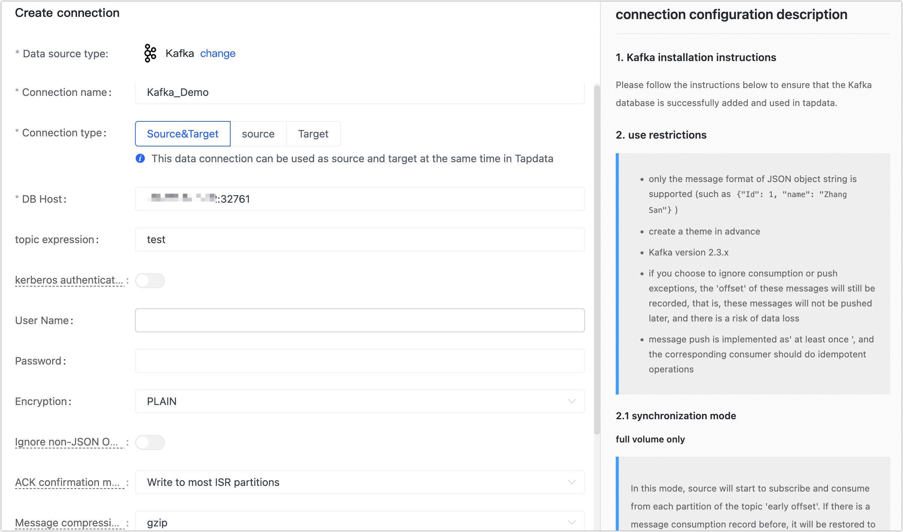

# Kafka

import Content from '../../reuse-content/_enterprise-and-cloud-features.md';

<Content />

Apache Kafka is an open-source distributed event streaming platform that is utilized by numerous companies for a variety of purposes, including high-performance data pipelines, streaming analytics, data integration, and crucial applications.

The following article provides a detailed guide on how to add Kafka to TapData Cloud. It walks you through the process of integrating Kafka into TapData Cloud, allowing you to leverage its capabilities for building efficient data pipelines.

## Supported Versions

Kafka 2.3.x

## Limitations

* Only the message format of the JSON Object string is supported, for example: `{"id":1, "name": "Jack"}`.
* The message push implementation is At least once, and the consumer side needs to design idempotence.


## Kafka Consumption Description

In the subsequent configuration of data replication/data transformation tasks, you can choose the synchronization method for the data, and the corresponding consumption instructions are as follows:

* **Only Full Data Synchronization**: You can choose to subscribe from the earliest offset of each partition in the Topic. If there is a previous message consumption record, you have the option to revert to the previous offset and resume message consumption from that point.

* **Only Incremental Data Synchronization**: You can subscribe to the topic from the latest offset of each partition. In the event of a previous message consumption record, you have the option to restore to the previous offset and commence message consumption from that point.

* **Full + Incremental Data Synchronization**: The subscription process will skip the full sync phase and begin directly from the incremental phase. If a full synchronization is not performed, the subscription will start from the earliest offset of each partition in the Topic. 

  However, if a full synchronization has occurred, the subscription will start from the latest offset of each partition in the Topic. In the presence of a previous message consumption record, it will be restored to the previous offset for resuming message consumption.

## Preparations

1. Log in to Kafka's server.

2. (Optional) If you use Kafka as the target database, it is recommended to create the topic to store the data in advance. If it is automatically created by TapData Cloud, the number of partitions and copies is 1.

   The following example creates a topic named kafa_demo_topic, which has a number of partitions and copies of 3:

   ```bash
   bin/kafka kafka-topics.sh --create --zookeeper localhost:2181 --replication-factor 3 --partitions 3 --topic kafa_demo_topic
   ```

   For more information, see [Kafka Quick Start](https://kafka.apache.org/23/documentation.html#quickstart).

3. Confirm the encryption method, if the kerberos authentication is enabled, you also need to prepare the key, configuration and other files.


## Connect to Kafka

1. [Log in to TapData Platform](../../user-guide/log-in.md).

2. In the left navigation panel, click **Connections**.

3. On the right side of the page, click **Create connection**.

4. In the pop-up dialog, select **Kafka**.

5. Complete the data source configuration according to the following instructions.

   

    * Connection Information Settings
        * **Connection name**: Fill in a unique name that has business significance.
        * **Connection type**: Supports Kafka as a source or target database.
        * **DB host**: Kafka connection address, including the IP address and port number, separated by a colon (:). The format should be as follows: `IP_Address:Port_Number`, `113.222.22.***:9092`. Please replace the appropriate IP address of your Kafka broker, and use the corresponding port number for Kafka communication (usually 9092).
        * **Topic expression**: In Kafka, topics support regular expressions and have a maximum length of 256 characters. For more information, see [Kafka Quick Start](https://kafka.apache.org/23/documentation.html#quickstart).
        * **Kerberos authentication**: If authentication is enabled in Kafka, you need to turn on the switch. Afterwards, you should upload and configure the required key and authentication information to establish a secure connection.
        * **User name**,**Password**,**Encryption**: If password authentication is enabled in Kafka, you will be required to provide the account and password credentials. Additionally, you should choose the encryption option to ensure a secure connection.
    * Advanced Settings
        * **Ignore non-JSON Object format messages**: If a message in the specified format is encountered in the future and it is not ignored, the pull operation will be terminated.
        * **ACK confirmation mechanism**: Select the appropriate option based on your business requirements:
            * Do not confirm
            * Write to master partitions
            * Write to most ISR partitions (default)
            * Write to all ISR partitions.
        * **Message compression type**: When dealing with large message volumes, enabling compression can significantly enhance transmission efficiency. Supports gzip, snappy, lz4, and zstd. By leveraging compression, you can effectively reduce the size of the messages, resulting in improved data transfer efficiency.
        * **Ignore push message exception**: Once the switch is turned on, the system will continue to record the offset of the relevant message; however, it will not push any further messages. It's important to note that this approach carries a risk of potential data loss since the system will not deliver subsequent messages.
        * **CDC Log Caching**: [Mining the source database's](../../user-guide/advanced-settings/share-mining.md) incremental logs, this feature allows multiple tasks to share incremental logs from the source database, avoiding redundant reads and thus significantly reducing the load on the source database during incremental synchronization. Upon enabling this feature, an external storage should be selected to store the incremental log.
        * **Agent settings**: Defaults to **Platform automatic allocation**, you can also manually specify an agent.
        * **Model load time**: If there are less than 10,000 models in the data source, their information will be updated every hour. But if the number of models exceeds 10,000, the refresh will take place daily at the time you have specified.

6. Click **Connection Test**, and when passed, click **Save**.

   :::tip

   If the connection test fails, follow the prompts on the page to fix it.

   :::
