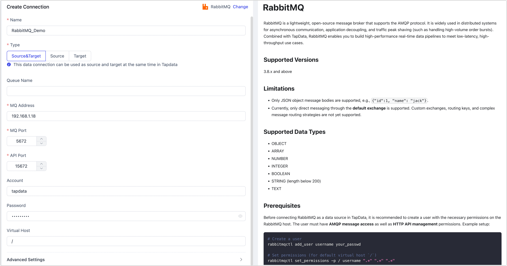

# RabbitMQ

RabbitMQ is a lightweight, open-source message broker that supports the AMQP protocol. It is widely used in distributed systems for asynchronous communication, application decoupling, and traffic peak shaving (such as handling high-volume order bursts). Combined with TapData, RabbitMQ enables you to build high-performance real-time data pipelines to meet low-latency, high-throughput use cases.

## Supported Versions

3.8.x and above

## Limitations

- Only JSON object message bodies are supported, e.g., `{"id":1, "name": "jack"}`.
- Currently, only direct messaging through the **default exchange** is supported. Custom exchanges, routing keys, and complex message routing strategies are not yet supported.

## Supported Data Types

- OBJECT
- ARRAY
- NUMBER
- INTEGER
- BOOLEAN
- STRING (length below 200)
- TEXT

## Prerequisites

Before connecting RabbitMQ as a data source in TapData, it is recommended to create a user with the necessary permissions on the RabbitMQ host. The user must have **AMQP message access** as well as **HTTP API management** permissions. Example setup:

```bash
# Create a user
rabbitmqctl add_user username your_passwd

# Set permissions (for default virtual host `/`)
rabbitmqctl set_permissions -p / username ".*" ".*" ".*"

# Grant management tag to allow HTTP API access (used by TapData)
rabbitmqctl set_user_tags username management
```

- `username`: The account name to be created.
- `your_passwd`: The password for the new account.

## Connect to RabbitMQ

1. Log in to TapData Platform.

2. In the left navigation panel, click **Connections**.

3. On the right side of the page, click **Create**.

4. In the pop-up dialog, search for and select **RabbitMQ**.

5. Fill in the connection details as follows:

   

   - **Connection Settings**
     - **Name**: A unique name with business relevance.
     - **Type**: RabbitMQ can be used as either a source or target.
     - **Queue Name**: Leave empty to load all queues, or specify multiple queues separated by commas.
     - **MQ Address**: The RabbitMQ server address (IP or domain).
     - **MQ Port**: AMQP service port, default is **5672**.
     - **API Port**: HTTP API port, default is **15672**, used to fetch metadata like queue info.
     - **Account / Password**: Provide the credentials of the RabbitMQ user with both AMQP and HTTP API permissions. If not created yet, refer to the Prerequisites section above.
     - **Virtual Host**: Defaults to `/`. If using a custom vhost, ensure the user has access to it.
   - **Advanced Settings**
     - **CDC Log Caching**: Mining the source database's incremental logs. This allows multiple tasks to share the same source database’s incremental log mining process, reducing duplicate reads and minimizing the impact of incremental synchronization on the source database. After enabling this feature, you will need to select an external storage to store the incremental log information.
     - **Agent settings**: Defaults to **Platform automatic allocation**, you can also manually specify an agent.
     - **Model Load Time**: If there are less than 10,000 models in the data source, their schema will be updated every hour. But if the number of models exceeds 10,000, the refresh will take place daily at the time you have specified.

6. Click **Test**, and after passing the test, click **Save**.

   :::tip

   If the connection test fails, follow the instructions on the page to resolve the issue.

   :::

## FAQs

- **Q**: Why do I see `ACCESS_REFUSED - Login was refused using authentication mechanism PLAIN` during connection test?

  **A**: This typically indicates incorrect credentials or insufficient permissions for the virtual host. Please refer to the Prerequisites section to properly create and authorize the user.

- **Q**: Why do I see `401 Unauthorized` or `HttpClientErrorException: 401`?

  **A**: This means the user lacks access to the RabbitMQ HTTP API (default port 15672), or the API port is incorrect. Use the command `rabbitmqctl set_user_tags your_username management` to grant permission. You can also verify access by visiting `http://<MQ_HOST>:15672` in a browser and logging in.

  You may also assign a higher-level permission tag such as `administrator` for full access.