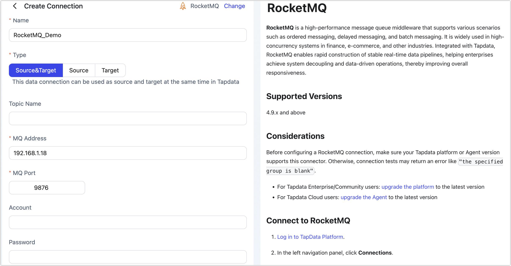

# RocketMQ

import Content from '../../reuse-content/_all-features.md';

<Content />

**RocketMQ** is a high-performance message queue middleware that supports various scenarios such as ordered messaging, delayed messaging, and batch messaging. It is widely used in high-concurrency systems in finance, e-commerce, and other industries. Integrated with Tapdata, RocketMQ enables rapid construction of stable real-time data pipelines, helping enterprises achieve system decoupling and data-driven operations, thereby improving overall responsiveness.

## Supported Versions

4.9.x and above

## Considerations

Before configuring a RocketMQ connection, make sure your Tapdata platform or Agent version supports this connector. Otherwise, connection tests may return an error like `"the specified group is blank"`.

## Connect to RocketMQ

1. Log in to TapData Platform.

2. In the left navigation panel, click **Connections**.

3. On the right side of the page, click **Create**.

4. On the redirected page, search for and select **RocketMQ**.

5. Configure the RocketMQ data source as described below:

   

   - **Connection Settings**
     - **Name**: Enter a unique, business-meaningful name.
     - **Type**: RocketMQ can be used as either a source or a target.
     - **Topic Name**: Leave empty to load all available topics. You can also manually specify topic names; use commas (`,`) to separate multiple topics.
     - **MQ Address**: Enter the RocketMQ server address (IP or domain supported).
     - **MQ Port**: Service port of RocketMQ. Default is **9876**. Tapdata reads message data via this port.
     - **Account / Password**: Enter the configured RocketMQ username and password.
   - **Advanced Settings**
     - **CDC Log Caching**: Mining the source database's incremental logs. This allows multiple tasks to share the same source database’s incremental log mining process, reducing duplicate reads and minimizing the impact of incremental synchronization on the source database. After enabling this feature, you will need to select an external storage to store the incremental log information.
     - **Agent Settings**: Defaults to **Platform automatic allocation**, you can also manually specify an agent.
     - **Model Load Time**: If there are less than 10,000 models in the data source, their schema will be updated every hour. But if the number of models exceeds 10,000, the refresh will take place daily at the time you have specified.
     - **Enable Heartbeat Table**: When the connection type is source or target, you can enable this switch. TapData will create a `_tapdata_heartbeat_table` heartbeat table in the source database and update it every 10 seconds (requires appropriate permissions) to monitor the health of the data source connection and tasks. The heartbeat task starts automatically after the data replication/development task starts, and you can view the heartbeat task in the data source editing page.

6. Click **Test**. If the test passes, click **Save**.

   If the connection test fails, follow the on-screen instructions to resolve the issue.
