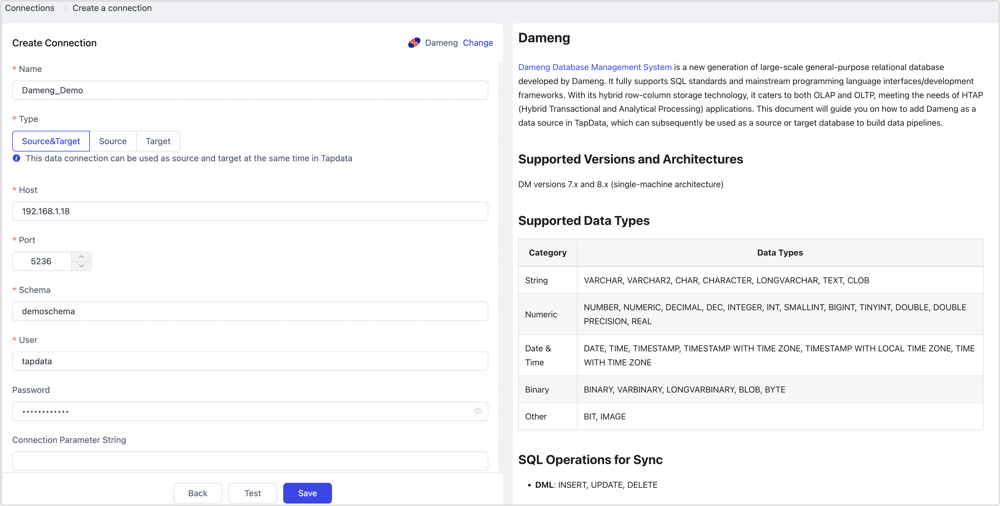
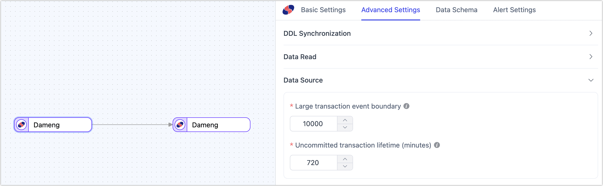

# Dameng
[Dameng Database Management System](https://en.dameng.com/) is a new generation of large-scale general-purpose relational database developed by Dameng. It fully supports SQL standards and mainstream programming language interfaces/development frameworks. With its hybrid row-column storage technology, it caters to both OLAP and OLTP, meeting the needs of HTAP (Hybrid Transactional and Analytical Processing) applications. This document will guide you on how to add Dameng as a data source in TapData, which can subsequently be used as a source or target database to build data pipelines.

```mdx-code-block
import Tabs from '@theme/Tabs';
import TabItem from '@theme/TabItem';
```

## Supported Versions and Architectures

DM versions 7.x and 8.x (standalone architecture)

## Supported Data Types

| Category    | Data Types                                                   |
| ----------- | ------------------------------------------------------------ |
| String      | VARCHAR, VARCHAR2, CHAR, CHARACTER, LONGVARCHAR, TEXT, CLOB  |
| Numeric     | NUMBER, NUMERIC, DECIMAL, DEC, INTEGER, INT, SMALLINT, BIGINT, TINYINT, DOUBLE, DOUBLE PRECISION, REAL |
| Date & Time | DATE, TIME, TIMESTAMP, TIMESTAMP WITH TIME ZONE, TIMESTAMP WITH LOCAL TIME ZONE, TIME WITH TIME ZONE |
| Binary      | BINARY, VARBINARY, LONGVARBINARY, BLOB, BYTE                 |
| Other       | BIT, IMAGE                                                   |

## SQL Operations for Sync

- **DML**: INSERT, UPDATE, DELETE

  :::tip

  When Dameng is used as a target, you can select the write strategy through the advanced settings of the task node: in case of insert conflicts, you can choose to convert to an update or discard the record; in case of update failures, you can choose to convert to an insert or just log the issue.

  :::

- **DDL**: ADD COLUMN, CHANGE COLUMN, DROP COLUMN, RENAME COLUMN

## Considerations

* Incremental log mining uses official features to load log files into temporary views and filter the DML and DDL logs of the tracked tables. This is similar to Oracle's LogMiner and may consume some database performance. If there are multiple synchronization tasks with scattered data tables, it is recommended to use Shared Mining to reduce database load.
* When the database log space is insufficient, you can use the command `SF_ARCHIVELOG_DELETE_BEFORE_TIME(SYSDATE-1);` to clean up archive logs from the day before, retaining only the logs from the last day. You can also specify the number of days to retain based on your needs.

## Preparation

Before connecting to the Dameng database, you need to complete some preparatory steps such as database user authorization:

* [As a Source Database](#source)
* [As a Target Database](#target)

### <span id="source">As a Source Database</span>

1. Log in to the Dameng database with DBA privileges.

2. Execute the following commands to create a user for data replication/transformation tasks.

   ```sql
   CREATE USER username IDENTIFIED BY "password" DEFAULT TABLESPACE table_space_name;
   ```

   * **username**: The username.
   * **password**: The password.
   * **table_space_name**: The tablespace name.

3. Grant the newly created user the necessary permissions. You can customize the permissions according to business needs.

   ```mdx-code-block
   <Tabs className="unique-tabs">
   <TabItem value="Full Data Synchronization">
   ```
   ```sql
   -- Replace "username" with the actual username. Authorization is not required within the same Schema.
   GRANT SELECT ANY TABLE TO username;
   ```
   </TabItem>

   <TabItem value="Full and Incremental Data Synchronization">

   ```sql
   -- Replace "username" with the actual username.
   -- To query tables
   GRANT SELECT ANY TABLE TO username;
   -- To query the table that records database initialization loading information
   GRANT SELECT ON V$DM_INI TO username;
   -- To query archive log information
   GRANT SELECT ON V$ARCHIVED_LOG TO username;
   -- To query general archive log information
   GRANT SELECT ON V$RLOG TO username;
   -- To query archive log analysis view
   GRANT SELECT ON V$LOGMNR_CONTENTS TO username;
   -- To query session view
   GRANT SELECT ON V$SESSIONS TO username;
   -- To query transaction view
   GRANT SELECT ON V$TRX TO username;
   ```
   </TabItem>
   </Tabs>

4. If you need to capture incremental data changes from the source database, follow these steps to enable archiving and archive logging.

   1. Enable archive logging. For detailed parameter descriptions, refer to the [Dameng Official Documentation](https://eco.dameng.com/document/dm/zh-cn/pm/backup-restore-combat#3.1.2%20%E5%BD%92%E6%A1%A3%E9%85%8D%E7%BD%AE).

      :::tip

      You can also run the command `SELECT para_name, para_value FROM v$dm_ini WHERE para_name IN ('ARCH_INI','RLOG_APPEND_LOGIC');` to check if this feature is already enabled. If the **PARA_VALUE** column shows a value of **1**, it is already enabled, and you can skip this step.

      :::

      ```sql
      -- Change the database to MOUNT state
      ALTER DATABASE MOUNT;
      
      -- Configure local archiving. If the directory specified by DEST does not exist, it will be created automatically.
      -- FILE_SIZE specifies the size of a single archive file in MB; SPACE_LIMIT specifies the space size limit, with 0 indicating no limit. You can clean up periodically using commands.
      ALTER DATABASE ADD ARCHIVELOG 'DEST = /bak/dmdata/dameng, TYPE = local, FILE_SIZE = 1024, SPACE_LIMIT = 0';
      
      -- Enable archive mode
      ALTER DATABASE ARCHIVELOG;
      
      -- Change the database to OPEN state
      ALTER DATABASE OPEN;
      ```

   2. Enable supplemental logging.

      ```sql
      -- Enable supplemental logging. It is recommended to set the value to 2
      -- It meaning all columns' information is recorded when logging UPDATE and DELETE operations, regardless of primary key columns.
      ALTER SYSTEM SET 'RLOG_APPEND_LOGIC'=2 MEMORY;
      ```


### <span id="target">As a Target Database</span>

1. Log in to the Dameng database with DBA privileges.

2. Execute the following commands to create a user for data replication/transformation tasks.

   ```sql
   CREATE USER username IDENTIFIED BY "password" DEFAULT TABLESPACE table_space_name;
   ```

   * **username**: The username.
   * **password**: The password.
   * **table_space_name**: The tablespace name.

3. Grant the newly created user the necessary permissions. You can customize the permissions according to business needs.

   ```sql
   -- Replace "username" with the actual username.
   GRANT CREATE TABLE, CREATE INDEX TO username;
   ```

## Connect to Oracle

1. Log in to TapData Platform.

2. In the left navigation panel, click **Connections**.

3. Click **Create** on the right side of the page.

4. In the dialog box that appears, search for and select **Dameng**.

5. On the page that appears, fill in the connection information for the Dameng database as described below.

   

   * **Connection Settings**
     
     * **Name**: Enter a unique name that is meaningful to your business.
     * **Type**: Supports using Dameng as a source or target database.
     * **Host**: Database connection IP address or hostname.
     * **Port**: Database service port, default is 5236.
     * **Schema**: Schema name. When creating a database user, Dameng will automatically create a Schema with the same name as the username (in all uppercase). If you need to connect to multiple Schemas, you must create multiple data connections.
     * **User**: Database account username.
     * **Password**: Password for the database account.
     * **Connection Parameters String**: Additional connection parameters, default is empty.
     * **Timezone**: Default is set to UTC (0 timezone). You can manually specify another timezone based on your business needs. Changing this setting will affect fields without a timezone, such as DATE and TIMESTAMP.
     
   * **Advanced Settings**
     * **Shared Mining**: Mines the source database for incremental logs. This allows multiple tasks to share the same source database's incremental log collection process, avoiding redundant reads and minimizing the load on the source database. Once enabled, you will need to select an external storage to store incremental log information.
     * **Include Tables**: Default is **All**. You can also choose to customize and specify tables to include, separated by commas (,).
     * **Exclude tables**: Once the switch is enabled, you have the option to specify tables to be excluded. You can do this by listing the table names separated by commas (,) in case there are multiple tables to be excluded.
     * **Agent settings**: Defaults to **Platform automatic allocation**, you can also manually specify an agent.
     * **Model load time**: If there are less than 10,000 models in the data source, their schema will be updated every hour. But if the number of models exceeds 10,000, the refresh will take place daily at the time you have specified.
     * **Enable Heartbeat Table**: When the connection type is selected as **Source and Target** or **Source**, you can enable this option. TapData will create a heartbeat table named **_tapdata_heartbeat_table** in the source database and update it every 10 seconds (database account needs relevant permissions) to monitor the health of the data source connection and tasks.
       :::tip
       The heartbeat task will start only after the data source is referenced and the data replication/development task is initiated. At this point, you can re-enter the edit page for this data source and click **View Heartbeat Task**.
       :::


6. Click **Test Connection**. If the test is successful, click **Save**.

   If the connection test fails, follow the prompts on the page to resolve the issue.


## Advanced Node Features



When configuring data synchronization/transformation tasks, using Dameng as a **source node** provides additional advanced features built into TapData to better meet complex business needs and maximize performance. You can configure these features based on business requirements:

* **Large Transaction Event Boundary**: When using LogMiner to obtain incremental data, this setting determines the threshold for entering large transaction logic, defaulting to 10,000 DML events. Setting this too high may increase memory pressure and risk OOM, while setting it too low may frequently rely on disk caching, affecting performance. It is recommended to avoid bulk data operations involving tens of millions of records in the business, such as `insert into select` or bulk `update`.
* **Uncommitted Transaction Lifetime**: To avoid data loss when restarting tasks, TapData retains long-uncommitted transactions in the task cache and starts mining from the earliest uncommitted transaction upon restart. To ensure collection performance, you can control the retention time of uncommitted transactions with this parameter (default is 702 minutes). Transactions exceeding this duration will be automatically cleared.
