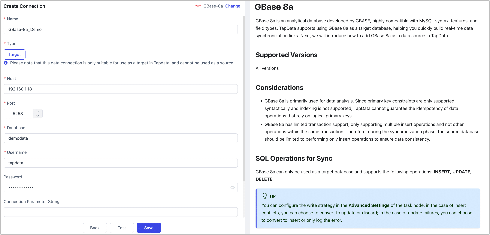

# GBase 8a

GBase 8a is an analytical database developed by GBASE, highly compatible with MySQL syntax, features, and field types. TapData supports using GBase 8a as a target database, helping you quickly build real-time data synchronization links. Next, we will introduce how to add GBase 8a as a data source in TapData.

```mdx-code-block
import Tabs from '@theme/Tabs';
import TabItem from '@theme/TabItem';
```

## Supported Versions

All versions

## Considerations

- GBase 8a is primarily used for data analysis. Since primary key constraints are only supported syntactically and indexing is not supported, TapData cannot guarantee the idempotency of data operations that rely on logical primary keys.
- GBase 8a has limited transaction support, only supporting multiple insert operations and not other operations within the same transaction. Therefore, during the synchronization phase, the source database should be limited to performing only insert operations to ensure data consistency.

## SQL Operations for Sync

GBase 8a can only be used as a target database and supports the following operations: **INSERT**, **UPDATE**, **DELETE**.

:::tip

You can configure the write strategy in the **Advanced Settings** of the task node: in the case of insert conflicts, you can choose to convert to update or discard; in the case of update failures, you can choose to convert to insert or only log the error.

:::

## Preparation

1. Log in to the GBase 8a database and execute the following command to create an account for data synchronization/development tasks.

   ```sql
   CREATE USER username WITH PASSWORD "passwd";
   ```

   - **username**: the username.
   - **passwd**: the password.

   Example: Create an account named `tapdata`.

   ```sql
   CREATE USER tapdata WITH PASSWORD "Your@passwd123";
   ```

2. Grant the newly created account the necessary privileges. For example, you can also set more granular privilege controls based on business needs.

   <Tabs className="unique-tabs">
   <TabItem value="Grant to Specified Database" default>

   ```sql
   GRANT SELECT, INSERT, UPDATE, DELETE, ALTER, CREATE, CREATE ROUTINE, CREATE TEMPORARY TABLES, DROP ON database_name.* TO 'username';
   ```

   </TabItem>

   <TabItem value="Grant to All Databases">

   ```sql
   GRANT SELECT, INSERT, UPDATE, DELETE, ALTER, CREATE, CREATE ROUTINE, CREATE TEMPORARY TABLES, DROP ON *.* TO 'username';
   ```

   </TabItem>
   </Tabs>

   * **database_name**: The name of the database to grant permissions.
   * **username**: Enter user name.

## Connect to GBase 8a

1. Log in to TapData Platform.

2. In the left navigation panel, click **Connections**.

3. On the right side of the page, click **Create**.

4. In the pop-up dialog, search for and select GBase 8a.

5. On the page that opens, fill in the GBase 8a connection information as described below.

   

   - **Connection Settings**
     - **Name**: Enter a unique name with business significance.
     - **Type**: Only supports GBase 8a as a target database.
     - **Host**: Database connection address.
     - **Port**: The service port of the database, default is **5258**.
     - **Database**: Database name, one connection corresponds to one database. If there are multiple databases, you need to create multiple connections.
     - **Username**: The database username.
     - **Password**: The password for the database.
     - **Connection Parameters String**: Additional connection parameters, default is empty.
     - **Time Zone**: Time zone configuration, default is 0 time zone.
   - **Advanced Settings**
     - **Agent Settings**: Defaults to **Platform automatic allocation**, you can also manually specify an agent.
     - **Model Load Time**: If there are less than 10,000 models in the data source, their schema will be updated every hour. But if the number of models exceeds 10,000, the refresh will take place daily at the time you have specified.

6. Click **Test**, and after passing the test, click **Save**.

   If the connection test fails, please follow the instructions on the page to fix the issue.